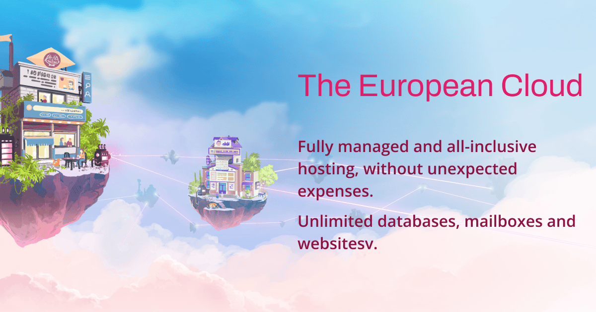

# alwaysdata help & documentation



A modern, fast, and accessible documentation built with [Eleventy](https://www.11ty.dev/) and [Tailwind CSS](https://tailwindcss.com/).

**[Help online](https://help.alwaysdata.com)**

## Features

- **Fast** - Static site generation with Eleventy v3
- **Modern Styling** - Tailwind CSS v4 with dark mode support
- **Search** - Command palette search powered by Pagefind
- **Syntax Highlighting** - Beautiful code blocks with Shiki
- **Responsive Tables** - Auto-wrapped with table-saw for mobile
- **Accessible** - Keyboard navigation, focus states, WCAG compliant
- **SEO Ready** - Sitemap, RSS, Open Graph, Twitter Cards
- **AI Ready** - llms.txt for AI-readable documentation

## Quick Start

```bash
# Clone the repository
git clone https://github.com/alwaysdata/documentation.git
cd documentation

# Install dependencies
npm install

# Start development server
npm run dev

# Build for production
npm run build
```

> [!WARNING]
> The task `npm run dev` runs a NodeJS http-server but it doesn't understand the `.htaccess` file (Apache server only) which contains a redirection from the root `http://localhost:8080` to `/fr/` or `/en/`.
> So expect an empty (404) root page then go manually to `/fr/` or `/en/`

## Requirements

- Node.js 24+ (see `.nvmrc`)

## Project Structure

```
├── config/             # Eleventy configuration modules
│   ├── collections.js  # Custom collections
│   ├── filters.js      # Template filters
│   ├── plugins.js      # Eleventy plugins
│   ├── shortcodes.js   # Custom shortcodes
│   └── transforms.js   # Output transforms
├── src/
│   ├── _data/          # Global data files
│   ├── _includes/      # Layouts and partials
│   ├── assets/         # CSS, JS, fonts, images
│   └── content/        # Documentation content (Markdown)
└── _site/              # Build output (generated)
```

## Writing Documentation

Create Markdown files in `src/content/docs/` with front matter:

```yaml
---
title: Page Title
description: Page description for SEO
eleventyNavigation:
  key: Page Title
  parent: Parent Page  # optional, for nesting
  order: 10            # optional, for sorting
---

Your content here...
```

## Available Markdown extensions

### Anchor
Adds automatically anchors (`id`) on headings for precise sharable URLs

### Footnotes
Adds footnotes feature:

#### Block footnote

```md
Here is a footnote reference,[^1] and another.[^longnote]

[^1]: Here is the footnote.

[^longnote]: Here's one with multiple blocks.

    Subsequent paragraphs are indented to show that they
belong to the previous footnote.
```

#### Inline footnote

```md
Here is an inline note.^[Inlines notes are easier to write, since
you don't have to pick an identifier and move down to type the
note.]
```

### Github-like alerts (or admonitions)
Adds flavours to blockquotes.  
Available types: `NOTE`, `TIP`, `WARNING`, `CAUTION`, `IMPORTANT`

```md
> [!NOTE]
> This is a note, to add context

> [!TIP]
> This is a tip, to share an optional pro tip

> [!WARNING]
> This is a warning notice, for potentially breaking stuff

> [!CAUTION]
> This is a caution notice, for dangers and breaking stuff

> [!IMPORTANT]
> This is a important notice, for really important information to read
```

## Scripts

| Command | Description |
|---------|-------------|
| `npm run dev` | Start development server at localhost:8080 |
| `npm run build` | Build for production |
| `npm run clean` | Remove build artifacts |

## Deployment

Eleventy generates static files in `_site/`, then deploy this folder any static hosting.

For production builds with minification:

```bash
ELEVENTY_ENV=production npm run build
```

## Credits

### Libraries & Tools

- [JuicyDocs](https://juicydocs.freshjuice.dev) - 11ty Starter
- [Eleventy](https://www.11ty.dev/) - Static site generator
- [Tailwind CSS](https://tailwindcss.com/) - Utility-first CSS
- [Pagefind](https://pagefind.app/) - Static search
- [Shiki](https://shiki.style/) - Syntax highlighting
- [Phosphor Icons](https://phosphoricons.com/) - Icon set
- [General Sans](https://www.fontshare.com/fonts/general-sans) - Typography
- [table-saw](https://github.com/zachleat/table-saw) - Responsive tables

## License

MIT License
