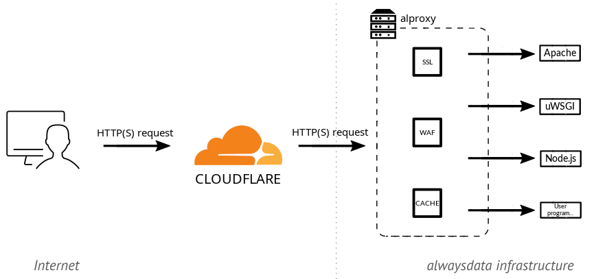

+++
title = "Analysis of an HTTP/2 Connectivity Incident with Cloudflare"
linkTitle = "20260505 - Analysis of an HTTP/2 Connectivity Incident with Cloudflare"
tags = ["troubleshooting", "network"]
+++

```
Date    | May 5th, 2026
Authors | François Lesueur & Cyril Baÿ
```

From March 25th to 27th, 2026, we experienced service disruptions for websites hosted with us behind a Cloudflare relay. This article looks back at the incident, its causes, and the steps taken to resolve it. It also aims to document *one* way to handle this type of incident.

This incident is (briefly) described in a [Cloudflare status](https://www.cloudflarestatus.com/incidents/mlhhr2sxhwwy) and a [thread on their forum](https://community.cloudflare.com/t/intermittent-502-origin-healthy-requests-never-reach-server-ewr-pop/911242). On our end, the incident was tracked in [this status](https://status.alwaysdata.com/operation/492/detail/).

## Architecture

Before describing the incident, we need to introduce the type of architecture affected and the components involved.

alwaysdata is a web hosting provider and, as such, serves over 80,000 websites. These sites can be static or dynamic (PHP, Python, JavaScript...), in which case they are executed by a dedicated server. These servers are standard third-party software such as Apache HTTP, uWSGI, Node.js...

A reverse proxy sits in front of these execution servers. It receives requests, handles all the TLS/HTTP protocol layer (including HTTP/2), and then forwards traffic to the appropriate execution server. This reverse proxy is an in-house piece of software called `alproxy`, combining custom code with third-party libraries. This architecture is described in our [documentation](/web-hosting/sites/http-stack/).

Like any hosting provider, we regularly experience (and handle) DDoS attacks, offer caching, and provide a WAF. Nevertheless, some customers still choose to host their site behind a Cloudflare relay. In that case, the web browser accessing the site connects to Cloudflare, which connects to our `alproxy`, which in turn connects to our execution server. The connection between Cloudflare and `alproxy` is configured by the customer and can use HTTP/1 or HTTP/2, with different levels of certificate verification on our end and different TLS protocol requirements.



## Initial Customer Reports

On March 25th, we received several tickets reporting tricky issues, with various unusual application malfunctions seeming unrelated to one another. The sheer volume of them surprised us. Initial analysis quickly led us to realize they were all different symptoms of a broader problem between Cloudflare and us. Given Cloudflare's reach on the Internet, we immediately switched to "Emergency" mode and mobilized!


The first question was whether this was a network issue (packet loss on a network link, for example) or an application-level issue (a request being mishandled). Analyzing our logs quickly pointed us toward an application-level problem, with requests being received but not processed at the application layer.
Based on these initial findings:

* nothing had changed on our end at the time of the reports, which seemed to rule out a deployment issue on our side;
* we were not seeing any notable buzz about this on the internet. If Cloudflare had a global outage, it should have been more widely apparent;
* these initial observations pointed us toward a more specific problem between Cloudflare and us, likely related to a change on Cloudflare's side.

Analyzing the failing requests revealed they were all using HTTP/2. The first mitigation, at that point, was to suggest that affected customers disable HTTP/2 from Cloudflare. This workaround was quickly validated.

The problem was therefore at application-level and limited to HTTP/2. Clearly, `alproxy` was failing to handle certain requests (which then timed out), but not all of them. In fact, analyzing the HTTP/2 logs alone, approximately 80% of requests succeeded, with only 20% failing. One possibility was a dormant bug in our code, a malfunction on Cloudflare's side, or a bit of both.

> A note on deployment practices. In the hosting world, and we are strong proponents of this ourselves, software updates are generally rolled out progressively. Synthetic tests never fully reflect real-world conditions, so new versions are first deployed and monitored on a few servers, then a larger portion, until a full rollout is achieved. This can take anywhere from a few days to a few weeks. During the rollout, close attention is paid to execution logs, incident reports in the relevant area, etc., with the ability to either adjust or roll back to the previous version if issues arise, while a complete fix is developed. So when we observed failures on roughly 20% of requests only, we suspected an ongoing software rollout on Cloudflare's side. At that point, it was a high-stakes race against the clock: either Cloudflare would detect and acknowledge errors in their deployment and roll back, which would resolve our issues; or they would push the rollout forward, and soon it wouldn't be 20% but 100% of requests that would fail!

## Problem Analysis

Once we had established that the bug was triggered only in HTTP/2, but not for all requests, we needed to pinpoint the exact triggering conditions. Those conditions were the essential first step because they would allow us to:

* characterize what was causing the problem, obviously;
* reproduce the issue in a controlled environment, more efficiently.

The first attempt was to increase the verbosity of the reverse proxy. Unfortunately, this didn't yield any specific information: the headers were exactly the same between functional and non-functional requests.


The next step was to observe the packets more closely. Typically, we wanted the kind of information you get from a network capture analyzed in Wireshark. This nonetheless had to be done in the live customer production environment, without any disruption or outage. We didn't have a Cloudflare test site, and adding one wasn't immediately feasible. We therefore had to investigate by observing existing traffic from customers who had left HTTP/2 enabled.

The first option was to capture a `pcap` with `tcpdump`. The point of observation was between Cloudflare and `alproxy`, meaning on the TLS-encrypted portion of the traffic. This required both capturing with `tcpdump` (straightforward) and retrieving the cryptographic material needed to decrypt in Wireshark (far less straightforward). A few solutions exist, but none could be set up quickly enough to be useful:

* The easiest approach is to retrieve the TLS session key from the browser side. Browsers support this by [setting the `SSLKEYLOGFILE` environment variable](https://everything.curl.dev/usingcurl/tls/sslkeylogfile.html), but this was irrelevant to us. When traffic goes through Cloudflare, the browser establishes TLS with Cloudflare, and then Cloudflare establishes TLS with `alproxy`. These are two distinct TLS tunnels and the key on the browser side has no connection to the one used between Cloudflare and `alproxy`.
* A second option is to disable all [*forward secrecy*](https://en.wikipedia.org/wiki/Forward_secrecy) in TLS. This way, the session key is exchanged directly between Cloudflare and `alproxy`, making it decryptable in the capture using our certificate's private key on `alproxy`'s end. However, forward secrecy is a highly desirable security property, potentially required by Cloudflare, so disabling it on a modern cryptographic stack and hoping Cloudflare would agree to establish a TLS session without it was far from certain, with a real risk of causing an outage.
* The best option is to ask one end of the tunnel (here `alproxy`) to dump the session key. The [openssl library supports this](https://www.pyopenssl.org/en/latest/api/ssl.html#OpenSSL.SSL.Context.set_keylog_callback) by adding a callback, but this didn't work during our first attempts. We chose a different approach.

We ultimately opted for traffic analysis using `bpftrace`, and more specifically [`bcc`](https://github.com/iovisor/bcc/). BPF allows instrumenting system calls or library functions, and inspecting or manipulating their parameters. BCC makes it possible to combine BPF code (resembling a subset of C) with Python-based analysis code, and its examples include [TLS connection analysis](https://github.com/iovisor/bcc/blob/master/tools/sslsniff.py). By observing calls to the `openssl` library, we obtained a very good approximation of the network exchange, a middle ground between our application logs and a `tcpdump` capture.

Using that as inspiration, along with the [hyperframe](https://github.com/python-hyper/hyperframe) library to parse HTTP/2 data, we built an HTTP/2 tracer. In that tracer, we were able to read the following trace:

```
SettingsFrame(stream_id=0, flags=[]): settings={2: 0, 3: 1, 4: 8388608, 5: 65536}::None
WindowUpdateFrame(stream_id=0, flags=[]): window_increment=8323073::None
HeadersFrame(stream_id=1, flags=['END_HEADERS', 'END_STREAM']): exclusive=False, depends_on=0, stream_weight=0, data=<hex:82874194f1e3c2f41a6b...>::[(':method', 'GET'), (':scheme', 'https'), (':authority', 'www.xxxxx.org'), (':path', '/'), ('x-forwarded-for', '2a00:b6e0:1:16:85::1'), ('user-agent', 'curl/7.88.1-1'), ('cf-ray', 'xxx-xxx'), ('accept', '*/*'), ('cdn-loop', 'cloudflare; loops=1'), ('cf-connecting-ip', '2a00:b6e0:1:16:85::1'), ('cf-ipcountry', 'FR'), ('cf-visitor', '{"scheme":"https"}'), ('x-forwarded-proto', 'https'), ('accept-encoding', 'gzip, br')]
SettingsFrame(stream_id=0, flags=['ACK']): settings={}::None
...
...
...
SettingsFrame(stream_id=0, flags=[]): settings={2: 0, 3: 1, 4: 8388608, 5: 65536}::None
WindowUpdateFrame(stream_id=0, flags=[]): window_increment=8323073::None
HeadersFrame(stream_id=1, flags=['END_HEADERS']): exclusive=False, depends_on=0, stream_weight=0, data=<hex:82874194f1e3c2f41a6b...>::[(':method', 'GET'), (':scheme', 'https'), (':authority', 'www.xxxxx.org'), (':path', '/'), ('x-forwarded-for', '2a00:b6e0:1:16:85::1'), ('user-agent', 'curl/7.88.1-3'), ('cf-ray', 'xxx-xxx'), ('accept', '*/*'), ('cdn-loop', 'cloudflare; loops=1'), ('cf-connecting-ip', '2a00:b6e0:1:16:85::1'), ('cf-ipcountry', 'FR'), ('cf-visitor', '{"scheme":"https"}'), ('x-forwarded-proto', 'https'), ('accept-encoding', 'gzip, br')]
DataFrame(stream_id=1, flags=['END_STREAM']): None::[]
SettingsFrame(stream_id=0, flags=['ACK']): settings={}::None
RstStreamFrame(stream_id=1, flags=[]): error_code=8::None
```

Here, by cross-referencing with the logs, the failing requests had a `HeadersFrame` without `END_STREAM`, followed by an empty `DataFrame`. The successful ones had `END_STREAM` directly in the `HeadersFrame`. We had found a difference at the HTTP/2 level!


There are [a few](https://github.com/reactor/reactor-netty/issues/3524) [examples](https://github.com/nodejs/node/issues/33891) of HTTP/2 clients that have *fixed* this type of behavior. Analysis of the RFCs led us to believe this is spec-compliant but undesirable (it adds an unnecessary packet). But if it's compliant, then we're the ones who need to fix it.

## Reproducing the Bug in a Controlled Environment

From this, we were able to craft a `curl` command that triggered the issue without going through Cloudflare, giving us a fast test environment: `curl -k -v --http2-prior-knowledge -X GET --data-binary "" -H "Content-Length:" https://servername.tld`. This request does indeed send an empty `DataFrame`.

At this point, we finally had an environment where we could reliably trigger the problem and therefore study it and test a fix outside of production. This is a crucial milestone when dealing with this type of issue.

## Fix

For the HTTP/2 layer, `alproxy` uses the [h2o](https://github.com/h2o/h2o) library via a Python binding. Both `alproxy` and the Python binding are internal code; `h2o` is a third-party library. The challenge was then to pinpoint which layer the bug lived in, by testing each component in isolation.

We were able to test a [HTTP/2 reverse proxy using `h2o` code directly](https://h2o.examp1e.net/configure/proxy_directives.html) and the problem was not present there. Then with a minimal wrapper around our Python binding, the problem already appeared. After a few hours of [RFC reading](https://datatracker.ietf.org/doc/html/rfc7230#section-3.3.3), [analysis](https://github.com/h2o/h2o/blob/4aa96860e99cc2a2e2777433949bb05aed678ebe/include/h2o.h#L128) of the [working C](https://github.com/h2o/h2o/blob/725e54bc932fbe0c6e208db4e71eb1df79ec43ff/lib/core/proxy.c#L107) [code](https://github.com/h2o/h2o/blob/725e54bc932fbe0c6e208db4e71eb1df79ec43ff/lib/core/proxy.c#L191), re-reading of [RFCs](https://datatracker.ietf.org/doc/html/rfc9113#DATA), comparison with the problematic Python code, verification against the [RFC](https://datatracker.ietf.org/doc/html/rfc9113#name-headers), a fix was found (barely a dozen bytes...).

## The Irony

The hard part was done. For production validation, we obviously wanted to find a site still exhibiting the problem in order to confirm the deployed fix was working.

And then, plot twist. We patched, it worked. We reverted the patch, it still worked?! Somewhat bewildered, we canceled the ongoing deployment, retested, and questioned our sanity... We digged into the logs, and found no trace of errors anymore. We eventually discovered that the problem had suddenly stopped, on all servers, around 1 AM. And then we found the [thread](https://community.cloudflare.com/t/intermittent-502-origin-healthy-requests-never-reach-server-ewr-pop/911242) on Cloudflare's forum announcing their rollback at exactly that moment... Everything lined up, we were in the clear!

Cloudflare had received multiple reports and chose to roll back their broken deployment while we worked on a fix. Thanks for the challenge, no hard feelings, or almost ;-)


