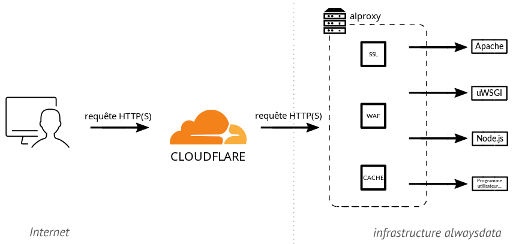

+++
url = "/fr/sous-le-capot/2026-05-05-incident-connectivite-cloudflare/"
title = "Analyse d'un incident de connectivité HTTP/2 avec Cloudflare"
linkTitle = "20260505 - Analyse d'un incident de connectivité HTTP/2 avec Cloudflare"
tags = ["incident", "réseau"]
+++


```
Date    | 5 mai 2026
Auteurs | François Lesueur & Cyril Baÿ
```

Du 25 au 27 mars 2026, nous avons subi des discontinuités de service pour les sites web hébergés chez nous derrière un relais Cloudflare. Cet article revient sur cet incident, ses causes et les étapes de sa résolution. Il a aussi pour but de documenter *une* manière de traiter ce type d'incident.

Cet incident est (succinctement) décrit dans un [statut Cloudflare](https://www.cloudflarestatus.com/incidents/mlhhr2sxhwwy) et un [fil de leur forum](https://community.cloudflare.com/t/intermittent-502-origin-healthy-requests-never-reach-server-ewr-pop/911242). De notre côté, cet incident a été suivi dans [ce statut](https://status.alwaysdata.com/operation/492/detail/).

## Architecture

Avant de décrire l'incident, nous devons présenter le type de l'architecture impactée et les composants entrant en jeu.

alwaysdata est un hébergeur web et, à ce titre, sert plus de 80 000 sites web. Ces sites peuvent être statiques ou dynamiques (PHP, Python, JavaScript...), auquel cas ils sont exécutés par un serveur ad hoc. Ces serveurs sont des logiciels tiers classiques tels que Apache HTTP, uWSGI, Node.js...

Un reverse-proxy est placé en frontal de ces serveurs d'exécution. Il reçoit les requêtes, gère toute la partie protocolaire TLS/HTTP (y compris HTTP/2) puis redirige vers le serveur d'exécution demandé. Ce reverse-proxy est un logiciel interne nommé `alproxy`, combinant du code maison et des bibliothèques tierces. Cette architecture est décrite dans la [documentation](/web-hosting/sites/http-stack/).

Comme tout hébergeur, nous subissons (et gérons) régulièrement des attaques DDoS, proposons du cache et un WAF. Néanmoins, certains clients choisissent quand même d'héberger leur site derrière un relais Cloudflare. Dans ce cas, le navigateur web accédant au site se connecte à Cloudflare, qui se connecte à notre `alproxy`, qui se connecte à son tour à notre serveur d'exécution. La connexion entre Cloudflare et `alproxy` est configurée par le client et peut être en HTTP/1 ou HTTP/2, avec différents niveaux de vérification du certificat que nous fournissons et différentes exigences de protocole TLS.



## Premiers rapports clients

Le 25 mars, nous recevons plusieurs tickets remontant des problèmes ardus, avec des dysfonctionnements applicatifs variés et inhabituels. A priori sans lien entre eux, cette densité nous surprend. De premières analyses nous font rapidement réaliser qu'ils sont en fait tous des symptômes divers d'un problème plus général entre Cloudflare et nous. Étant donnée la place de Cloudflare sur Internet, nous passons en mode « Urgence » et nous nous mobilisons immédiatement !


La première question est de savoir s'il s'agit d'un problème réseau (perte de paquets sur un lien réseau par exemple) ou applicatif (requête mal gérée). L'analyse des logs de notre côté nous dirige rapidement vers un problème applicatif, avec des requêtes reçues mais non traitées au niveau applicatif. Sur ces premiers éléments :

* rien n'ayant changé de notre côté au moment du signalement, cela semble éliminer un problème de mise en production chez nous ;
* nous ne constatons pas de « bruit particulier » sur le sujet sur Internet. Si Cloudflare avait une panne globale, on devrait le constater plus largement ;
* ces premières constatations nous orientent vers un problème plus spécifique entre Cloudflare et nous, a priori plutôt lié à une modification côté Cloudflare.

L'analyse des requêtes en erreur fait apparaître qu'elles sont toutes en HTTP/2. La première remédiation, à cet instant, est de proposer aux clients impactés de désactiver HTTP/2 chez Cloudflare. Ce palliatif est rapidement validé.

Le problème est donc applicatif et limité à HTTP/2. Manifestement, `alproxy` échoue à traiter certaines requêtes (qui finissent alors en timeout), mais pas toutes. En effet, en analysant uniquement la partie HTTP/2, environ 80% des requêtes sont traitées avec succès, seulement 20% échouent. Une possibilité est un bug dormant dans notre code, un mauvais fonctionnement côté Cloudflare, ou un peu des deux.

> Note sur les méthodes de déploiement. Dans le monde de l'hébergement, et nous sommes les premiers à l'appliquer, les évolutions logicielles sont généralement déployées progressivement. En effet, les tests synthétiques ne reflètent jamais complètement la réalité et les nouvelles versions sont donc d'abord installées et suivies sur quelques serveurs, puis une plus grande partie, jusqu'à arriver à un déploiement complet. Cela peut durer de quelques jours à quelques semaines. Pendant ce déploiement, une attention particulière est apportée aux journaux d'exécution, aux remontées d'incidents sur le domaine, etc., avec la possibilité en cas de problème soit d'ajuster, soit de revenir à la version précédente le temps d'apporter une correction complète. Ainsi, quand nous observons ces problèmes sur environ 20% des requêtes uniquement, nous soupçonnons une évolution logicielle en cours de déploiement chez Cloudflare. Et à ce moment, c'est une course contre la montre à quitte ou double : soit Cloudflare va détecter et reconnaître des erreurs sur son déploiement et va revenir en arrière, ce qui résoudrait nos problèmes ; soit Cloudflare va valider le déploiement et ce ne seront bientôt plus 20% mais 100% des requêtes qui seraient en échec !

## Analyse du problème

Une fois établi que le bug se déclenchait uniquement en HTTP/2, mais pas sur toutes les requêtes, nous avions besoin d'éclaircir les conditions de déclenchement précises. En effet, ces conditions sont la première étape car elles permettent de :

* caractériser ce qui pose problème, évidemment ;
* reproduire en environnement contrôlé et plus efficacement, également.

La première tentative a été d'augmenter la verbosité du reverse-proxy. Malheureusement, cela n'a pas apporté d'informations spécifiques : les en-têtes étaient exactement les mêmes entre les requêtes fonctionnelles et les requêtes non-fonctionnelles.


L'étape suivante était d'observer les paquets plus finement. Typiquement, nous voulions le type d'informations obtenues par une capture réseau analysée dans Wireshark. Cela devait néanmoins se faire en environnement de production client, sans altération ni coupure. Nous n'avions en effet pas de site Cloudflare de test, et l'ajout d'un domaine n'était pas immédiat. Nous avons donc dû nous contenter d'observer sur le trafic existant de clients ayant laissé le HTTP/2 actif.

La première possibilité est d'obtenir un `pcap` avec `tcpdump`. Le point à observer est entre Cloudflare et `alproxy`, et donc sur la partie du trafic chiffrée en TLS. Cela nécessite donc à la fois de capturer avec `tcpdump` (facile) et de récupérer le matériel cryptographique nécessaire au déchiffrement dans `wireshark` (beaucoup moins facile). Il existe quelques solutions mais aucune n'a pu être mise en place assez rapidement pour nous servir :

* Le plus simple est de récupérer la clé de session TLS côté navigateur web. Les navigateurs le permettent, en [définissant la variable d'environnement `SSLKEYLOGFILE`](https://everything.curl.dev/usingcurl/tls/sslkeylogfile.html), mais cela ne nous intéresse pas. Lors d'un passage par Cloudflare, le navigateur fait du TLS avec Cloudflare, puis Cloudflare fait du TLS avec `alproxy`. Ces deux tunnels TLS sont distincts, la clé côté navigateur n'a aucun lien avec celle utilisée entre Cloudflare et `alproxy`.
* Une seconde option est de désactiver toute la partie [*forward secrecy*](https://fr.wikipedia.org/wiki/Confidentialit%C3%A9_persistante) de TLS. Ainsi, la clé de session est échangée directement entre Cloudflare et `alproxy` et on peut la déchiffrer dans la capture avec la clé privée de notre certificat côté `alproxy`. Cependant, la *forward secrecy* est une propriété de sécurité très souhaitable, potentiellement exigée par Cloudflare, et donc la désactiver sur une pile cryptographique moderne et espérer que Cloudflare accepte de monter la session TLS sans cela est loin d'être certain, avec donc un risque de coupure.
* La meilleure option est de demander à l'un des bouts du tunnel (ici `alproxy`) de dumper la clé de session. La [bibliothèque openssl le permet](https://www.pyopenssl.org/en/latest/api/ssl.html#OpenSSL.SSL.Context.set_keylog_callback) en ajoutant un callback, mais cela n'a pas fonctionné lors de nos premiers essais. Nous avons choisi une autre approche.

Nous avons finalement opté pour l'analyse du trafic avec `bpftrace`, et plus spécifiquement [`bcc`](https://github.com/iovisor/bcc/). BPF permet d'instrumenter des appels systèmes ou des fonctions de bibliothèques, et de manipuler ou observer leurs paramètres. BCC permet de combiner un code BPF (ressemblant à un sous-ensemble du C) avec un code d'analyse en Python, et propose dans les exemples l'[analyse de connexions TLS](https://github.com/iovisor/bcc/blob/master/tools/sslsniff.py). En fait, en observant les appels à la bibliothèque `openssl`, nous obtenons une très bonne approximation de l'échange réseau, intermédiaire entre nos logs applicatifs et une capture `tcpdump`.

En utilisant cette inspiration et la bibliothèque [hyperframe](https://github.com/python-hyper/hyperframe) pour parser les données HTTP/2, nous avons obtenu un traceur HTTP/2. Et dans ce traceur, nous avons pu lire la trace suivante :

```
SettingsFrame(stream_id=0, flags=[]): settings={2: 0, 3: 1, 4: 8388608, 5: 65536}::None
WindowUpdateFrame(stream_id=0, flags=[]): window_increment=8323073::None
HeadersFrame(stream_id=1, flags=['END_HEADERS', 'END_STREAM']): exclusive=False, depends_on=0, stream_weight=0, data=<hex:82874194f1e3c2f41a6b...>::[(':method', 'GET'), (':scheme', 'https'), (':authority', 'www.xxxxx.org'), (':path', '/'), ('x-forwarded-for', '2a00:b6e0:1:16:85::1'), ('user-agent', 'curl/7.88.1-1'), ('cf-ray', 'xxx-xxx'), ('accept', '*/*'), ('cdn-loop', 'cloudflare; loops=1'), ('cf-connecting-ip', '2a00:b6e0:1:16:85::1'), ('cf-ipcountry', 'FR'), ('cf-visitor', '{"scheme":"https"}'), ('x-forwarded-proto', 'https'), ('accept-encoding', 'gzip, br')]
SettingsFrame(stream_id=0, flags=['ACK']): settings={}::None
...
...
...
SettingsFrame(stream_id=0, flags=[]): settings={2: 0, 3: 1, 4: 8388608, 5: 65536}::None
WindowUpdateFrame(stream_id=0, flags=[]): window_increment=8323073::None
HeadersFrame(stream_id=1, flags=['END_HEADERS']): exclusive=False, depends_on=0, stream_weight=0, data=<hex:82874194f1e3c2f41a6b...>::[(':method', 'GET'), (':scheme', 'https'), (':authority', 'www.xxxxx.org'), (':path', '/'), ('x-forwarded-for', '2a00:b6e0:1:16:85::1'), ('user-agent', 'curl/7.88.1-3'), ('cf-ray', 'xxx-xxx'), ('accept', '*/*'), ('cdn-loop', 'cloudflare; loops=1'), ('cf-connecting-ip', '2a00:b6e0:1:16:85::1'), ('cf-ipcountry', 'FR'), ('cf-visitor', '{"scheme":"https"}'), ('x-forwarded-proto', 'https'), ('accept-encoding', 'gzip, br')]
DataFrame(stream_id=1, flags=['END_STREAM']): None::[]
SettingsFrame(stream_id=0, flags=['ACK']): settings={}::None
RstStreamFrame(stream_id=1, flags=[]): error_code=8::None
```

Ici, en analysant les logs en parallèle, les requêtes qui échouent ont un `HeaderFrame` sans `END_STREAM`, puis un `DataFrame` vide. Celles qui réussissent ont le `END_STREAM` directement dans le `HeaderFrame`. Nous avons donc trouvé une différence au niveau HTTP/2 !


On trouve [quelques](https://github.com/reactor/reactor-netty/issues/3524) [exemples](https://github.com/nodejs/node/issues/33891) de clients HTTP/2 qui ont *corrigé* ce type de fonctionnement. L'analyse des RFC nous amène à penser que c'est conforme à la spécification mais non souhaitable (cela rajoute un paquet inutile). Mais si c'est conforme, c'est bien nous qui devons corriger.

## Reproduction du bug en environnement maîtrisé

À partir de cela, nous avons pu construire un `curl` qui déclenchait le problème, sans passer par Cloudflare, et ainsi avoir un environnement de test rapide : `curl -k -v --http2-prior-knowledge -X GET --data-binary "" -H "Content-Length:" https://servername.tld`. Cette requête envoie bien un `DataFrame` vide.

À ce moment, nous avons enfin un environnement dans lequel nous savons déclencher le problème, et donc l'étudier puis tester sa correction hors production. C'est une étape cruciale dans le cheminement face à ce type de problème.

## Correction

Pour la partie HTTP/2, `alproxy` utilise la bibliothèque [h2o](https://github.com/h2o/h2o) via un binding Python. `alproxy` et le binding Python sont du code interne ; `h2o` est un code tiers. L'enjeu est alors de cerner à quel niveau se trouve ce bug en mettant en place des tests brique par brique.

Nous avons pu tester un [reverse-proxy HTTP/2 utilisant directement le code de `h2o`](https://h2o.examp1e.net/configure/proxy_directives.html), le problème n'était pas présent. Puis avec un code minimaliste autour de notre binding Python, le problème apparaissait déjà. Il restait alors quelques heures de [lecture de RFC](https://datatracker.ietf.org/doc/html/rfc7230#section-3.3.3), d'[analyse](https://github.com/h2o/h2o/blob/4aa96860e99cc2a2e2777433949bb05aed678ebe/include/h2o.h#L128) du [code](https://github.com/h2o/h2o/blob/725e54bc932fbe0c6e208db4e71eb1df79ec43ff/lib/core/proxy.c#L107) [C fonctionnel](https://github.com/h2o/h2o/blob/725e54bc932fbe0c6e208db4e71eb1df79ec43ff/lib/core/proxy.c#L191), de relecture de [RFC](https://datatracker.ietf.org/doc/html/rfc9113#DATA), de comparaison avec le code Python problématique, de vérification de [RFC](https://datatracker.ietf.org/doc/html/rfc9113#name-headers), et un correctif a pu être apporté (une petite dizaine d'octets à peine...).

## Ironie de l'histoire

L'essentiel était fait, pour la validation en production nous souhaitions évidemment retrouver un site exhibant le problème pour valider la correction déployée.

Et là, c'est le drame. On patche, ça fonctionne. On dépatche, ça fonctionne toujours ?! Avec un certain étonnement, nous annulons le déploiement en cours, nous retestons, nous nous interrogeons sur notre santé mentale... On creuse les logs, on ne trouve en fait plus de trace d'erreur. On finit heureusement par trouver que le problème a subitement, sur tous les serveurs, cessé vers 1h du matin. Et on trouve alors l'[échange](https://community.cloudflare.com/t/intermittent-502-origin-healthy-requests-never-reach-server-ewr-pop/911242) sur le forum de Cloudflare annonçant le *rollback* de leur côté à ce moment... Tout correspond, nous sommes saufs !

Cloudflare avait reçu plusieurs signalements et avait choisi de revenir en arrière sur ce mauvais fonctionnement le temps que nous trouvions la correction. Merci pour le challenge et sans rancune, ou presque ;-)


