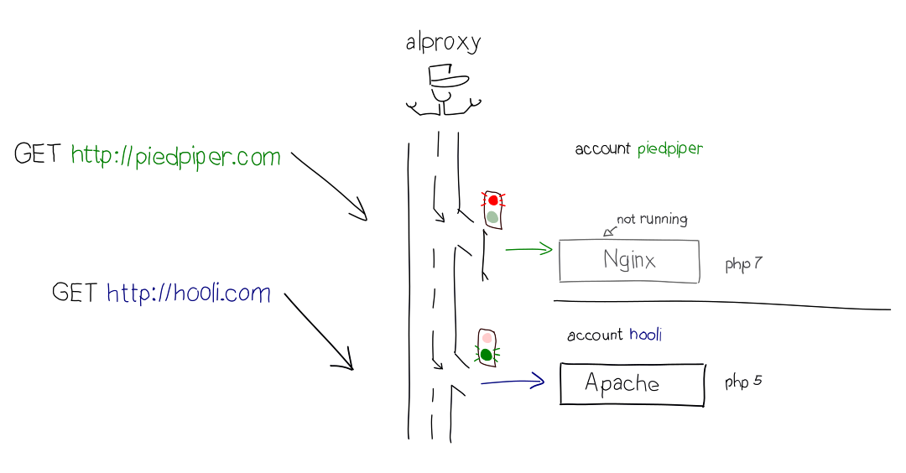
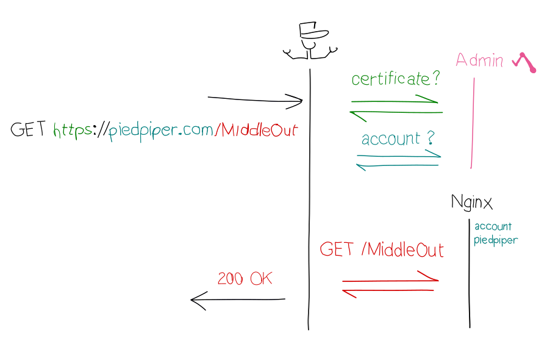

Today, we are proud to announce the deployment on all our servers of *alproxy*, the new version of our reverse proxy. This update is another milestone on the path to a modern hosting service. Read on to find out what's new!

## Reverse-proxy? What's that?

Usually, a single piece of software handles all the HTTP traffic of a server. At alwaysdata, we had to do things a bit differently, and allow each account to run its own HTTP daemon (Apache) to serve its web pages. This design choice gives our users more control over their production environment: for instance, they can load custom Apache modules or choose the version of PHP on which to run their website.

This particularity makes complex setups possible (such as bridging your app with an old Windows enterprise server... which is admittedly not for the faint of heart!), and also provides better isolation between all the accounts hosted on the same server.

This is why alproxy is a central piece in our production architecture: the reverse-proxy receives all HTTP requests, reads their destination and then dispatches the requests to the right account's Apache instance. In this regard, alproxy acts a bit like the mailboy sorting and delivering mail to the different companies that have offices in the building.

Not only does alproxy dispatch HTTP traffic, but it also checks the health and status of all the HTTP daemons running in each account: it starts a daemon when required, stops it if it has been idle for a while (to reclaim memory that can be used by someone else) and relaunches it when its configuration is updated or if it crashes.

Since all the HTTP traffic goes through alproxy, it also has to handle the security layer of HTTPS connections. All of this is done dynamically: the certificate and routing is controlled from alwaysdata's administration panel rather than written in configuration files.

## New features brought by alproxy

As a key component of our technical stack, this upgrade brings improvements at many levels of the production environment.

### Better HTTPS security and private IPs no longer required

That's right, HTTPS traffic served by alproxy is now secured according to the most recent industry standards: using TLS 1.2 by default, secure ciphers only and enabling [*Forward Secrecy*](https://en.wikipedia.org/wiki/Forward_secrecy). Our HTTPS configuration is now ranked A on SSLabs. And thanks to [SNI](https://en.wikipedia.org/wiki/Server_Name_Indication), a private IP is no longer required to use your own certificate.

We are actively working on the integration of [Let’s Encrypt](https://letsencrypt.org/). In a few weeks, Let’s encrypt certificates will be fully and automatically managed by alwaysdata. Thus, HTTPS will be enabled by default on all websites and domains. We also plan to enable OCSP stapling and TLS session resumption, two features of TLS that will bring welcomed performance improvements.

### More robust, alproxy fixes problems before you notice

This new version of alproxy has been designed to be more robust and to enable auto-healing. For example, this means that alproxy handles overload and traffic spikes more gracefully (for instance, during DDoS attacks), but also that various problems are automatically detected and fixed.

### Use Apache, Nginx, Node.js or all of them together

We will soon give our customers the ability to choose the HTTP daemons they want to run in their accounts. You will be able to replace Apache by Nginx, Node.js or whatever combination fits your website requirements.

And if you want to try bleeding-edge software, you can rely on alproxy to clean things up if ever something goes wrong.

### WebSockets are available

Using a modern web server without using shiny features is no fun, that's why we added the support of the [WebSocket protocol](https://en.wikipedia.org/wiki/WebSocket) in alproxy.

### There is more to come

While it's too soon for us to talk about HTTP/2 (there's still a lot of work to be done), we are looking forward adding a lot of new features in the coming months. For instance, we would like to add a *WAF* ([Web Application Firewall](https://en.wikipedia.org/wiki/Web_application_firewall)) which blocks malicious requests (and has good chances to mitigate bot attacks against vulnerable Wordpress installations). We will also add a HTTP cache middleware, which can be leveraged to improve the responsiveness of your websites and allow building a [CDN](https://en.wikipedia.org/wiki/Content_delivery_network).

## Under the hood

Before we end this tour of alproxy, let's talk a bit about how it's built!

alproxy is written in [Python](https://www.python.org/), and build on top of [asyncio](https://www.python.org/dev/peps/pep-3156/). We use many features introduced in Python 3.5, and sometimes had [to work around some non-trivial issues](https://github.com/python/asyncio/pull/428). During the development, we have worked on an open-source library called [asynctest](https://github.com/Martiusweb/asynctest). We hope to publish some technical blog posts to tell you more about some interesting parts of alproxy, like how we managed to handle TLS handshakes in a fully asynchronous environment.

## Towards a better service

We are constantly improving our platform, and we have still a few more milestones to reach: alwaysdata will soon deploy its new production environment, including updated PHP, Python and Ruby versions, and improved dependency management (composer, pip, gem or npm will work out of the box).

We will be rolling out those updates to existing accounts gradually, as we want to ensure that migrating to this new environment won't break your websites. Stay tuned!
