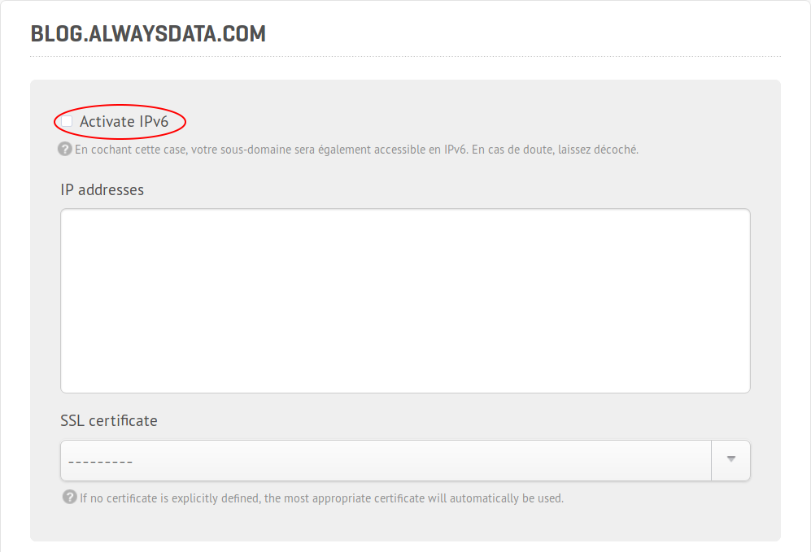

Starting on Feb. 8th — in just one week — we'll activate IPv6 support automatically on all of your subdomains. Let's explore the changes you'll need to anticipate before you go for it (spoiler alert: you don't have to do anything on your side, as we'll take care of everything).

## IPv6: what is it?

We won't publish a new post about [what IPv6 is](https://en.wikipedia.org/wiki/IPv6) nor [why it's a good thing](https://www.lifewire.com/why-is-ipv6-important-to-internet-users-2483451) because [others have done so in the past](https://www.rfc-editor.org/search/rfc_search_detail.php?title=ipv6&pubstatus%5B%5D=Any&pub_date_type=any). We just want you to remind that due to the lack of IPv4 addresses, it was essential to find a better solution. However, the deployment of IPv6 has been lagging and is flawed at some points.

Yet, the [rate of IPv6 among the main ISPs in France](https://www.arcep.fr/index.php?id=13726) is still limited. Worldwide support isn't necessarily better, with only [27% of websites accessible in IPv6](http://www.worldipv6launch.org/measurements/). Reports published in December show that there's still plenty of work to be done.

We at *alwaysdata* have offered IPv6 support since 2008, when it was a technical exception for hosting providers around the world. Based on our infrastructure at that time, the quality of service for IPv6 was mitigated, essentially because we were relying on another provider. Since we have now finished [our big migration](/en/docs/technical-specifications/migrations/2017-software-architecture/), we're ready to give you even stronger support for IPv6 by default, and we guarantee our infrastructure.

## What does it change?

Practically, it changes nothing. All of our services have been available under IPv6 for a long time, in addition to e-mail (IMAP, SMTP), remote access (SSH, FTP), and web services (HTTP, databases, etc.). By the way, you can already enable it from your cockpit. It's a setting related to a subdomain, so it's a bit hard to find (Domains > Details > Subdomains > Edit > Activate IPv6):

This setting will now be removed, and your website(s) will be accessible under IPv6 without requiring any specific action.

Technically, it's only a DNS *AAAA* record that we declare automatically for all of your subdomains. Please keep in mind that if you host your own DNS by yourself outside of *alwaysdata*, you need to declare this *AAAA* record on your side to get IPv6 support.

The switch to IPv6 is transparent: if you get an IPv6 address from your ISP on your device, it will be used by default instead of IPv4, you'll get access to your services and websites with this address.

## So, I do nothing. That's it?

That's it.

The only exception is for your web apps. If your app tracks your users by recording their IP address (e.g. in a database), you should check that your app is compatible with IPv6: the string length is different for IPv4 and IPv6, so you may not record the IPv6 address correctly.

Otherwise, there's nothing that you need to do.

## What's the point?

First, it's a solution for the lack of IPv4 addresses, which is a must, as we have clearly been out of stock for a while.

Then, due to the differences between [IPv4 and IPv6 packet headers](https://teamarin.net/2014/07/02/ipv6-effects-web-performance/) and the [quality of connection provided by IPv6](https://labs.ripe.net/Members/gih/examining-ipv6-performance), (largely because it doesn't need systems like NAT to deal with the reduced IPv4 address space), we can get a slight performance gain on web applications.

