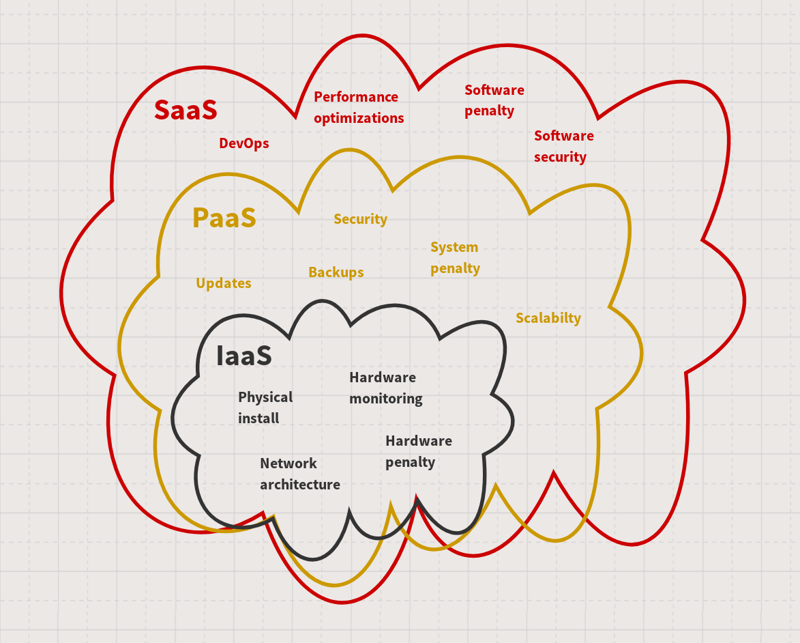

We often get legitimate questions from people who don't know the *alwaysdata* solution in-depth. Among those, a recurrent one is about our pricing, which is often due to users not understanding our offerings. We're aware that this happens because what we do isn't typical for hosts. So[^1], let's take a look at what we're doing here.

## What's the Cloud (computing)?

In data centers, you will find servers[^2], network systems, and cables (a lot!) to plug them together. They may also have storage systems like [SANs](https://en.wikipedia.org/wiki/Storage_area_network) (Storage Area Network) devices and other various kinds of devices. Data centers are not just identical machines *ad infinitum*.

When you access a remote service like a website, an API, your e-mail, or any other network-based solution, you reach one of those servers. Requests go through routers, switches, and cables[^3]. The server handles your request, processes the data, maybe by pulling it from a remote storage system or a distant database, and returns its response.

In order to host that kind of solution[^4], you have to push your code to one of those servers. Your app will then be available online to your users.

To run your app codebase, you will need a complex stack of tools installed on the server. Reality means that someone needs to manage those tools. And that's the point about what we're doing at *alwaysdata*: we not only rent you a machine, we also manage it for you.

## Behind the fog

As we said, in-the-cloud servers are computers. Let's have a look at what we need to run them:

*TL;DR*: This part is dense (like British fog). If you don't want to know every detail, I suggest you go to the [next part](#infrastructure-platform-software-as-a-service-whats-the-difference). To be short: *Cloud* is infrastructure where data centers host servers, which embed all the stacks you need to power your own application.

### A data center

Maybe it's obvious, maybe it's not, but we need a place to install, power-plug, and run our servers. The data center physically hosts the machines, and supplies everything they need to run (electricity, controlled temperature, secured access, etc.).

### Networks

We need to connect the servers to the rest of the world, so a network infrastructure is mandatory. It includes routers (to connect to network providers), switches (to distribute the network to the machines), firewalls and anti-DDOS protections, sensors, etc.

### Servers

Basically, yeah, we need several machines in order to rent the machines. So physical servers are available, which provide CPU, memory, storage, possibly GPU computing, etc. They can be built by different manufacturers, with different technical features (CPU models or architecture, RAM size, etc.). These machines are the raw computing power of the infrastructure.

### Isolation (Virtualization / Containerization[^5])

This is low-level software executed in the kernel space or similar that runs virtual machines or containers[^6] and distributes hardware resources (memory, CPU time or power, disk space, networks, etc.). It virtually isolates accounts on the server to give the users trusted access to an almost-whole system, even if it's not a physical one.

### The Operating System (OS)

This is the core software of your machine. It can be GNU/Linux, BSD, Unix, Windows, or some other server-oriented solution. It acts as a link between the hardware (even if virtualized) and the rest of your software stack to give access to the memory, CPU, network, etc. Basically, without it, nothing runs.

### The Infrastructure software

*Here's the point*.

You need to run your codebase on your server, and this codebase is dependent on *a lot* of tools and libraries. It involves databases, servers (like an *HTTP* server), interpreters (like *Python*, *PHP*, *Node.js*, etc.), maybe brokers, caching solutions, indexers, and so on. You will also need a way to get remote access, through *SSH* or *FTP*. Maybe you'll need a versioning system too (probably *Git* or *Mercurial*). You will definitely need an e-mail stack, not only for your own e-mail boxes, but also to allow your app and system to send messages when needed (e.g. in case of errors). And you will have to secure it all with firewalls and ban systems to prevent attacks.

It's a huge and complex system that needs to be maintained, updated, and monitored. It often comes with a dedicated interface to allow you to manage its features and configuration options.

### Your hosted application

Congrats 🎉!

You've finally got a server up and running, so you can now deploy your app/website/solution in a production context, to serve it to your users.

That's the basics of what you can find in the Cloud. Whatever service you run online, whatever provider you choose, the stack will have to be like this. This means that for any service you want to run, you have to worry about this whole stack, or you have to find some partner to worry about a part of it for you.

## Infrastructure, Platform, Software (as-a-service), what's the difference?

As seen above, the technical stack needed to run your service is huge. Hard to build from scratch, hard to maintain. So the market organized itself around the required strengths to deliver those services. We're in the age of *as-a-service* solutions. We can find three kinds of offers which target different audiences of customers: *IaaS*, *PaaS*, and *SaaS*. Fortunately, they can be visualized like this:

Offers labeled *as-a-service* have existed for a while. This label is only a gift box[^7] that packages the old well-known workers: sysadmins, network architects, security experts, DevOps, etc. All of these people work in the basement to ensure you've got the desired quality to power your apps.

### IaaS

*Infrastructure-as-a-service* is a service that offers the basic physical stack. The fee you pay provides access to a machine, which can be physical or virtualized. Your provider takes care of the data center (its own, or a subcontracted one), the network access, the physical servers, network systems, storage units, and maybe the virtualization layer in case of VPS.

- **what you have to do**: You have to manage the OS (often provided in a bare version by your server renter), its security, the technical stack, libs, tools, etc. Then you will be able to deploy your app, configure it for production use, and run it.
- **what you need to keep in mind**: managing a whole stack is hard. You'll have to maintain everything on your machines by yourself. It means paying (with money or with time) for sysadmin and network tasks, security, backups, recovery in case of emergency, and migration. It's a critical point and you are on your own.

*Note*: It's possible that one *IaaS* provider can rely on another *IaaS* offer. This means one provider can rent a VPS hosted on physical servers owned by another *IaaS* provider. Depending on your needs and constraints, remember to check how your provider works.

### PaaS

*Platform-as-a-service* gives you the infrastructure as seen above, plus it maintains the whole system stack: OS, interpreters, libs, databases, security, etc. It often provides a way to manage your environment without a mess, such as a CLI, config files in your project, a dedicated versioned repository, or a web panel for GUI use.

- **what you have to do**: You just have to deploy and configure your app to run it.
- **what you need to keep in mind**: Your provider will handle all costs of sysadmin, network, security, backups, etc. It remains in your domain to deploy your app; your provider probably won't help you with that. Also, you're responsible for the security of your app itself. To keep it simple: you pay the DevOps costs.

### SaaS

*Software-as-a-service* is a more advanced solution where you can use the software out-of-the-box as a customer. You won't need to deploy your own instance. This way, you can subscribe to the provider offer to get a full access to the solution as a user. The provider can use its own infrastructure/platform, or it can rely on a subcontractor offer for hosting. This is the model used by many tech startups, as they develop softwares they sell in *SaaS* mode and rely on hosters for infrastructure.

- **what you have to do**: For you, as an end-user, it's totally transparent.
- **what you need to keep in mind**: You can't customize the server outside of the application settings. It's a service, remotely available, that acts like an app on your phone. You never have access to the full server. If you have many apps in *SaaS* mode, you will have huge costs (by user or by service), so using a *PaaS* offer to host all your apps is probably the smarter move.

So, let's do another sketch (I like to do sketches) to summarize those concepts. In each cloud, you'll find what roles you pay for in each offer, which also means what you can't manage by yourself:

## Who are you, *alwaysdata*?

We are a *PaaS* provider. We are [owner of our own physical stack](/en/blog/2018-02-20-4-years-later-being-independent-feedback/). We maintain for you the entire system you need in order to provide your solution to your customers. This is true for our [Dedicated servers](https://www.alwaysdata.com/en/offers/max/) offers, but it's also true for our [Shared hosting](https://www.alwaysdata.com/en/offers/plus/) offer. In our model, Dedicated servers use the same platform as Shared hosting. The difference is that you're completely alone in your server instance in the former two: you're the only one that consumes resources.

Since we started *alwaysdata*, we have chosen to not just be an *IaaS* provider. Twelve years ago, we weren't able to find a solution that gave us the flexibility we needed to host apps and services in a managed environment. So, we made our own and decided to release it for the rest of the world. And that's the basic reason why we can't compete with other *IaaS* solutions: they simply don't offer the same level of services, nor the same level of quality.

We choose to offer a full environment. *alwaysdata* provides support for all available interpreters in the market, the ability to run whatever programs you want in your userspace, the ability to run services in the background, many SQL and NoSQL databases, full SSH remote access, and much more! Even in the Shared Hosting environment, our features are far beyond those of our competitors, who often only support PHP behind a single Apache instance, with a MySQL database and no SSH access.

Performance and security are also in our DNA. We never automatically rely on the virtualization layer to do isolation, as can be seen elsewhere. Instead, we use the kernel and OS systems designed to isolate accounts. This practice allows us to give you an increased level of performance with no compromise on security. Of course we use virtualization in some parts of our platform, but we use it only when it makes sense.

I hope this post helps you better understand the key differences between the offers of hosting providers. You should [have a try](https://www.alwaysdata.com/en/register/) at what a modern *PaaS* solution should always be like. Giving you the comfiest position to run your apps has been our goal since we started!

[^1]: hoping things will be more understandable with the next release of our website
[^2]: which are computers generally with high computational power
[^3]: never underestimate the cables!
[^4]: I will talk about the *server-less* paradigm in a future blog post, where we will learn that a *server-less* solution generally implies a server anyway `¯\_(ツ)_/¯`
[^5]: I also have a blog post in my todo to talk about virtualization vs. containerization vs. isolation
[^6]: purists will probably already put my name on their need-to-kill list when they read that, I hope you'll forgive me for this shortcut in my explanation: I try to stay concise, and the debate on virtualization vs. containers in hosting is out of the scope of this post
[^7]: but gift boxes are cool, they're a promise of joy
