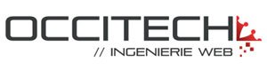

For 12 years, *alwaysdata* works along Web professionals for their hosted PaaS solution to help them to deliver their services the better way. This community of makers is rich in knowledge and talents. We wanted to salute them.

We start this new blog post series to let you meet people behind projects listed at *alwaysdata* for a while. Here's [Occitech](https://www.occitech.fr), a Web studio founded in 2006, for the first portrait.

> **How does it work?**
>
> We met Étienne Zulauf, co-founder of the studio, to ask him the following 3 questions: What are your particularities; What technical needs do you encounter; Why did you choose *alwaysdata*? This post is a gist of our interview to let you discover their world.

## What makes Occitech that particular?

Two developers lead Occitech. This particularity leads to no business task force, and so on no growing business nor profitability objectives. What makes our people happy is the quality of the code delivered through agile processes, and the new technologies used when they fit the goals of the project, thanks to a continuous technological watch.

Decent work conditions, looking for good relationships with clients, and pretty much flat management allow for tremendous transparency about enterprise budgets and results. This way, Occitech's employees understand financial decisions and don't dream when they work on new projects. They are more confident in the whole enterprise's plan.

## With a vast majority of eShop and dedicated Web apps projects, what technical needs do you encounter?

Occitech develops business applications that use [PHP](/en/docs/web-hosting/languages/php/) or [NodeJS®](/en/docs/web-hosting/languages/nodejs/) backends, with [React](http://reactjs.fr/react/) frontend interfaces. eShop projects are based on the [Magento](http://magento.com) solution, a technology well-known by the studio for several years now.

Some projects use modern technologies, like [Event Sourcing](https://microservices.io/patterns/data/event-sourcing.html), or [GraphQL](https://graphql.org) API for increased performance in client-server requests. Occitech is at ease deploying those new patterns and technologies when they fit with the project's objectives, even if they are outside of their comfort zone. Occitech's goal is always the same: to give a bespoke conception to specific needs, with the best quality available.

All developments are covered by tests and continuously deployed at *alwaysdata* thanks to the services provided by the platform.

## Occitech works with *alwaysdata* since 2013, giving its clients the facilities they need

By sharing its dedicated services with its clients, Occitech gives a hosting service that's stable and efficient. Both *alwaysdata* servers' horsepower and quick 'n precise support allow Occitech to offer a high-quality hosting platform through a dedicated company: [Ethersys](https://www.ethersys.fr).

> This service is managed by a senior sysadmin, Cyprien, who provides precise guidance outside of hosting scope, on clients' CMS or other issues. Clients love him and congratulate him regularly... Thanks to alwaysdata and Cyprien, we're able to offer our clients both dedicated server performance and sysadmin support for a starting price of €30 per month.

By using the *alwaysdata* platform, new features that always come faster, settings more and more precise, languages versions always up-to-date, and other features, Ethersys can rely on a reliable partner for its service base.

> Both for us or other teams, alwaysdata's platform is an ideal for every developer.

## We let Étienne Zulauf, co-founder of Occitech, conclude those 3 questions:

A second studio was created last summer. [Commit42](https://www.commit42.fr), who shares our office, and explores other technological and managing methods, is a great success. We confirmed this way our capacity to share our technical knowledge, and our ability to create synergies with a second team, both close to our technologies and inspired by our methods. This new company grows fast and goes to other horizons. It's fascinating!

Then, we released a project started in 2015 that offers a solution to manage visitor screens for online stores, with modern technologies like React and GraphQL: [Front-Commerce](https://www.front-commerce.com). Here again, the *alwaysdata* platform is a must-have: with a backend written in PHP[^1] and a NodeJS® middleware, compared to other hosting providers, everything can run on the same account, without any pre-requisites. We launched it in production this year on [www.terrang.fr](https://www.terrang.fr) and [www.chainethermale.fr](https://www.chainethermale.fr)[^2], the results are great: modern tools for developers that will decrease their development time, without having to deal with templating; and really fast visitor performance for a better transformation rate for the seller. Some known French agencies will start to deploy the solution over the next months, and we're trying to reach the rest of Europe and the USA... A massive program for a new trade that we still don't know: editor!

---

A big thank you to Étienne for his time in this interview game, and for his audacity to be the first one in the series. We will let you discover other passionate Web people that use the *alwaysdata* solution.

[^1]: Magento 2
[^2]: among others
