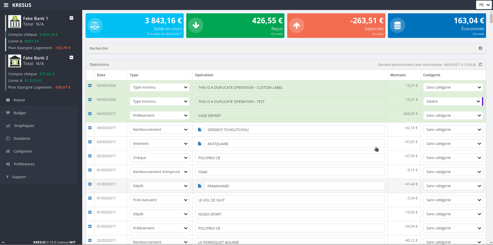
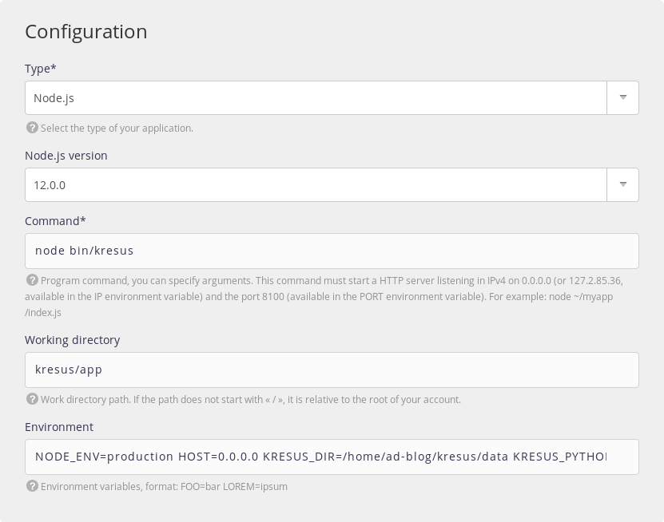

We are sometimes faced with use cases where we need to mix different technologies to run our apps. This became such a common use case that it is now fundamental to the micro-services architecture. We tend to mix technologies to create the most powerful environment possible.


## Running different versions of the same interpreter

One of the most powerful (and, sadly less known) parts of alwaysdata's architecture is the **environment version switcher**!

alwaysdata aims to provide a wide range of interpreters: *PHP*, *Python*, *Node.js*, *Ruby*, *Erlang* even *Perl* are all supported in your alwaysdata account from scratch. But sometimes we need a specific version of an interpreter. What if you need to run an application that requires a minimum version of an interpreter? Let's say, *Node.js 10*? Fact is, your account is pre-provisioned with a wide range of *versions* for each interpreter. E.g., *Node.js* comes with all the following versions (at the time of writing):

- 12.0.0
- 11.12.0
- 11.8.0
- 11.1.0
- 11.0.0
- 10.15.3
- 10.15.1
- 10.13.0
- 10.12.0
- 10.9.0
- 9.11.2
- 8.15.1
- 8.15.0
- 8.12.0
- 8.11.4
- 6.17.0
- 6.16.0
- 6.14.4

Wow. That's *a lot*!

Now, I can specify the version I want to use by using the *environment version switcher*:

```shell
$ NODEJS_VERSION=11.8.0 node --version
v11.8.0
```

I can also be less specific and stick to the latest major version of a given release:

```shell
$ NODEJS_VERSION=11 node --version
v11.12.0
```

The *environment version switcher* is available for **all** interpreters embedded in your account: `PYTHON_VERSION`, `PHP_VERSION`, and so on. You can retrieve a list of all available versions in the dedicated language page in your admin panel: *Environment > [language]*.

## Mix'em all: The [Kresus](https://kresus.org) use-case

Let's view this in action with the [Kresus](https://kresus.org) project. *Kresus* is a personal finance manager that can connect to your online bank account using a dedicated library: [Weboob](http://weboob.org). All of this is self-hosted, a mandatory feature if you [care for your privacy](/en/blog/2018-01-28-why-does-privacy-matter/).

But *Kresus* is written in *Node.js* and expects a `node` version >= 10, while *Weboob* is written in *Python* and requires a `python` >= 3. So let's mix'em together!



Connect to your account using *SSH*, and create a directory to host the project:

```shell
$ mkdir ~/kresus
$ cd ~/kresus
```

### Install Weboob

We will create a Python virtualenv for *Weboob* that will host the library and its components:

```shell
$ PYTHON_VERSION=3 python -m venv ~/kresus/weboob
$ source ~/kresus/weboob/bin/activate
(weboob) $ pip install git+https://git.weboob.org/weboob/weboob.git
(weboob) $ weboob-config update
(weboob) $ deactivate
```

### Install Kresus

Now we are ready to install the *Kresus* manager. We first need to install the `yarn` package manager, as *Kresus* relies on this for build tasks:

```shell
$ NODEJS_VERSION=12 npm install --global yarn
```

*Yes*, that's another *powerful feature* of alwaysdata PaaS: even if you're *not* `root`, you **can** install the dependencies **globally**! Thanks to our wrapping features, everything is *sandboxed* in your account, and seen as a system-wide tool by your package managers!

Let's install the project now:

```shell
$ git clone https://framagit.org/kresusapp/kresus.git ~/kresus/app
$ cd ~/kresus/app
$ NODEJS_VERSION=12 npm install
$ NODEJS_VERSION=12 npm run build:prod
```

### Launch the service

Now we're ready to run the service!

Create a [new site](/en/docs/web-hosting/sites/add-a-site/) in your admin panel at *Web > Sites > Add a site*. Select a *Node.js* site, and specify the `12.0.0` version.



Here are the parameters:

- Command: `node bin/kresus`
- Working directory: `kresus/app`
- Environment: `NODE_ENV=production HOST=[IP] KRESUS_DIR=/home/[username]/kresus/data KRESUS_PYTHON_EXEC=/home/[username]/kresus/weboob/bin/python KRESUS_SALT=[long random string]`

Make sure to substitute the following values:

- `IP`: the *IPv4* the app should listen to, indicated under the Command field. It's specific for each app, and Node.js apps expect it to be exposed by the HOST environment variable
- `username`: your account *username* at alwaysdata
- `long random string`: a random string with at least 16 chars used by *Kresus* for sessions purposes

You may also check the *Force HTTPS usage* in the SSL tab to ensure a secured connection.

And that's it. Launch your app by visiting the site URL. The first connection may take a small amount of time due to the initialization of the DB, as well as the first bank account retrieval. Grab a coffee and be patient.


This is just a small example of the powerful features we offer at alwaysdata.

Over the next few weeks, we will be migrating our platform to a new version and introducing a new wrapping feature that will allow you to access your version of choice of any interpreter. The *environment version switcher* will remain available, but soon you will be able to run `node12` or `python3.7` directly rather than using environment variables.

See you in a few weeks for this new feature! In the meantime, [run your own instance of *Kresus*](https://www.alwaysdata.com/en/register/)!
