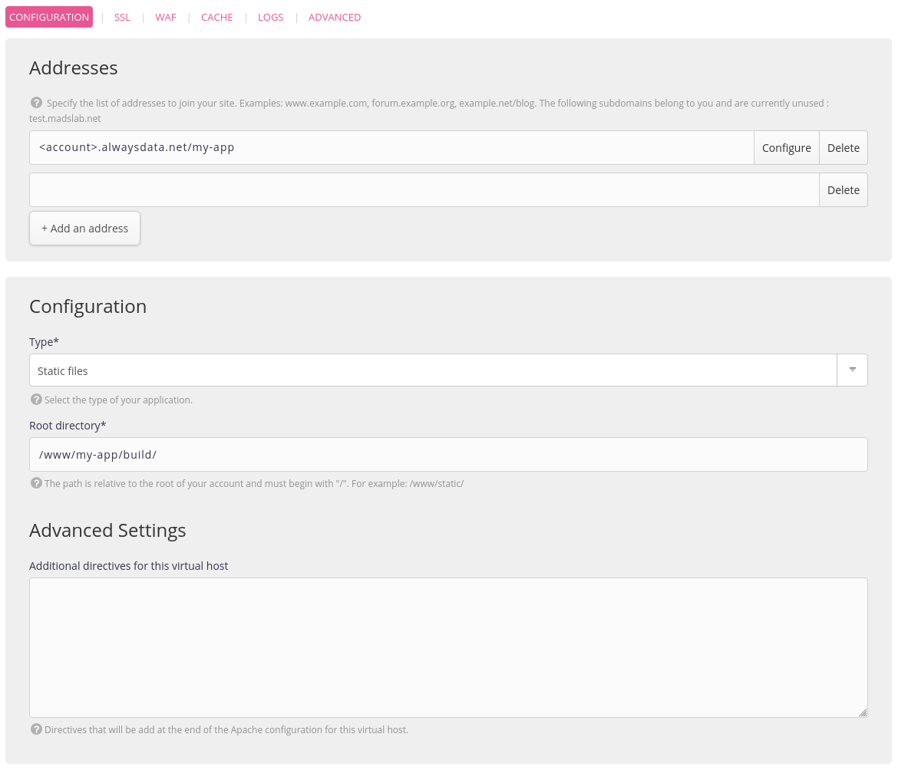
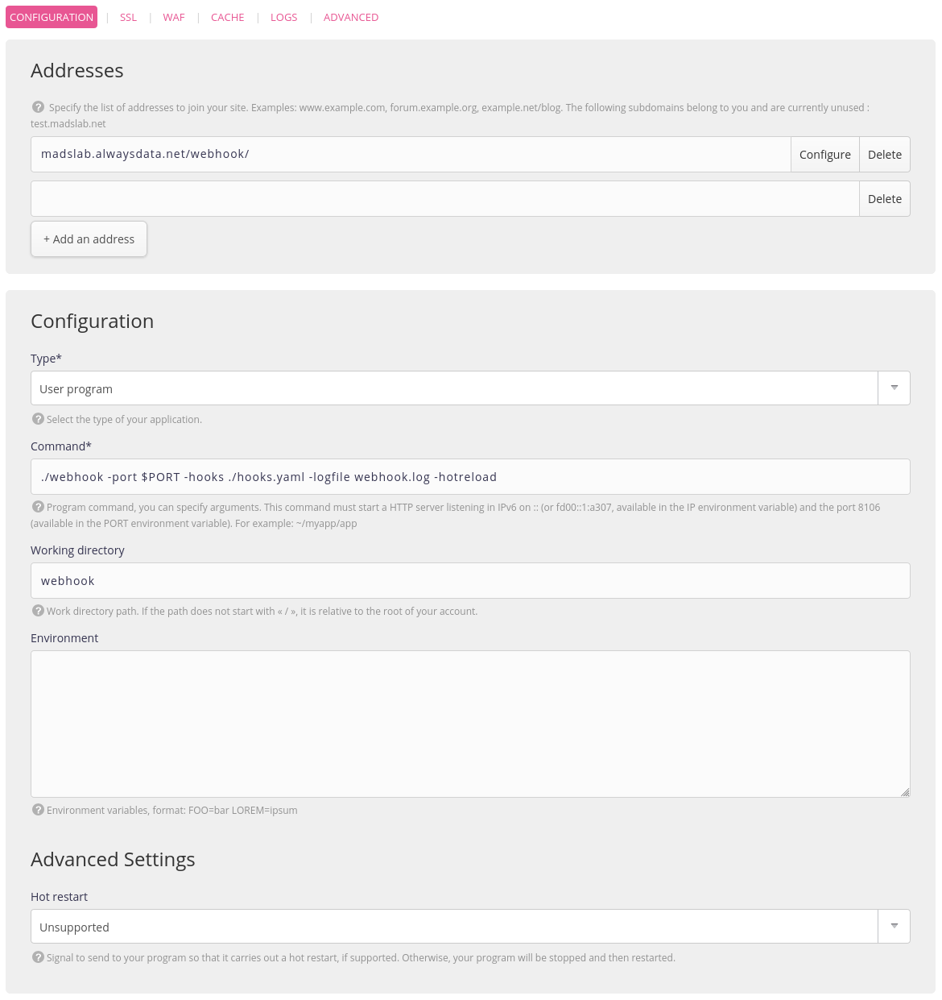
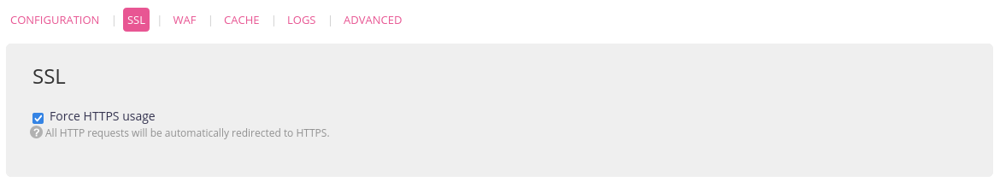
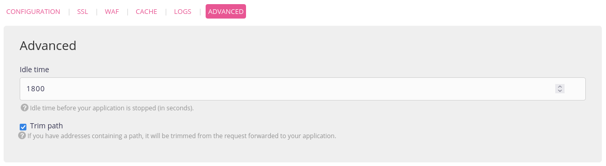
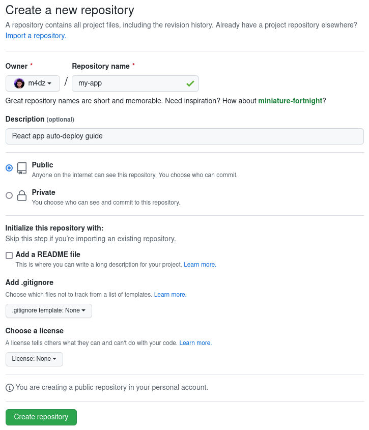
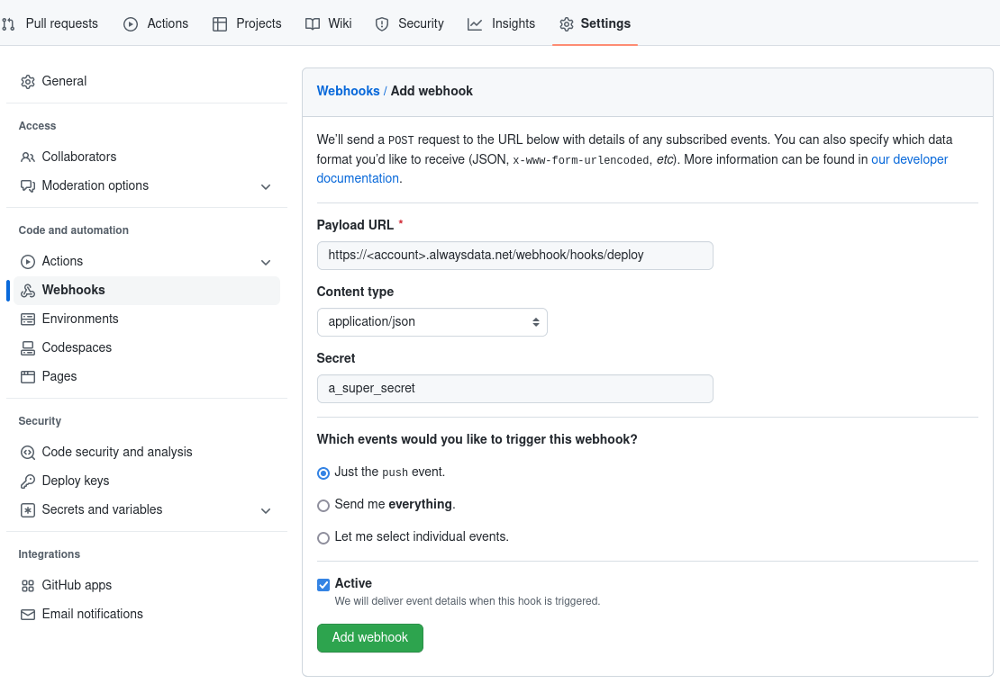

In an increasingly advanced front-end ecosystem, with an ever-richer selection of frameworks and increasingly demanding tooling, one can sometimes find oneself in a not so comical situation: how to handle a reliable and effective deployment? A case study with **Create React App**, let's go!


> [!NOTE] Lexical Note
> This guide will take place in two environments:
> - *Local*: run these commands on your local development environment (likely: your laptop).
> - *Server*: on your hosting account. With **alwaysdata**, you can connect over *SSH* to run these commands.
>
> For an account on **alwaysdata**, mentions of `<account>` in paths/URLs/etc. refer to your account name (i.e. if your account name is `superman`, replace `<account>` with `superman`).

## *Create React App*, what's that?

Whether you missed the last few years of front-end development or you're a bit lost in your first steps with React, a quick reminder: **React** is a *JS/TypeScript* framework that provides a development environment for your websites and applications. I want to emphasize the front-end aspect of this topic: even though it's possible to use *React* with server-side rendering, its primary use case is to generate front-end assets: *HTML*, *CSS*, and *JavaScript*. Nothing more.

Since a *React* app is just a set of static files, there's no need for a complex back-end architecture to serve your front end. No *Node.js* server or anything. A simple HTTP web server is enough. As stated in the [Create React App deployment documentation](https://create-react-app.dev/docs/deployment/):

> Set up your favorite HTTP server so that a visitor to your site is served `index.html`, and requests to static paths like `/static/js/main.<hash>.js` are served with the contents of the `/static/js/main.<hash>.js` file.

I'll take this opportunity to mention *Create React App*. If *React* is a framework dedicated to designing Web applications, setting up all of its toolings can be complex. Tools that encapsulate all of this logic have appeared to make things easier for you.

## Development vs. Production

Let's start our tutorial by creating a new React-based application using *Create React App*. In your local environment, run the command:

```shell
$ npx create-react-app my-app
$ cd my-app
```

Congratulations! Here is your first functional *React* application (without having coded anything!). *Create React App* has generated the basic files and installed the various modules necessary for the development and compilation of your project.

Compilation? Yes! Your front-end application will not be served directly to your clients but will have to be transpiled into *JavaScript*. *Create React App* has equipped your project with two commands:

- `npm start` : this is your development mode command; it will launch a web server on your machine to allow you to work on your application comfortably (with hot-reloading, etc.)
- `npm run build` : this is the command dedicated to *transpiling*, the one that will produce the static assets that you will then need to deploy on the server side.

On the server side now: in your *alwaysdata* administration interface, create a new site of type **Static files**, with the following information:

- address : `<account>.alwaysdata.net/my-app`
- root directory: `/www/my-app/build`



As this directory does not exist yet, create it from your local environment over *SSH*:

```shell
$ ssh <account>@ssh-<account>.alwaysdata.net mkdir -p www/my-app/build
```

## Manual Deployment: The Simple and Quick Option

Everything is ready on the server side to receive your *React* site! Let's move on to deployment.

You first need to indicate the final *URL* of your project in the `package.json` file to allow the build task to generate the assets with the correct file paths. Add the following entry:

```
"homepage": "//<account>.alwaysdata.net/my-app"
```

Still from your local environment, launch the *build* task:

```shell
$ npm run build
```

You get a `build` directory that contains your static assets. To deploy them, use rsync via *SSH*:

```shell
$ rsync -rz build <account>@ssh-<account>.alwaysdata.net:www/my-app
```

You can go to your site's address and admire the first production release of your application!

## Automated Deployment from Github: Be Professional

This manual deployment works perfectly, but it puts a burden on your shoulders. Each time you want to deploy your project, you will have to launch the *build* task and then deploy the files via *rsync/SSH*.

Let's move on to the DevOps part by automating the process using *GitHub Webhooks*!


### *Webhooks*, the magic bond

With *Webhooks*, *GitHub* will be on duty to notify your site that a new version is available every time you push new commits to the `main` branch.

To do so, you will need to equip your *alwaysdata* account with a webhook service that will execute the deployment task for you. The [adnanh/webhook](https://github.com/adnanh/webhook/) project will do the trick. Connect to your account with *SSH* and install it:

```shell
$ mkdir webhook
$ wget -O- https://github.com/adnanh/webhook/releases/download/2.8.0/webhook-linux-amd64.tar.gz \
  | tar -xz --strip-components=1 -C webhook
```

Create a new site in your alwaysdata admin interface of type **User Program** with the following information:

- address: `<account>.alwaysdata.net/webhook`
- root directory: `webhook`
- command: `./webhook -port $PORT -hooks ./hooks.yaml -logfile webhook.log`
- remember to also check the *Force HTTPS usage* and *Trim path* checkboxes







### *GitHub*, The Central Perk

On the *GitHub* side now, we're going to set up a new repository for our project. [Create it as usual](https://github.com/new) by giving it the name of your project.



Then go to the *Settings* section to add a new *Webhook* to your server:

- payload URL: `https://<account>.alwaysdata.net/webhook/hooks/deploy`
- secret : *a random password*
- content-type : `application/json`



### Call me WALL·E

Our *GitHub* repository is configured, it will now trigger requests to your webhook server for new events, such as `git push`. All that's left is to automate the deployment.

Connect with *SSH* and create the webhook configuration file by editing the `webhook/hooks.yaml`:

```yaml
- id: deploy
  execute-command: /home/<account>/webhook/deploy.sh
  command-working-directory: /home/<account>
  pass-arguments-to-command:
    - source: payload
      name: repository.name
    - source: payload
      name: repository.clone_url
    - source: payload
      name: head_commit.id
  trigger-rule:
    and:
      - match:
          type: payload-hmac-sha1
          secret: <github_webhook_secret>
          parameter:
            source: header
            name: X-Hub-Signature
      - match:
          type: value
          value: refs/heads/main
          parameter:
            source: payload
            name: ref
```

Remember to replace the values of `<account>` and `<github_webhook_secret>` in this configuration, and [restart the webhook site](https://admin.alwaysdata.com/site/) in the administration interface once done.

This `deploy` *webhook* defines the action to run when a *GitHub* notification is received. It will call the script `webhook/deploy.sh` with several parameters, but only when the event is a *push* to the `main` branch.

All that remains is the deployment script itself, which will be executed by the *webhook* server when a notification is received. It will be responsible of the following tasks:

1. Clone the repository in a temporary directory.
2. Retrieve the latest version specified by *GitHub* in its payload.
3. Perform the *build* task.
4. Clean up after itself.

Still, using *SSH*, add the script `webhook/deploy.sh` to your server account:

```shell
#!/bin/bash

NAME=$1
URL=$2
COMMIT=$3

CLONE_DIR=$(mktemp -d)
DEST_DIR=${HOME}/www/${NAME}

mkdir -p ${DEST_DIR}

git clone --bare ${URL} ${CLONE_DIR}
git --work-tree ${DEST_DIR} --git-dir=${CLONE_DIR} checkout --force ${COMMIT}
npm --prefix=${DEST_DIR} install
npm --prefix=${DEST_DIR} run build
rm -rf ${CLONE_DIR}
```

Remember to make the file executable with the command `chmod +x webhook/deploy.sh`.

You're all set! Now just let everything run its course. Go back to your local environment and add the *GitHub* repository to your project before pushing the `main` branch:

```shell
$ git remote add origin https://github.com/<gh_name>/my-app.git
$ git push -u origin main
```

This push will trigger the notification through the *Webhooks*. Once notified, the *alwaysdata* side server will run the deployment script, and your site will be updated. You can check the progress by consulting the `webhook/webhook.log` file on the server side.


Make changes to your site, push to *GitHub*, reload your site at `http://<account>.alwaysdata.net/my-app`, and admire! You no longer have anything to do to manage your deployments.

## The best PaaS is the one that suits you

You don't need solutions like *Netlify*, *Heroku*, or others to manage the **DevOps** part of your deployments. Even though these platforms offer many practical tools to make your deployments easier (like atomic deployments, etc.), they're not mandatory.

We have set up a simple solution here to automate the deployment of static front-end applications on your *alwaysdata* account without using third-party tools. Our deployment tool is independent of the application itself, so you can now use it to deploy other projects: in another *GitHub* repository, configure a webhook pointing to the same endpoint with the same *secret*, and watch your deployments happening on their own in your `www` directory.

It is now up to you to adapt the solution to more complex cases, integrating migration tasks, updating databases, and atomic builds to prevent service interruptions during redeployment… the list is far from its end. Happy deployment 🤓 !
