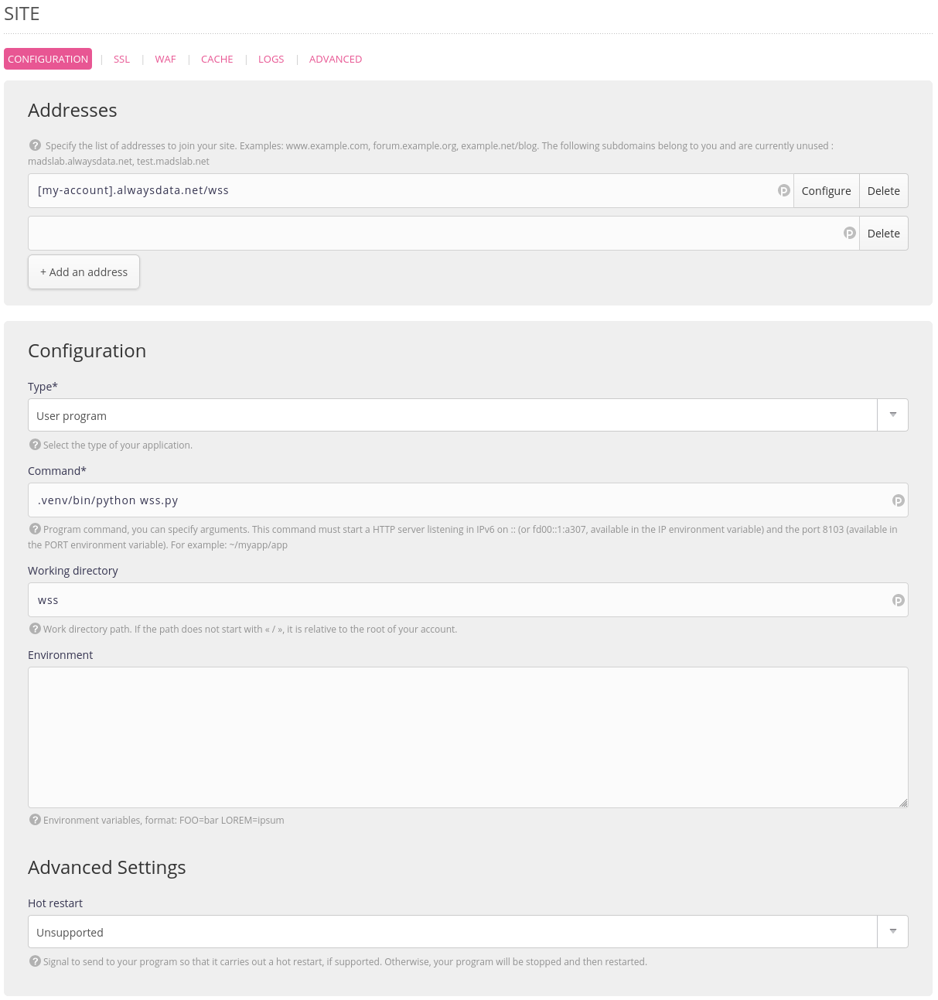
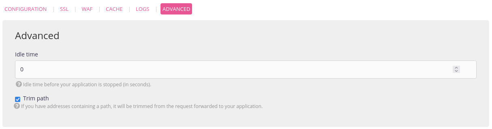
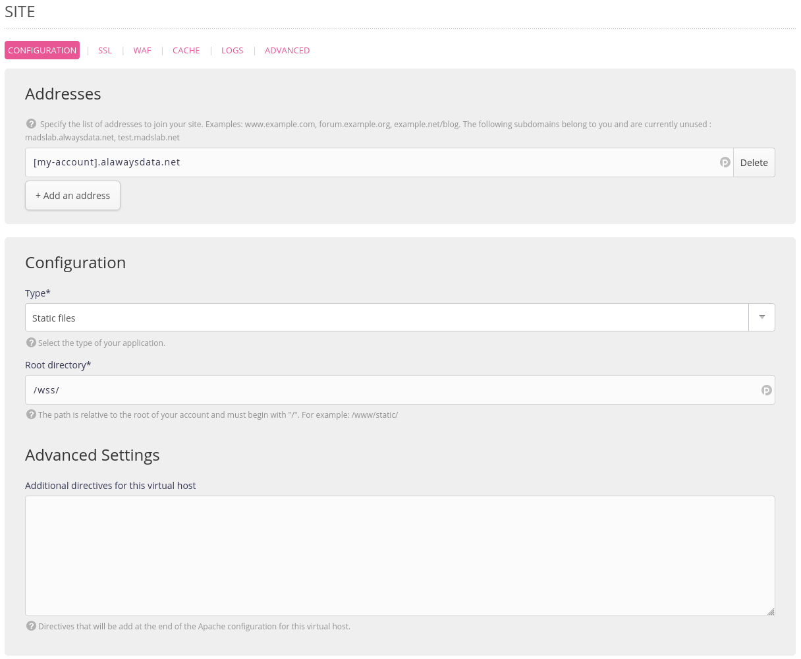

Created by [WHATWG](https://websockets.spec.whatwg.org/) in 2011 and standardized by [IETF](https://datatracker.ietf.org/doc/html/rfc6455) in the same year, the [WebSocket](https://en.wikipedia.org/wiki/WebSocket) protocol has been providing web application developers with the ability to break free from the traditional TCP Client/Server model for real-time data transfer for over 10 years.

In the initial model, the client requests a resource from the server, the server returns it, and the communication ends. It is not possible for the server to easily “push” messages to the client (such as notifications).

WebSocket provides support for bidirectional communication (known as *full-duplex*) in which the server can now spontaneously “push” data to the client, and where the client can subscribe to messages that interest them and react to them later. Application interactivity, directly in the browser!

In 2023, how does hosting a WebSocket server application work?


## When A Stanger Calls

Let’s get back to basics: WebSocket is a network protocol in the application layer (in the famous [OSI model](https://en.wikipedia.org/wiki/OSI_model)). You don’t need to be a networking expert to use it, so everything will happen at the code level. It uses a traditional TCP connection between the client and server and the HTTP architecture.

To put it simply:

1. The client will request the initial application resource (HTML + JS) from the server.
2. This resource will be responsible for establishing communication with the WebSocket server to receive notifications.
3. The WebSocket server will register the client as a recipient and push relevant data to them when necessary.
4. The client, which was previously waiting, will receive data streams from the server and can process this data.

Note that in WebSocket, there is *Web*: the architecture is no different from traditional web applications. We still use HTTP/TCP, we just use a different application protocol. This means that we will need to use dedicated libraries.

## The Service That Does “Pong”

There are plenty of libraries that can provide WebSocket support in almost all available web languages. For the purpose of this demonstration[^1], we will implement a small WebSocket server in Node.js and then in Python. You are free to implement it in PHP, Ruby, Java, Perl, etc.

Our example is very simple: once connected, our client will be able to send the `ping` message to the server, which will then send `pong` back to all connected clients one second later. This simple example demonstrates the interactivity between all connected elements (i.e. *broadcasting*) of our application.

### With Node.js…

Currently, the most reputable library for creating a WebSocket server application in Node.js is [websockets/ws](https://github.com/websockets/ws). Add the `ws` package to your project using `npm`[^2], and create a `wss.js` file for your WebSocket server:

```javascript
import WebSocket, { WebSocketServer } from 'ws';
 
const wss = new WebSocketServer({
  host: process.env.IP || '',
  port: process.env.PORT || 8080
});
```

We can attach the WebSocket server to the `IP`/`PORT` pair exposed in the environment variables for more flexibility, with a fallback to port `8080` for ease of development.

Our server is ready, now it needs to be equipped with its functionalities. First and foremost, it should be able to receive client connections.

```javascript
wss.on('connection', (ws) => {
  // log as an error any exception
  ws.on('error', console.error);
});
```

Next, when a client sends the `ping` message, the server should respond with `pong` to all active clients.

```javascript
wss.on('connection', (ws) => {
  /* ... */
  ws.on('message', (data) => {
    // only react to `ping` message
    if (data != 'ping') { return }
    wss.clients.forEach((client) => {
      // send to active clients only
      if (client.readyState != WebSocket.OPEN) { return }
      setTimeout(() => client.send('pong'), 1000);
    });
  });
});
```

That’s all. To launch the WebSocket server, simply run the `wss.js` file with Node.js:

```	shell
$ node wss.js
```

### … or with Python!

To change things up from the usual examples, let’s create the same WebSocket server in Python using *asyncio* and [websockets](https://pypi.org/project/websockets/). Start by installing the `websockets` package using `pip` in your venv, and then create a `wss.py` file:

```python
#!/usr/bin/env python
 
import os
 
import asyncio
import websockets
 
 
async def handler(websocket): pass
 
 
async def main():
    async with websockets.serve(
        handler,
        os.environ.get('IP', ''),
        os.environ.get('PORT', 8080)
    ):
        # Run forever
        await asyncio.Future()
 
 
if name == "__main__":
    asyncio.run(main())
```

Now let’s define our functionalities: registering clients, and broadcasting the message when a `ping` is received. Add to the `handler` method which contains the logic for our server:

```python
connected = set()
 
 
async def handler(websocket):
    if websocket not in connected:
        connected.add(websocket)
    async for message in websocket:
        if message == 'ping':
            await asyncio.sleep(1)
            websockets.broadcast(connected, 'pong')
```

### The Web Client Side

Our client will be simple: a web page with JavaScript that connects to the WebSocket server, sends a `ping` on connection, and has a method to manually send a new `ping`.

Create an `index.html` file for your client:

```xhtml
<!DOCTYPE html>
<script>
    WS_SERVER = 'localhost:8080'
    dateFormatter = new Intl.DateTimeFormat('en-US', {
        hour: "numeric",
        minute: "numeric",
        second: "numeric"
    })
 
    const websocket = new WebSocket(`ws://${WS_SERVER}/`)
 
    const ping = (msg) => {
        msg = msg || 'ping'
        console.log("Send message", msg)
        websocket.send(msg)
    }
 
    websocket.addEventListener('message', ({data}) => {
        console.log("Recv message", data, dateFormatter.format(Date.now()))
    })
 
    websocket.addEventListener('open', () => ping())
</script>
<p>Open the developer console and run the <code>ping()</code> function</p>
```

Start your WebSocket server (Python or Node.js), and open this HTML page with the developer tools open. You should see `ping`/`pong` messages appear in the console. Try manually executing the `ping()` function in the developer tools.

Now open this HTML page again in another tab, with the developer tools open. Execute the `ping()` function in either tab. Both will receive the pong from the server.

Congratulations, you have achieved a basic level of bidirectional broadcast communication between the client and server in *full-duplex* via WebSocket!


## Noot Noot: WebSite or WebService ?

We now need to deploy this WebSocket server and client in a production environment.

At **alwaysdata**, we offer several solutions for deploying tools that need to be executed for long periods of time and accessed by clients in the future: *Sites* and *Services*.

For *Sites*, it’s straightforward: deploying a web server (Apache, WSGI, Node, etc.) that will be requested later by a client to obtain various resources via HTTP. This is the traditional historical web.

*Services*, on the other hand, are designed to run long processes that can potentially be accessed other than via HTTP, within the environment of your account (such as a Git repository server over SSH with [soft-serve](https://github.com/charmbracelet/soft-serve), or a monitoring/filtering system for messaging.)

So, for a WebSocket server, should you use *Sites* or *Services*?

While one might imagine that Services are the right place — *for a long-running process that can be accessed from outside* — I will repeat this here: WebSocket includes *Web*! The WebSocket protocol is software that uses HTTP/TCP, just like any *Site*.

### A plan that comes together

Our application consists of two parts: a client and a WebSocket server. The WebSocket server cannot serve as a resource like a traditional web server (that’s not its role), so you will need two sites:

1. A *Static files* type site that will serve your `index.html` client.
2. A second site adapted to the language of your WebSocket server to execute it.

For the WebSocket server, use an address of the type: `[my-account].alwaysdata.net/wss`. Your WebSocket client must connect to this address. Make sure the *Trim path* option is enabled as the server is hosted behind a `pathUrl`. You may need to set the value of the *idle time* to `0` to ensure that it will never be stopped by the system, and to keep the connections to the clients active, even in case of prolonged inactivity.




Update the `index.html` file to specify the WebSocket server URL in the `WS_SERVER` variable. Then create a *Static files* site with the address `[my-account].alwaysdata.net` to serve this file.



Head to this address: your WebSocket communication is up and running!


This article is, of course, only an introduction to the concepts of WebSocket, but it highlights several fundamental elements:

1. WebSocket enables bi-directional and simultaneous multi-client communication.
2. A WebSocket server runs in parallel with the application’s Web server. The latter is responsible for distributing the application to the browser, which will then start it; but it is the former that is responsible for the transit of business data flows.
3. Even though it seems to be a different protocol, WebSocket exploits the fundamentals of the Web, its underlying building blocks, and its robust protocols.

You don’t need to be a network expert to develop with WebSocket. You will use what you already know well from the *Web*, with its event model.

It’s up to you to find the right uses that suit your needs; to add data processing; to transit JSON or binary formats; to support authentication… Everything you already know how to do on the Web is applicable.

Happy coding!

[^1]: and to avoid always doing the same thing
[^2]: or pnpm or yarn
