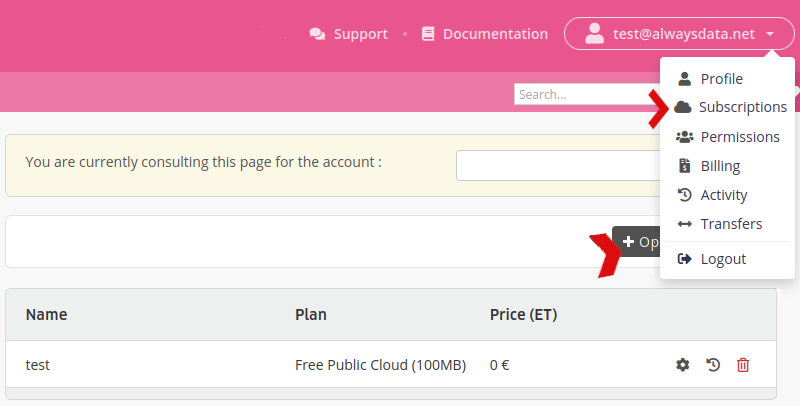
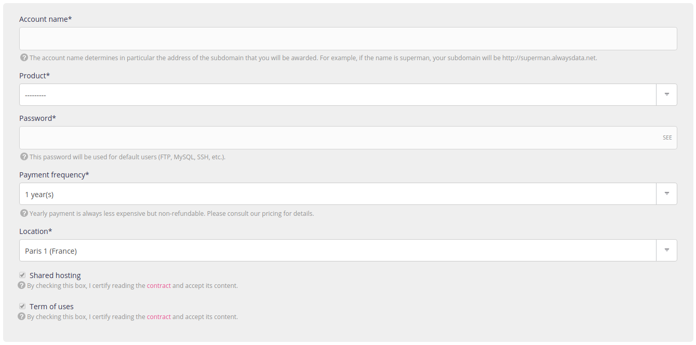

Go to the **Subscriptions** menu in your client interface.

After clicking on **Open a new account** you will see a form for choosing:
- its name,
- its location: Public Cloud, Private Cloud,

if Public Cloud:
- the product (pack),
- payment frequency (monthly or yearly).

