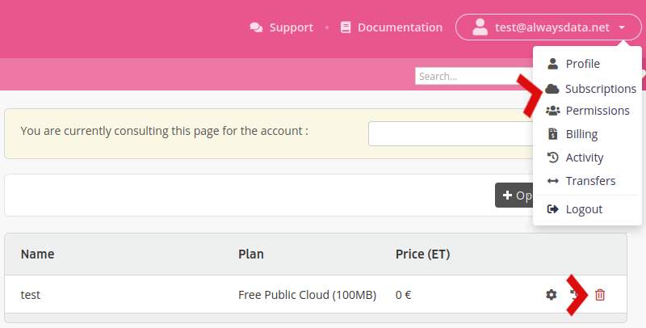

You can delete an *account* (e.g. `my_project`) or your *profile* (e.g. `<name@example.org>`, the `my_project` account owner).

In the first case, go to the **Subscriptions** menu and click on the *trash* for the account to delete.

This will delete all of the domains, e-mail addresses, websites, files, databases (...) linked to this account.

> [!NOTE]
> Only the **account owner** can perform this action. Furthermore, no refunds are provided for early deletion.

- [How to delete its profile](/en/docs/admin-billing/profile/delete-profile)
