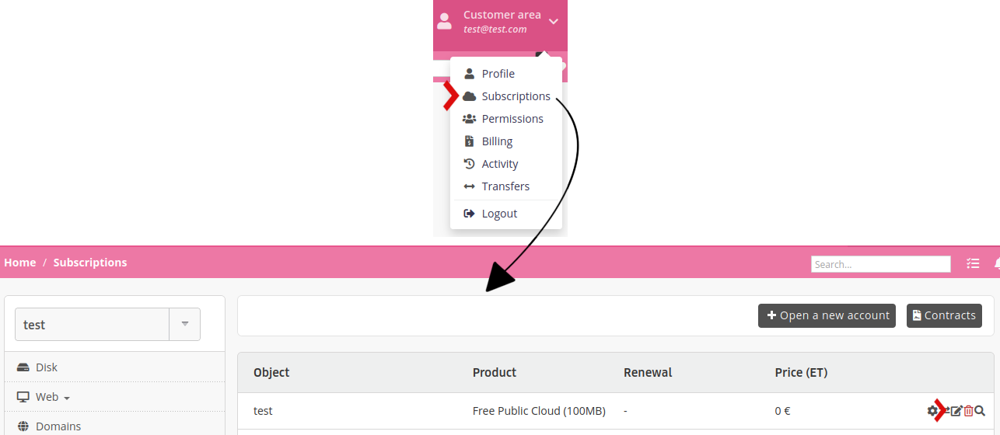
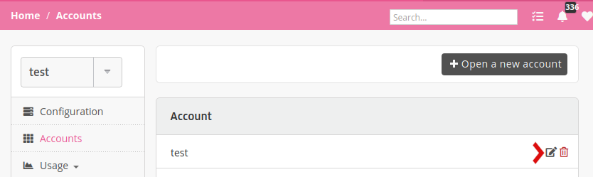
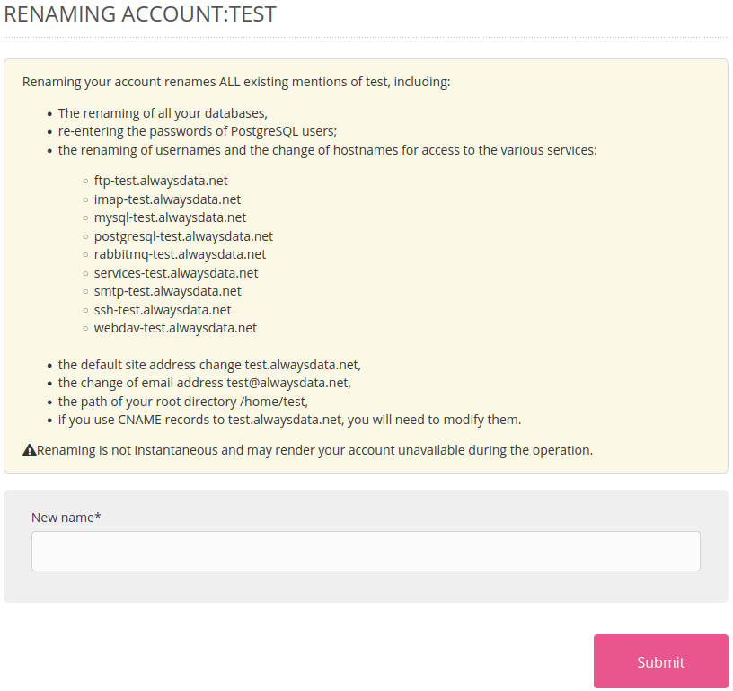

If the name of an account is no longer appropriate (name change, spelling error, etc.), you can change it.

> [!WARNING]
This is an **advanced** feature. Renaming an account changes many elements: default addresses, hostnames to different services, databases, users, root directory path…  
> As a result, you'll *certainly* have to make configuration changes in your applications, and this can make services *temporarily unavailable*.

Go to:

- in the **Subscriptions** menu of your **Customer area** for accounts on the *Public Cloud*

- in the **Accounts** menu of the **server** menu for accounts on the *Private Cloud*

The new account name will then be requested:

> [!NOTE]
> Only the **account owner** can perform this action.
