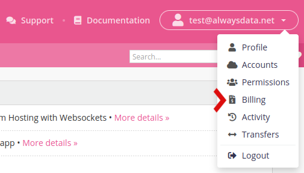

An invoice is issued a few hours after subscribing to an alwaysdata service (hosting, IP address, etc.).

You have **30 days** to pay it in **Billing > Transactions > Credit the account** or **Billing > Payment methods > Credit the account** using various [payment methods](billing/payment-methods).

- [Choose your hosting plan](/en/docs/admin-billing/billing/choose-its-paas)
- [Private Cloud prices](/en/docs/admin-billing/billing/private-cloud-prices)
- [Public Cloud prices](/en/docs/admin-billing/billing/public-cloud-prices)

* [Sponsorship](/en/docs/admin-billing/billing/sponsorship)
* [Discount Programs](/en/docs/admin-billing/programs)
* [Chorus Pro](/en/docs/admin-billing/billing/payment-methods#chorus-pro)

- [Change plan](/en/docs/admin-billing/billing/upgrade-your-plan)
- [Interventions fees](/en/docs/admin-billing/billing/servers-interventions)
- [Miscellaneous questions](/en/docs/admin-billing/billing/misc)

All of your invoices and receipts can be downloaded in `zip` archive from the **Billing > Transactions** tab.

Our subscriptions are subject to tacit reconduction and automatically renewed.
