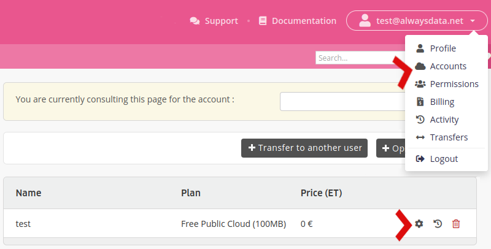

To change the offer, go to **Subscriptions > Edit - ⚙️ the relevant account**:

You can change the *[pack](/en/docs/admin-billing/billing/public-cloud-prices)* and the *commitment period*. The invoice for the new subscription is generated the next day and you will have 30 days to pay it.

In the following cases, contact [support](https://admin.alwaysdata.com/support/add/):

- Take a [Private Cloud](/en/docs/admin-billing/billing/private-cloud-prices) (or change its configuration / commitment period),
- Move the accounts to a Private Cloud server (and vice versa): the accounts are "black boxes" that the support team can easily move from one server to another without touching its content,
- Change the commitment period for an IP subscription.

## Prorata refund

A prorata refund is automatically made to the *prepaid account*:

- when changing to a higher or lower offer,
- when migrating accounts to a Private Cloud.

This refund can only be used to pay future invoices.

> [!NOTE]
> No refund is made when changing for the free pack - contact [support](https://admin.alwaysdata.com/support/add/) so that they can assess your situation.
