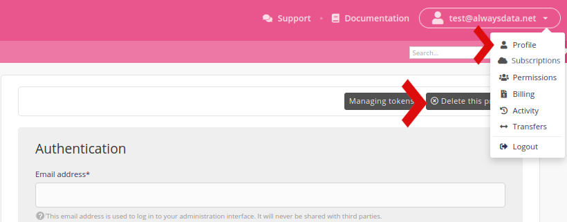

You can delete an *account* (e.g. `my_project`) or your *profile* (e.g. `<name@example.org>`, the `my_project` account owner).

In the second case, go to the **Profile** menu and click on *Delete this profile*.

This will delete all of the accounts and servers attached as well as your history.

> [!WARNING]
> Once this operation is done there is no way to undo it.

- [How to delete an account](/en/docs/admin-billing/accounts/delete-account)
