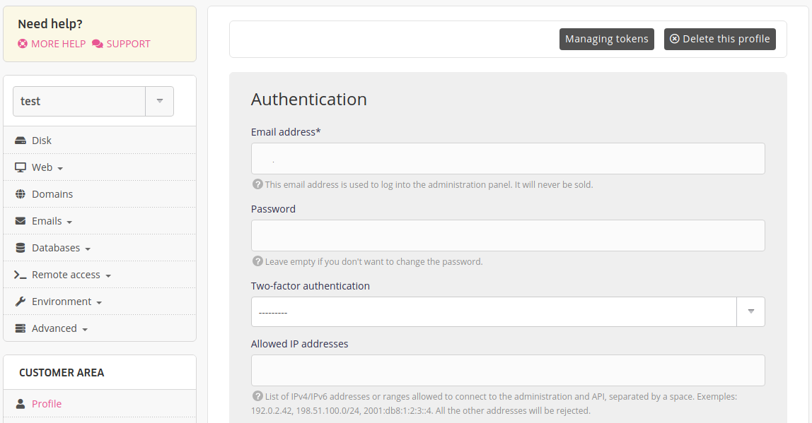

To allow access to the alwaysdata administration interface by some IP addresses only, go to **Profile**.

Access will be blocked for any other connection from an IP address that is not filled-in.

> [!NOTE]
> If you made a mistake - or change - of access IP addresses send an email to *contact[at]alwaysdata.com* to deactivate it. [A verification will be carried out](/en/docs/admin-billing/profile/admin-access-loss#blockage-related-to-ip-restrictionhahahugoshortcode-s1-hbhb).
