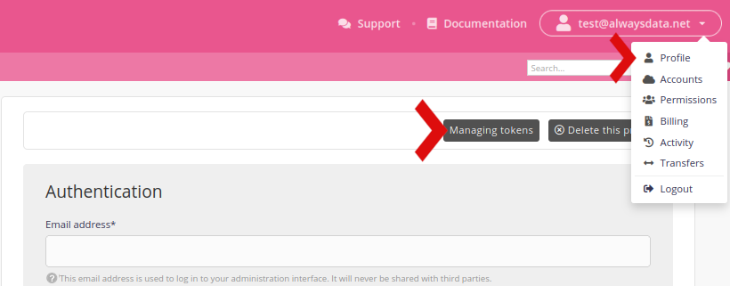

Tokens are identifiers used to authenticate a user or a program calling our [API](/en/docs/development/api).

They can be generated in the **Profile** menu.

It is necessary to have enabled [two-factor authentication](/en/docs/admin-billing/profile/two-factor-authentication) to generate/modify your tokens.

> [!TIP]
> For even more security generate one per application.

As for the alwaysdata administration interface you can give access to only [few IPs](/en/docs/admin-billing/profile/ip-access-authorization).

They have the same [permissions](/en/docs/admin-billing/permissions) as the profile they are linked to.
