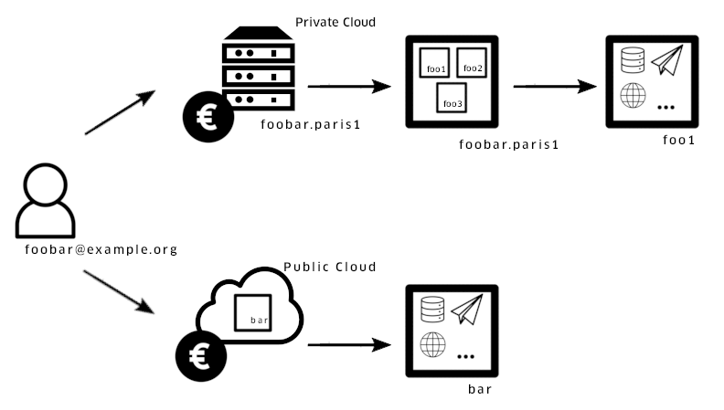
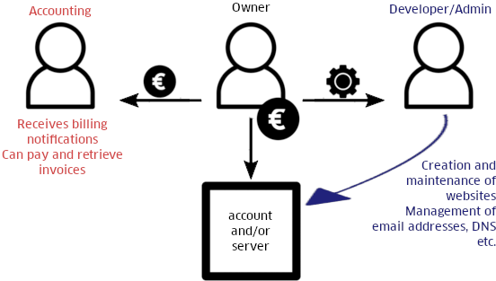
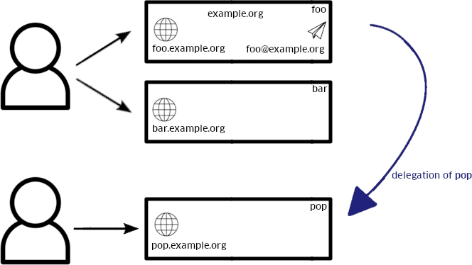

An alwaysdata user, named **profile** is represented by an email address used to log in to the [administration interface](https://admin.alwaysdata.com).

This user *can* be the owner of **accounts** on our [Public Cloud](/en/docs/admin-billing/billing/public-cloud-prices) as well as **[servers](/en/docs/admin-billing/billing/private-cloud-prices)** on which they can create accounts. Each **account** is *isolated* from one another.

On these **accounts**, it is possible to manage [domains](/en/docs/domains/), host [email addresses](/en/docs/e-mails/), [websites](/en/docs/web-hosting/sites), [databases](/en/docs/web-hosting/databases), or other applications.

They can also have **[permissions](/en/docs/admin-billing/permissions)** on other alwaysdata profiles.

Hosted email addresses are linked to domains. They are *always* on the same account as the domain.

[Site addresses](/en/docs/web-hosting/sites/add-a-site/#addresses) *can* also be linked to domains. If so, they can be:
- on the same account;
- on another account of the same profile alwaysdata;
- [delegated](/en/docs/domains/delegate-a-subdomain) to an account in another alwaysdata profile.

> Icons: The Noun Project
