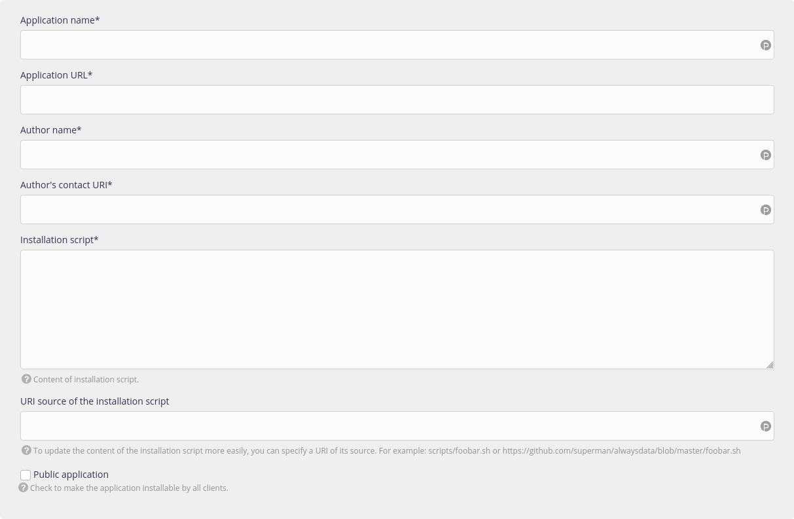

Any user may propose a script in the *language of their choice* allowing users to install their application. This script will be run with the *permissions for the account where installation took place* and must start with a YAML format comment.



Scripts comprise two parts:

- the YAML format **dataset** for configuring the site and requesting the information required by the script (the `FORM_*` variables) from the user. It can be split into four:

    - **site**: refer to the [API documentation](https://api.alwaysdata.com/v1/site/doc/) that restates all of the possible options.
    - **database**: mysql, postgresql, couchdb, rabbitmq.
    - **requirements**: specify limiting requirements which blocks their installation on certain plans.
    - **form**: all of the variables requested from the user creating the site. Example: site title, administrator ID, e-mail address, administrator's name, etc.
- the actual **script**.

## Environment variables

|Variables|Description|Example|
|--- |--- |--- |
|USER|Account name|`foo`|
|HOME|Account root for the script|`/home/foo/example/`|
|APPLICATION_NAME|Application name||
|INSTALL_URL|Site address|`foo.example.net/test`|
|INSTALL_URL_PATH|Site root (base URL)|`/test`|
|INSTALL_URL_HOSTNAME|Site host name|`foo.example.net`|
|INSTALL_PATH_RELATIVE|Relative path from the account root (without final slash)|`example`|
|INSTALL_PATH|Absolute path (without final slash)|`/home/foo/example`|
|DATABASE_USERNAME|Database connection user (managed automatically)|`foo_*`|
|DATABASE_PASSWORD|User password for database connection (managed automatically)||
|DATABASE_NAME|Site database (managed automatically)|`foo_*`|
|DATABASE_HOST|Host name for database server connection|`mysql-foo.alwaysdata.net` (base MySQL)|
|SMTP_HOST|Host name for mail sending server connection|`smtp-foo.alwaysdata.net`|
|RESELLER_DOMAIN|Root domain used by the hosting provider|`alwaysdata.net`|
|FORM_*|Other variables explicitly requested from the user in the "form" section in the YAML dataset||
|PORT|Specific port for User program, Node.js, Elixir, .NET or Deno type sites||
|`::` or IP|Specific port for User program, Node.js, Elixir, .NET or Deno type sites (prefer `::` to IP)||

If other variables are needed, open a [support ticket](https://admin.alwaysdata.com/support/add/).

### Notes and tips

- The script needs to start with `set -e` to stop it when it fails,
- Specify the **version of the language used** (PHP, Python, Ruby, Node.js and Elixir). This is recommended to avoid being dependent on the default account configuration,
- The root directory specified by the user (`INSTALL_PATH`) serves as the root for a script (an `export HOME=` is run by default),
- To make an installation script public, you must specify the `disk` condition in the `requirements`,
- It is preferable to request a minimum amount of information to avoid making the script an exhaustive one. *Users may change the configuration of their application later on.*
- To add an **optional** form field, set the `required` option to `false`. If the user does not specify anything, the field remains blank,
- *Labels* and *regex_text* are translatables. Depending on the language chosen in its alwaysdata administration interface, the user can have the form questions in the specified languages.

> [!NOTE]
> To make a script accessible to alwaysdata platform users, check the box to make it *public*.
> **Any script marked as public must be maintained and will at least be checked by the alwaysdata team.**


> [!TIP]
> A *deposit URL* may be provided to make maintenance easier. In this case, once the changes are pushed to the deposit all that remains is to update the application via the button provided.


## Examples

1. Odoo installation script

```
#!/bin/bash

# Declare site in YAML, as documented on the documentation: https://help.alwaysdata.com/en/marketplace/build-application-script/
# site:
#     type: user_program
#     working_directory: '{INSTALL_PATH_RELATIVE}'
#     command: '.venv/bin/python odoo-bin --config=.odoorc --http-port=$PORT'
# database:
#     type: postgresql
# requirements:
#     disk: 1400

set -e

# https://www.odoo.com/documentation/19.0/administration/install/source.html
# https://www.odoo.com/documentation/19.0/administration/on_premise/deploy.html#builtin-server
# https://www.odoo.com/documentation/19.0/developer/reference/cli.html

export PYTHON_VERSION=3.13
export NODEJS_VERSION=24

git clone -b 19.0 --depth 1 https://github.com/odoo/odoo.git .

npm install -g rtlcss

# Create virtualenv & install dependancies in it
python -m venv .venv
source .venv/bin/activate

pip install --upgrade pip
pip install -r requirements.txt

mkdir -p odoo-data

# Configuration
cat << EOF > .odoorc
[options]
db_name = $DATABASE_NAME
db_user = $DATABASE_USERNAME
db_password = $DATABASE_PASSWORD
db_host = $DATABASE_HOST
addons_path = $INSTALL_PATH/addons
data_dir = $INSTALL_PATH/odoo-data
email_from = $USER@$RESELLER_DOMAIN
http_interface = ::
EOF

# Install
python odoo-bin --config=.odoorc --init --no-http --stop-after-init

# Default credentials for first login: admin / admin
```

The `disk:1400` condition specifies that the Odoo installation requires 1400 MB of disk space. The Free plan is therefore too tight.

2. Backdrop installation script

```
#!/bin/bash

# Declare site in YAML, as documented on the documentation: https://help.alwaysdata.com/en/marketplace/build-application-script/
# site:
#     type: php
#     path: '{INSTALL_PATH_RELATIVE}'
#     php_version: '8.5'
# database:
#     type: mysql
# requirements:
#     disk: 60
# form:
#     language:
#         type: choices
#         label:
#             en: Language
#             fr: Langue
#         choices:
#             de: Deutsch
#             en: English
#             es: Español
#             fr: Français
#             it: Italiano
#     site_name:
#         label:
#             en: Site name
#             fr: Nom du site
#         max_length: 255
#     email:
#         type: email
#         label:
#             en: Email
#             fr: Email
#         max_length: 255
#     admin_username:
#         label:
#             en: Administrator username
#             fr: Nom d'utilisateur de l'administrateur
#         regex: ^[ a-zA-Z0-9.+_-]+$
#         regex_text:
#             en: "It can include uppercase, lowercase, numbers, spaces, and special characters: .+_-."
#             fr: "Il peut comporter des majuscules, des minuscules, des chiffres, des espaces et les caractères spéciaux : .+_-."
#         max_length: 255
#     admin_password:
#         type: password
#         label:
#             en: Administrator password
#             fr: Mot de passe de l'administrateur
#         min_length: 5
#         max_length: 255

set -e

# https://docs.backdropcms.org/documentation/system-requirements
# https://github.com/backdrop-contrib/bee/wiki/Usage

wget --no-hsts https://github.com/backdrop-contrib/bee/releases/download/1.x-1.1.0/bee.phar
php bee.phar download-core
php bee.phar install --db-name=$DATABASE_NAME --db-user=$DATABASE_USERNAME --db-pass=$DATABASE_PASSWORD --db-host=$DATABASE_HOST --username=$FORM_ADMIN_USERNAME --password=$FORM_ADMIN_PASSWORD --email=$FORM_EMAIL --site-mail=$USER@$RESELLER_DOMAIN --langcode=$FORM_LANGUAGE --site-name=$FORM_SITE_NAME --auto
```

Use the `regex_text` condition to explain the `regex` with words.
