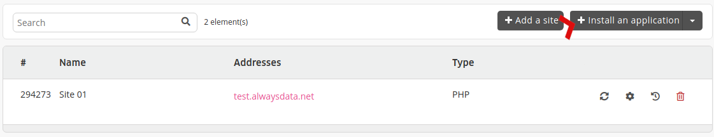

Deploy applications or frameworks quickly and easily in your user space.

Applications are implemented with a standard secure configuration. Then it is up to you to change, update or customize your installation later on.

The system creates their directories during the installation.

* [Change a website address](/en/docs/web-hosting/sites/change-a-website-address)

> [!TIP]
> If our marketplace does not offer what you are looking for, install it by hand and automate its deployment by building an [application installation script](/en/docs/development/marketplace/build-application-script).

## Guides

- [Drupal](/en/docs/development/marketplace/drupal)
- [Joomla](/en/docs/development/marketplace/joomla)
- [Odoo](/en/docs/development/marketplace/odoo)
- [PrestaShop](/en/docs/development/marketplace/prestashop)
- [WordPress](/en/docs/development/marketplace/wordpress)
