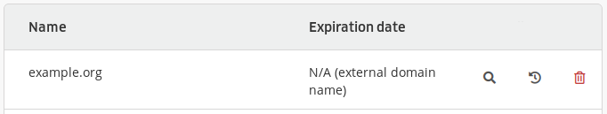

An operation that is free, this allows transferring the domain’s *technical* management without touching its *administrative* management (its registrar). If you wish to move all of the management to alwaysdata, use a [domain transfer](/en/docs/domains/transfer-a-domain).

Here we wish to add the domain and **change of DNS servers** at the registrar to put `dns1.alwaysdata.com` and `dns2.alwaysdata.com`.

1.  From your administration interface, go to **Domains > Add a domain**;
    

2.  Fill-in the domain names that you wish to add,
    

> [!INFO]
> Enter the domain only, without the subdomain. For example: `example.org` and not `www.example.org`.

3.  Choose to **manage** it.
    

This will add the domain as an *external domain* in the list.

Then you can create [e-mail addresses](/en/docs/e-mails/create-an-e-mail-address), [websites](/en/docs/web-hosting/sites/add-a-site) and manage [DNS records](/en/docs/domains/add-dns).

> [!WARNING]
> If some DNS records are to be kept - for example not to change email providers - the [DNS zone](/en/docs/domains/add-dns) will need to be prepared before making the DNS server change.
