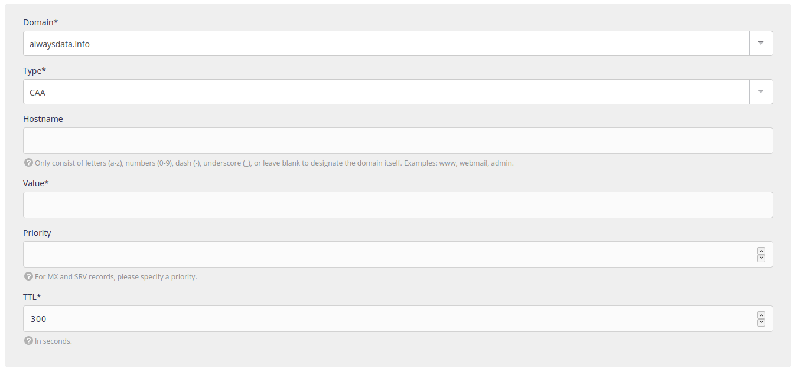

A [CAA record](https://en.wikipedia.org/wiki/DNS_Certification_Authority_Authorization) lists the certification authorities approved to issue certificates for a domain. Any certification authority that is not listed in a CAA record of a domain, will not be allowed to issue certificates for that domain or any subdomain.

1.  Go to **Domains > Details of [example.org] - 🔎 > DNS records**,
    

2.  Choose **Add a DNS record**,

3.  Fill-in the form. 
    

> [!WARNING]
> Do not put the root into the **Hostname**.
> For example, by putting `www.example.org` in this box, you will create a record for `www.example.org.example.org`.


Three tags are available:
- `issue` which allows an authority,
- `issuewild` which allows an authority for wildcard certificates,
- `iodef` which gives a URL that certification authorities can contact in case of problems.

> [!NOTE]
> [Let's Encrypt certificates](/en/docs/web-hosting/sites/ssl-tls/lets-encrypt) are generated for every HTTP address hosted on our servers. They must be authorized.


## Some examples

-  Let's Encrypt authorization:

    ```
    » Hostname: [leave blank]
    » Value: 0 issue "letsencrypt.org"
    » TTL: 300
    ```

----
* [RFC 6844](https://tools.ietf.org/html/rfc6844)
