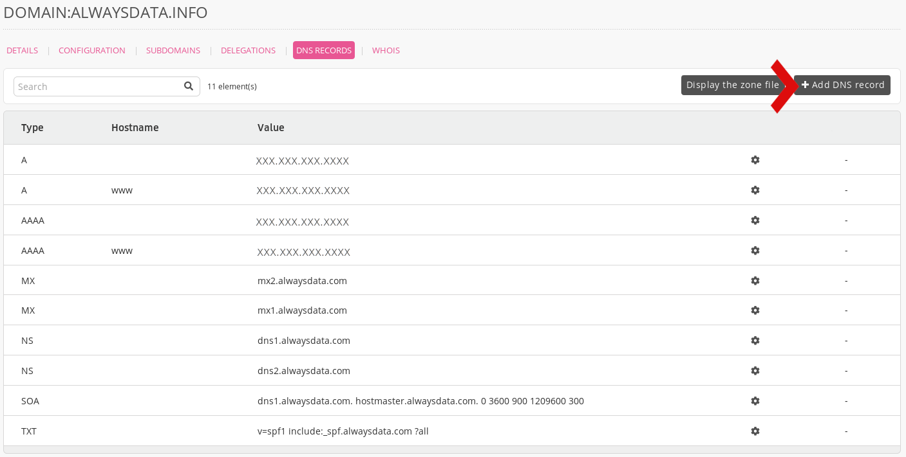
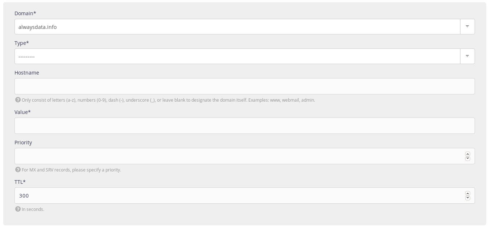
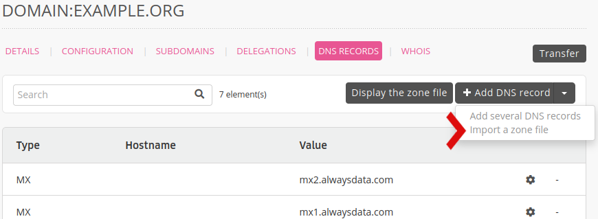

1.  Go to **Domains > Details of [example.org] - ⚙️ > DNS records**,
    

2.  Choose **Add a DNS record**,

3.  Fill-in the form.
    

> [!WARNING]
> Do not put the root into the **Hostname**. For example, by putting `example.org` in this box, you will create a record for `www.example.org.example.org`.

> [!NOTE]
> A record with `@` as hostname for some providers is the empty subdomain. In our case, the **Hostname** box should be empty.

- [Add a SRV record](/en/docs/domains/add-srv-record)
- [Add a CAA record](/en/docs/domains/add-caa-record)
- [Use external MX](/en/docs/domains/use-external-mx)

## Import a zone file

A DNS zone file is a text file that contains details of every DNS records. It follows a standard format, making it suitable for transferring DNS records from one provider to another.

That will erase the previously added DNS records.

## Resources

- [List of DNS record types](https://en.wikipedia.org/wiki/List_of_DNS_record_types)
- [Add several DNS records with CSV](/en/docs/domains/create-dns-records-using-csv)
