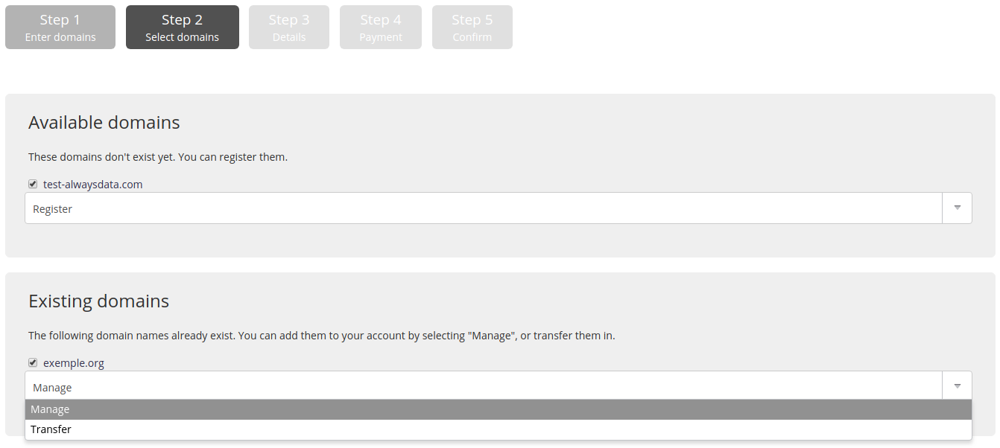
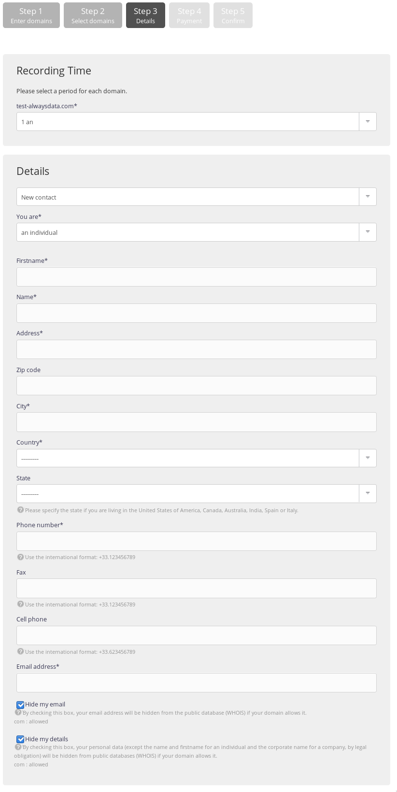

1.  From your administration interface, go to **Domains > Add a domain**,
    

2.  Fill-in the domain names that you wish to buy,
    

> [!NOTE]
Enter the domain only, without the subdomain.
> For example: `example.org` and not `www.example.org`.

3.  Choose *save*. **Buy** may not be offered: when the domain already exists, if alwaysdata does not handle the extension, if the domain is already recorded for another alwaysdata account, etc.
    

4.  Choose the *existence duration* for the domain. It may be renewed again later on, and

5.  Enter the owner’s contact information. This information depends on the extension taken.
    

> [!NOTE]
> The domain will be created a few minutes after payment.

- [Prices](https://www.alwaysdata.com/en/domains/#main)

## What domain extension should I choose?

There are many extensions available. Some are geographic and attached to a country or an institutional area, others are generic ones. The extension you choose will depend on your requirement, your budget, as well as the owner’s nationality.
