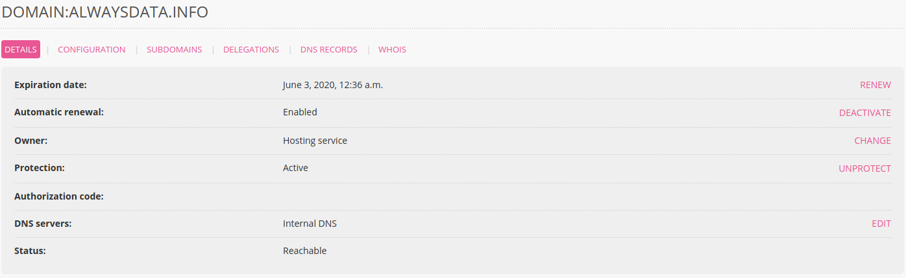
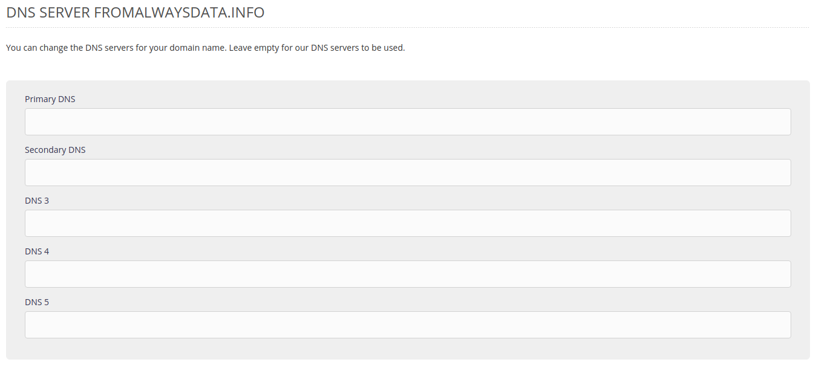

The [DNS servers](https://en.wikipedia.org/wiki/Domain_Name_System) define which servers to contact for every service. Therefore they are defined at the registrar - the provider that handles the domain’s administrative management.

1.  Ask your new provider for their DNS servers,
2.  From your administration interface, go to **Domains > Details** for the relevant domain and **> Modify** its DNS servers,
    
3.  Specify the addresses for your new DNS servers. 
    
    
> [!NOTE]
> When the DNS server fields are empty, the domain uses the alwaysdata DNS servers.
