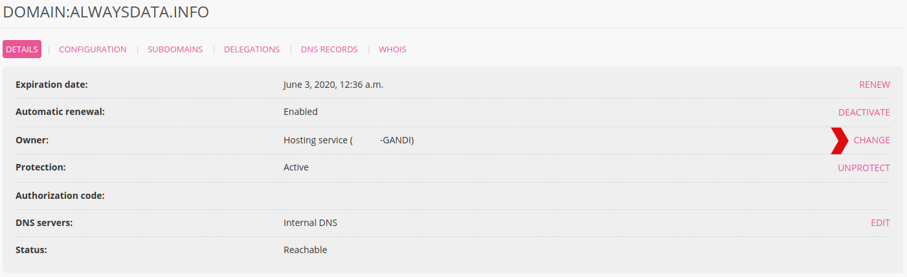

Go to **Domains > Details of [example.org] - 🔎 > CHANGE** (opposite **Owner**). This brings you to a form where you can fill-in the data on the new owner.

A confirmation e-mail is sent to both parties. *Check the e-mail addresses before starting the operation*.

There is a charge for this operation for the following extensions: _.am_, _.be_, _.me.uk_.

If you just want to update the address, phone number or email address, you can simply [update owner information](/en/docs/domains/update-owner-details).
