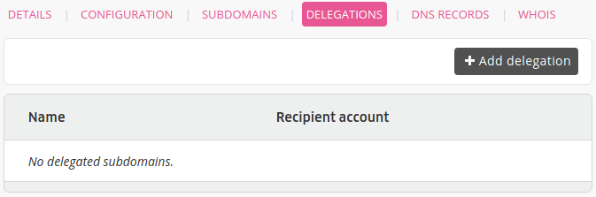
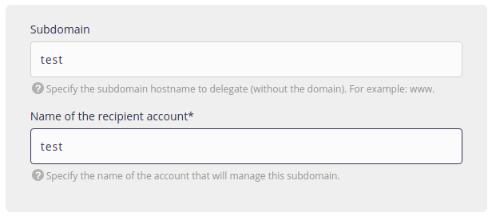
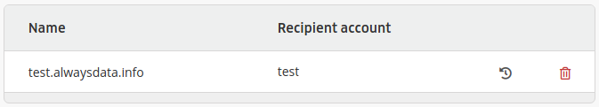

To allow another alwaysdata user to use a subdomain belonging to your domain, you need to grant them permission.

To do this, go to **Domains > Details of [example.org] - 🔎 > Delegations > Add a delegation**.

> [!NOTE]
> Do not place the root in **Subdomain**.
> For example, by putting `www.example.org` in this box, you will create a delegation for `www.example.org.example.org`.

