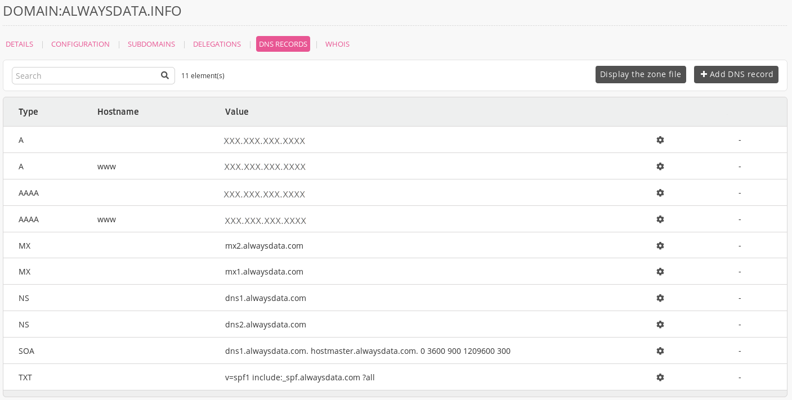
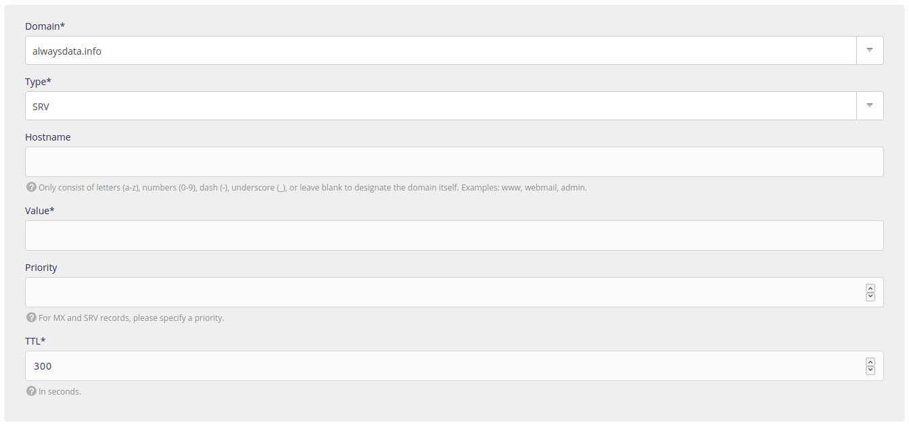

An [SRV record](https://en.wikipedia.org/wiki/SRV_record) defines the location of specific services.

1.  Go to **Domains > Details of [example.org] - 🔎 > DNS records**,
    

2.  Choose **Add a DNS record**,

3.  Fill-in the form. 
    

> [!WARNING]
> Do not put the root into the **Hostname**.
> For example, by putting `www.example.org` in this box, you will create a record for `www.example.org.example.org`.


## Some examples

-   Automatically configure a mail client with `_autodiscover._tcp`:
    ```
    » Hostname: _autodiscover._tcp
    » Value: 0 443 address.server.mail
    » Priority : 1
    » TTL: 300
    ```
  
-   Use Lync (formerly Skype) with `_sip._tls` and `_sipfederationtls._tcp` :
    ```
    » Hostname: _sip._tls
    » Value: 1 443 sipdir.online.lync.com
    » Priority : 100
    » TTL: 3600
    ```
    ```
    » Hostname: _sipfederationtls._tcp
    » Value: 1 443 sipfed.online.lync.com
    » Priority: 100
    » TTL: 3600
    ```
