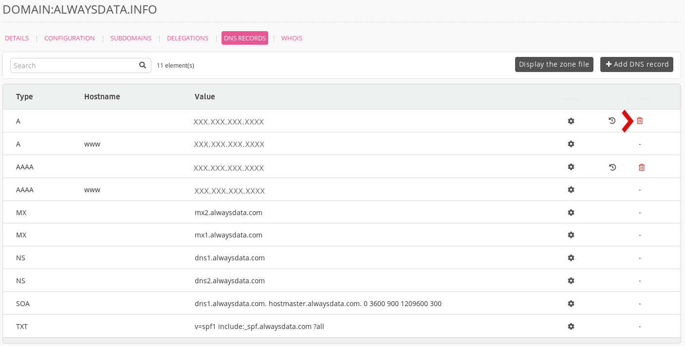

1.  Go to **Domains > Details for [example.org] domain - 🔎 > DNS records**,

2.  Click on the **trash** corresponding to the record to delete.
    

> [!NOTE]
> The records created by default by our system (e.g. by adding an address in **Web > Sites**) cannot be *deleted* but you may *overwrite* them by [adding a DNS record](/en/docs/domains/dns-management/add-dns) for the relevant host name.
