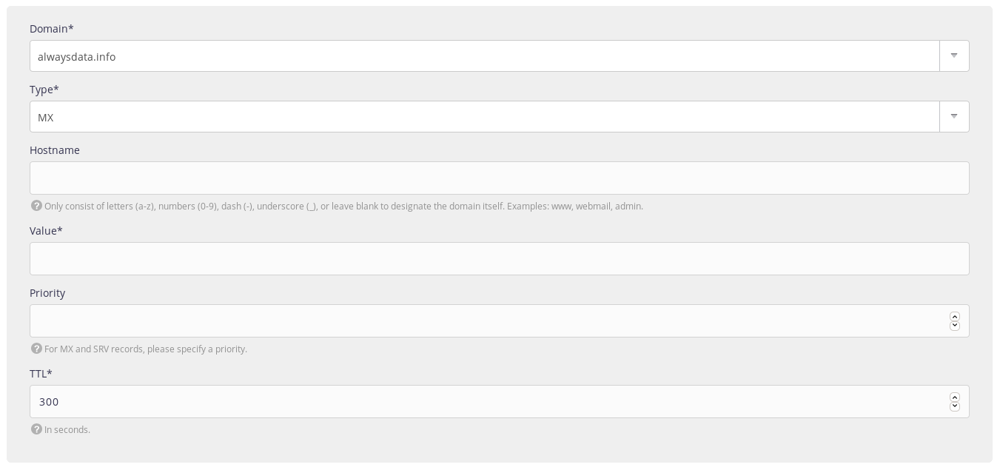

To use a message server belonging to another provider, change the [MX records](https://en.wikipedia.org/wiki/MX_record). These determine the server used to receive e-mail.

1.  Go to **Domains > Details of [example.org] - 🔎 > DNS records** ;
    

2.  Choose **Add a DNS record**,

3.  Fill-in the form.
    
    This will automatically disable our MX records.

> [!WARNING]
> Do not put the root into the **Hostname**. For example, by putting `example.org` in this box, you will create a record for *example.org.example.org*.

> [!NOTE]
> A record with `@` as hostname for some providers is the empty subdomain. In our case, the **Hostname** box should be empty.

## MX servers for various providers

|Provider|TTL|Priority|Value|
|--- |--- |--- |--- |
|Gandi|10800|10|spool.mail.gandi.net|
||10800|50|fb.mail.gandi.net|
|GSuite|3600|1|aspmx.l.google.com|
||3600|5|alt1.aspmx.l.google.com|
||3600|5|alt2.aspmx.l.google.com|
||3600|10|alt3.aspmx.l.google.com|
||3600|10|alt4.aspmx.l.google.com|
|Microsoft Outlook|3600|1|`[id_mx_microsoft]`.mail.protection.outlook.com|
|OVH|3600|1|mx0.mail.ovh.net|
||3600|5|mx1.mail.ovh.net|
||3600|50|mx2.mail.ovh.net|
||3600|100|mx3.mail.ovh.net|

> [!NOTE]
> `[id_mx_microsoft]` is randomly generated by Microsoft based on the domain name

## Bypass MX servers

It may be useful to bypass external MX to reach alwaysdata's MX directly.

To send an e-mail to `foobar@example.org` through alwaysdata's MX (while `example.org` uses external MX):

- create the [e-mail address](/en/docs/e-mails/create-an-e-mail-address) in the admin,
- send an e-mail to:
    - `foobar%example.org@mx.alwaysdata.com` if the account is located on the Public Cloud,
    - `foobar%example.org@server.alwaysdata.com` if the account is located on a Private Cloud (`server` to replace by the name of the server).
