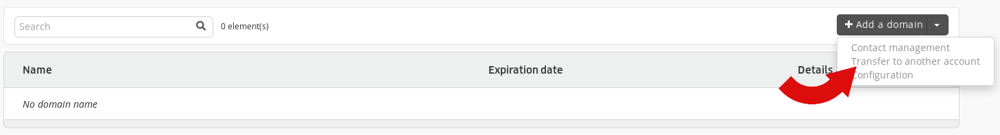
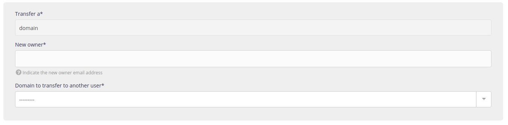
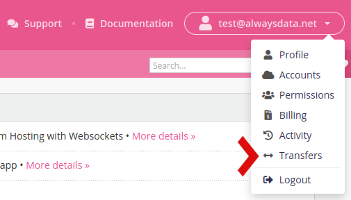

This article explains how to transfer a domain *and* its e-mail addresses to **another alwaysdata account**.

1.  From the **Domains** menu in the initial account,

2.  Choose the **Transfer to another account** action,
    

3.  And follow the steps.
    

> [!NOTE]
> Only the *account owner* can initiate a transfer.

The destination profile needs only to accept it from the **Transfers** section and wait until the e-mail boxes copy to their account. As this action depends on the size of the e-mail boxes, this may take time.

> [!TIP]
> To move a domain to an account belonging to the *same profile* with which you are connected, simply enter your e-mail address.
