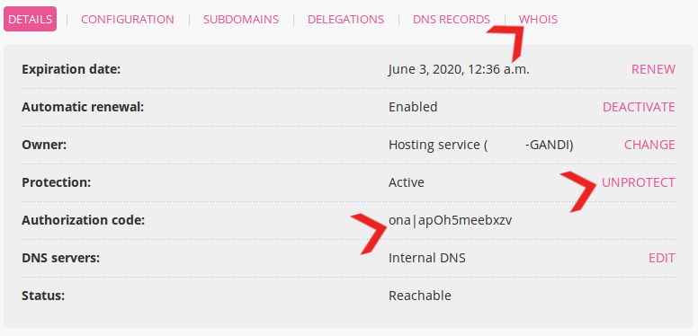

To transfer a domain to another host services provider, initiate the command from the new provider.

## Preparation

Before starting the operation the owner needs to:
  - remove the protection against transfers,
  - check that the owner’s information is correct and visible in the `whois` [^1],
  - retrieve the authorization code.

This information is retrieved from the **Domains > Details of [example.org] - 🔎** tab:

He can also disable [DNSSEC](/domains/dns-management/dnssec/) to avoid *potential* issues.
 
>[!NOTE]
A transfer cannot be made during the first 60 days after creation or after a previous transfer.

[^1]: More information on [whois](https://en.wikipedia.org/wiki/Whois)
