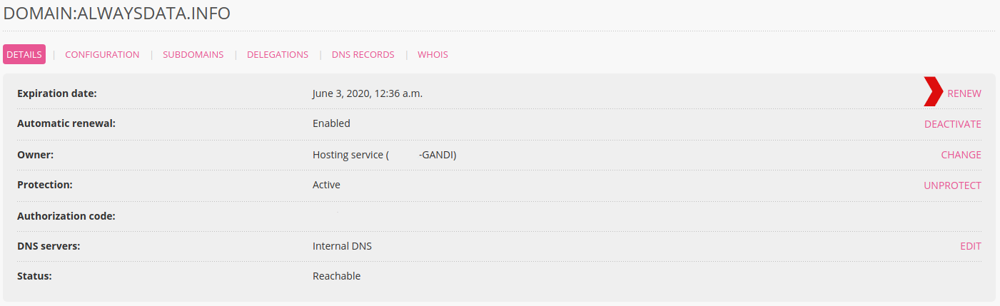
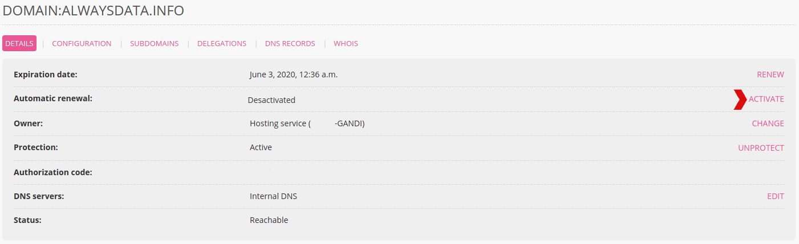
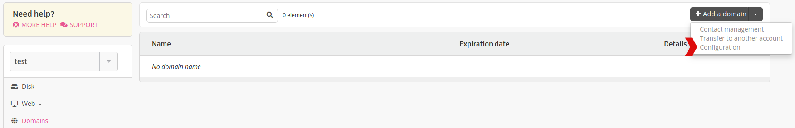
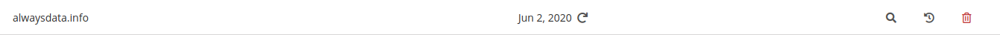

Go to **Domains > Details of [example.org] - 🔎 > RENEW**.

- [Deadlines](/en/docs/domains/deadlines)

## Automatic renewal

This is set up via **Domains > Details of [example.org] - 🔎 > ACTIVATE** (opposite **Automatic renewal**).

To set up automatic renewal for all of the new domains in an account, go to **Domains > Configuration** (accessible via the drop down menu on the right of **Add a domain**).

A domain with automatic renewal in place has an icon showing this:

By default the automatic renewal will take place 45 days before expiration.

> [!WARNING]
> Automatic renewal for a domain can only be completed if the **prepaid account** has the necessary credit to pay for this OR a **credit card** or **bank account** is provided for automatic debits. To set up automatic payments, go to the **Billing > Payment Methods** menu in your **Client Area**.

### Bank account automatic debits

Direct debits from a bank account are not immediately taken into account.

To avoid suspension of the domain before the debit is taken into account, a period of *15 days* is therefore set up between the activation date of the automatic renewal and the expiration date of the domain. In other words, **if a domain expires within 15 days of the day that the auto-renewal is activated, then it will be necessary to renew it yourself**. The system will not do it itself.
