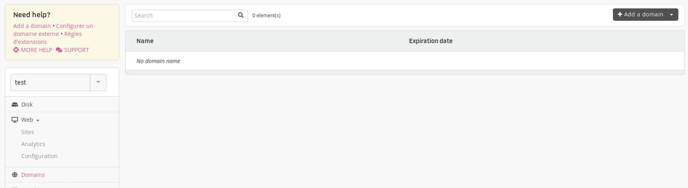
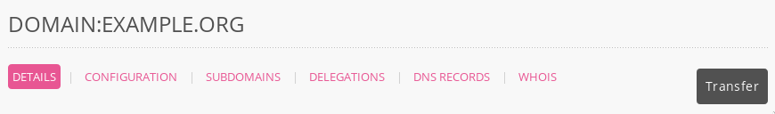
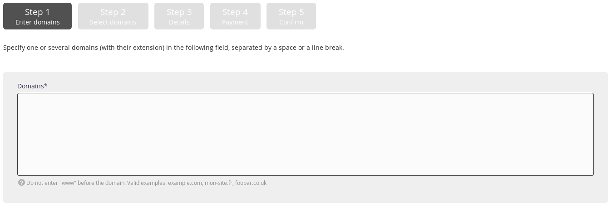
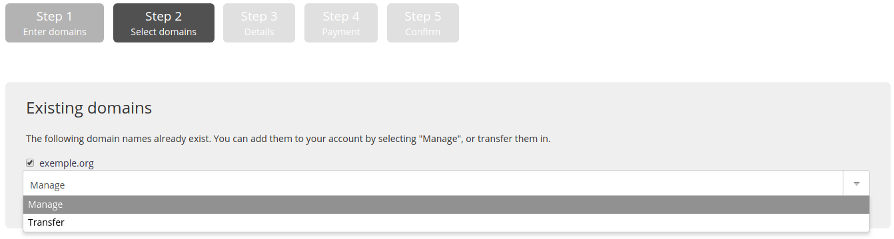
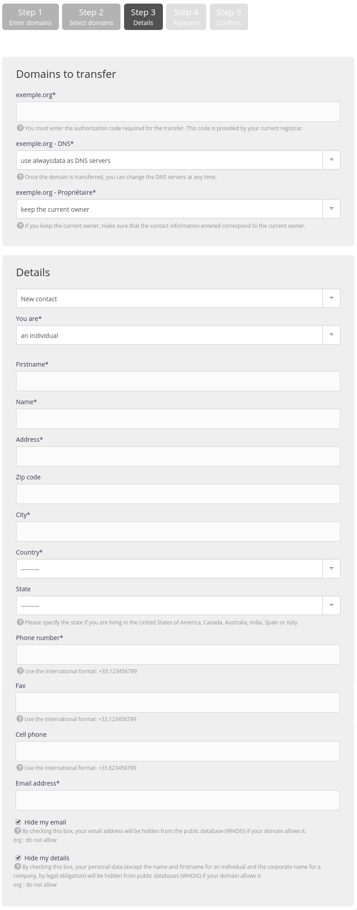

This operation is [charged](https://www.alwaysdata.com/en/domains/#main) for. It allows transferring the *administrative* management of your domain to alwaysdata.

> [!WARNING]
> If you wish to transfer the domain to another alwaysdata client, please proceed with an [internal domain transfer](/en/docs/domains/move-a-domain).

## Preparation ahead of time

Before starting the operation the owner must :

- remove the protection against transfers,
- check that the owner’s information is correct and visible in the `whois` [^1],
- get the authorization code,
- retrieve a backup of his data (including e-mail).

A transfer cannot take place within 60 days of its creation or a previous transfer.

> [!TIP]
> The [technical management](/en/docs/domains/add-an-external-domain) transfer can be done before to avoid issues linked to the time taken by the administrative transfer.

## Starting the transfer

1.  From your administration interface, go to **Domains > Add a domain**,
    
    
    
    If the domain has already been [added](/en/docs/domains/add-an-external-domain) to your alwaysdata interface, you can transfer it via **Domains > Details** for the relevant domain and **> Transfer**.

    

2.  Fill-in the domain names that you wish to buy,
  
    

> [!NOTE]
Enter the domain only, without the subdomain.
> For example: `example.org` and not `www.example.org`.

3.  Choose to **transfer** it,
    
    
    
4.
    - Provide the *authorization code* if the extension requires it,
    - Choose whether or not to use our DNS servers: this entails transferring the domain’s technical management to alwaysdata, and
    - Enter the owner’s contact information. This information depends on the extension taken. 
    
    

> [!WARNING]
> A validation e-mail is set for a certain number of extensions. Without validation, the transfer is aborted.

> [!NOTE]
> A transfer takes on average 6 to 8 days but this can be accelerated by contacting your current service provider.

### Specific case

The IPS Tag asked by [Nominet](https://registrars.nominet.uk/) - registry of `.uk` - is **GANDI**.

## Preparing the domain

During this time, the domain will be added to your administration interface as an *External Domain Name* with an operation in progress. You can prepare our servers by:

  - updating your [DNS records](/en/docs/domains/dns-management/add-dns) if you use other servers for certain services,
  - creating the [e-mail addresses](/en/docs/e-mails/create-an-e-mail-address).

Regarding the website, there are a number of possible choices:

  - adding the addresses before they point to our servers. In this case, there may be a delay relating to the generation of [SSL Let's Encrypt certificates](/en/docs/web-hosting/sites/ssl-tls/lets-encrypt),
  - prepare the site at another address and wait until the last moment to add addresses to the site. There may be a period of time when the site is no longer accessible.

---

## Links

- [Transfers: error codes](/en/docs/domains/troubleshooting#transfer)

[^1]: More information on [whois](https://en.wikipedia.org/wiki/Whois)
