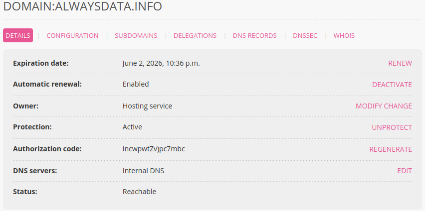

Each domain is linked to a specific owner user. To find out which user is linked to a domain go to **Domains > Details of [example.org] - 🔎**:

You can change the address, email, and phone number using the **MODIFY** button (opposite **Owner**).

To change the name of the owner or the company turn to [change of ownership](/en/docs/domains/change-of-owner).
