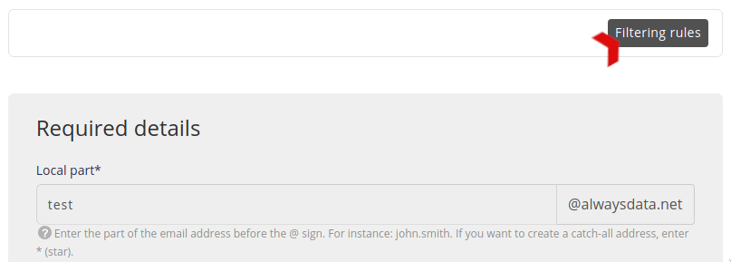
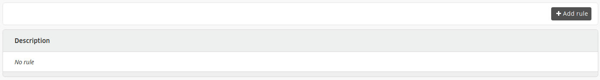
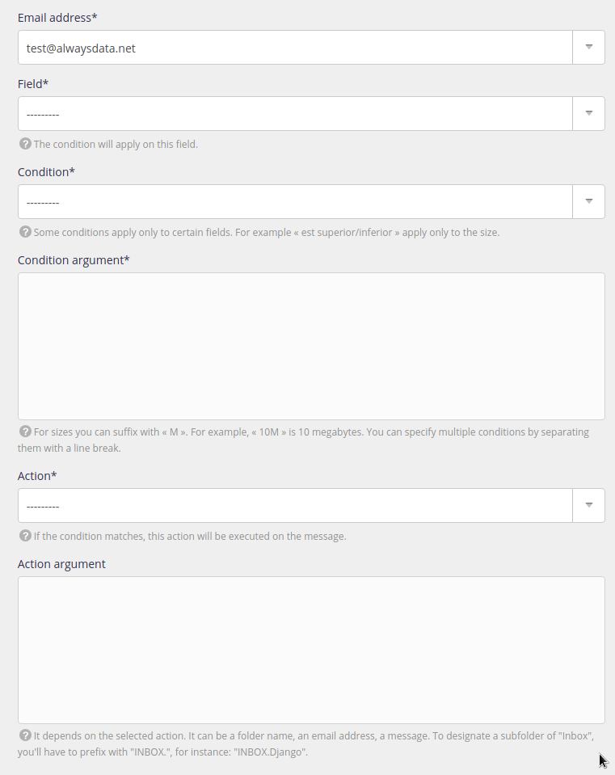

To better manage e-mails and sort them automatically, filtering rules are available. These rules can be created at the e-mail client or server level.

To create them on the latter, go to **E-mails > Addresses > Change** the desired address **> Filter rules**.

You will find a list of your rules that you can add to.

Filtering rules are translated into [Sieve](http://sieve.info/) format and you can find it in the `$HOME/admin/mail/[domain]/[local-part]/filter.sieve` file in your file space.

> [!TIP]
> To create more complex rules, you will need to use [Sieve rules](/en/docs/e-mails/use-sieve-scripts).

---

- [API resource](https://api.alwaysdata.com/v1/mailbox/rule/doc/)
