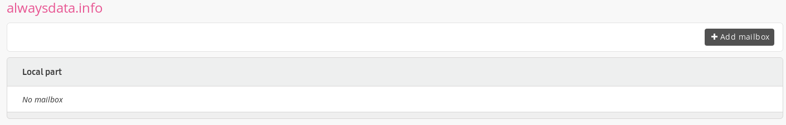
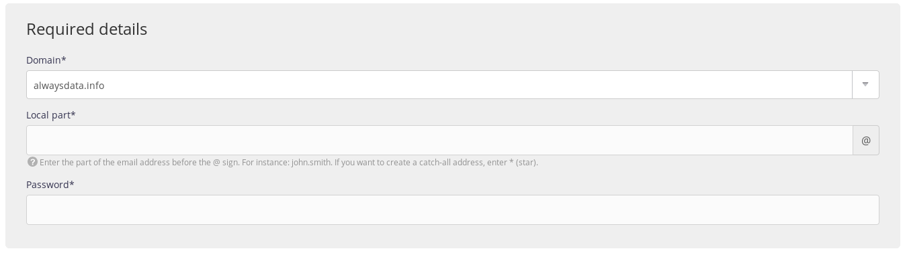
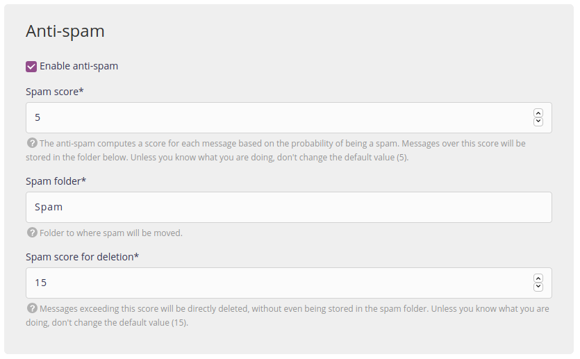
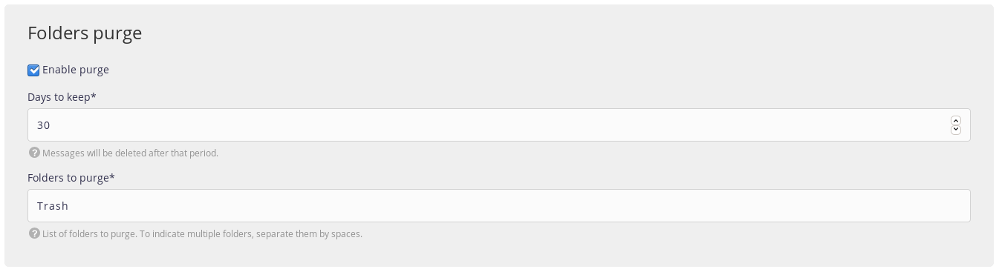
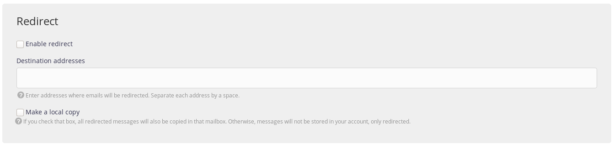
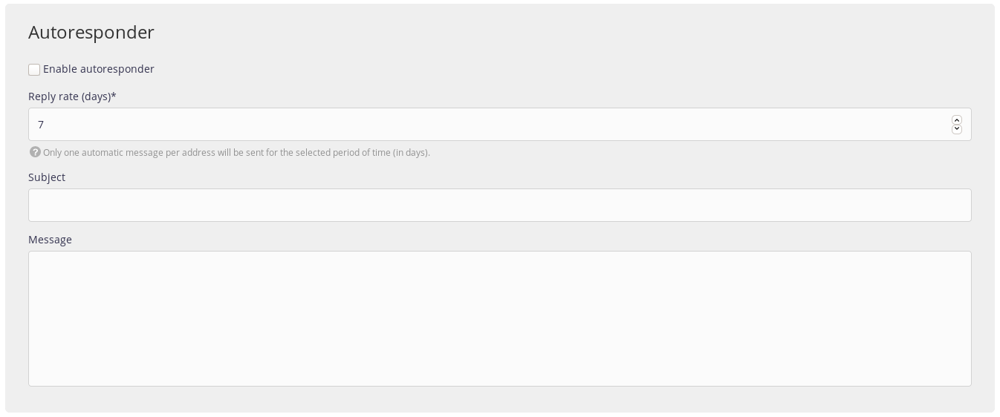
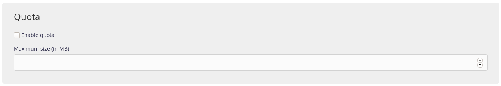
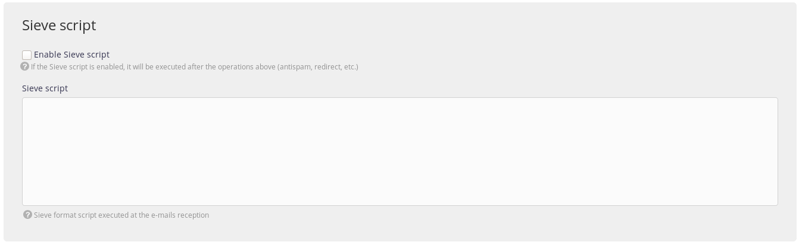

From the administration **E-mails > Addresses** section, you can create e-mail boxes (so long as you added a [domain name](/en/docs/domains/).

Then there will be a series of fields to fill-in. Here are the details.

## Required information

- *Domain*: the domain name for the address to create,
- *Local part*: the part to the left of the e-mail address _@_ (_e.g._ if you wish to create `contact@example.org`, the local part will be `contact`). You can also create a [catch-all address](/en/docs/e-mails/catch-all).
- *Password*: the password needed to connect to this e-mail address.

## Antispam

The antispam used to filter out undesired e-mail advertising (*spam*) is the open-source software [Rspamd](https://rspamd.com/).

> [!WARNING]
> The configurable antispam is the antispam of incoming mail. The emails leaving our servers inevitably go through a non-configurable antispam.

- *Score*: the antispam software assigns every message a score based on the probability of it being spam. Messages that exceed this score will be saved in a folder. The lower the score, the more likely an e-mail will be marked out as spam, so it is preferable to leave the default value.
- *Folder*: the folder that spam is moved to. The default folder is `Spam`.
- *Score for spam to delete*: messages that exceed this score will be deleted immediately, without even being saved in the spam folder. Unless you are sure of what you are doing, leave the default value.

The [ClamAV](http://www.clamav.net/) antivirus included to Rspamd is used to filter potentially infected e-mail.

## Purge folders

- *Retain duration*: after this time, the messages will be definitively deleted.
- *Folders*: list of folders to purge (separated by a space).

> [!NOTE]
> This function is relevant when using the antispam and/or antivirus software: it is up to you to empty the folders regularly.

## Redirect

- *Addresses*: addresses that the e-mails will be redirected to separated by a space).
- *Local copy*: by checking this box, all redirected e-mails will also be copied to this e-mail box. If not, the e-mails will not be stored, simply redirected.
	- If this box is not checked, we therefore create [an alias](https://en.wikipedia.org/wiki/Email_alias).

> [!NOTE]
> If you use the antivirus and/or the antispam software, e-mails considered to be fraudulent are never redirected to avoid passing on these bad messages to outside vendors.

> [!WARNING]
> alwaysdata's mail servers are not necessarily authorized by the authentication rules (SPF, DKIM, DMARC) of the senders. This can block the redirections.

## Auto-reply

- *Repeat frequency*: only one automatic message per address will be send for the entire duration of the period (in days).
- *Subject*: the automatic message subject.
- *Message*: the automatic message body text.

## Quota

- *Size*: the maximum size of the e-mail box, in *Mb* (if this quota is reached, new messages will be rejected).

> [!NOTE]
> If no maximum size is specified for an e-mail box, then the space available in the pack will represent the ceiling.

## Script Sieve

This technology is used to perform [more precise operations](/en/docs/e-mails/use-sieve-scripts) when your messages are received. If you activate the Sieve script, then it will be run after all of the operations configured on the form creating your e-mail box.
