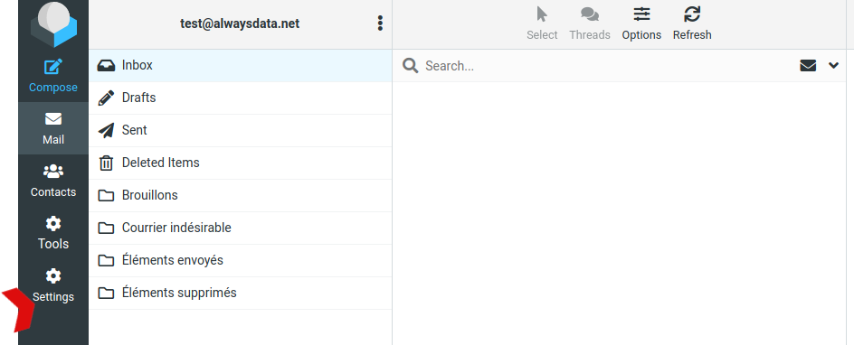
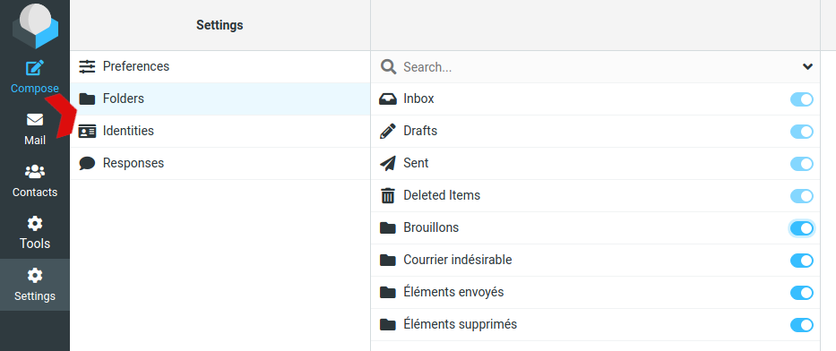

## Limit on the number of mails sent

There is no limit but when sending an important email, all the emails will not leave at the same time. They will be sent "as they go".

Spam mailing is strictly forbidden.

## Some folders are not visible in the webmail

Go on **Settings > Folders** to check hidden folders:

