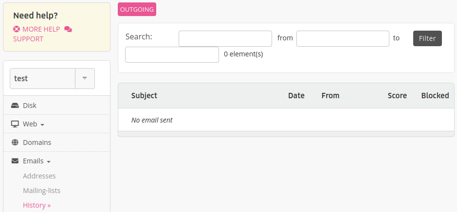
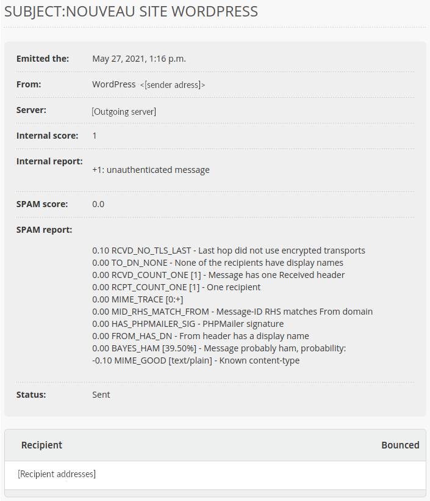

You have access to outgoing logs in the menu **Emails > History**.

- *[Score](/en/docs/e-mails/outgoing-e-mails/delivery#scoring-system)*: score given by alwaysdata's antispam that determines if an email is sent or not[^1],
- *Blocked*: if the email has been blocked by alwaysdata's antispam. Must not be confused with a *bounce*[^2] which includes other reasons.

- *Internal score*: score given by alwaysdata's antispam,
- *Internal report*: details of alwaysdata's antispam score. It takes int account the Rspamd score,
- *SPAM score*: [Rspamd](https://www.rspamd.com/) score,
- *SPAM report*: details of Rspamd score.

By default only emails sent in the last 7 days are displayed. To find another use the filters.

[^1]: an email with a score higher than 3 will not be sent on shared servers. On Private Cloud, the default value is 5 (editable).
[^2]: this can be caused for example by a blockage of our antispam, a refusal by the recipient servers or a non-response from them for several days. The sender shall then receive a *Mail delivery failed* stating the reasons for the bounce.
