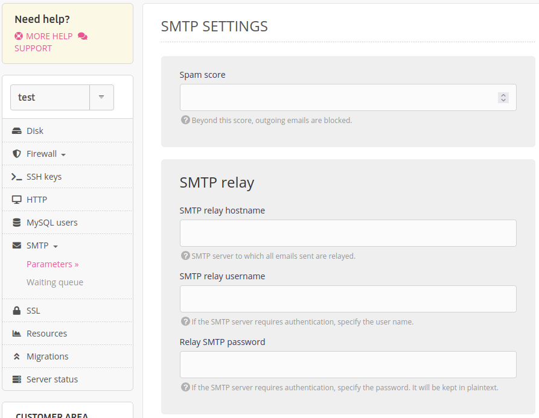

The SMTP relay service makes it possible to use an external third-party server to send emails. This may be used, for instance:

- to not affect the reputation of your alwaysdata server;
- benefit from specialist services.

This option is available on alwaysdata’s [Private Cloud offers](/en/docs/admin-billing/billing/private-cloud-prices).

## Installation

In the **SMTP > Parameters** menu of your server, fill in the login information of the SMTP relay you have chosen.

All the emails that are supposed to be sent from the server will now be sent from the relay server.
