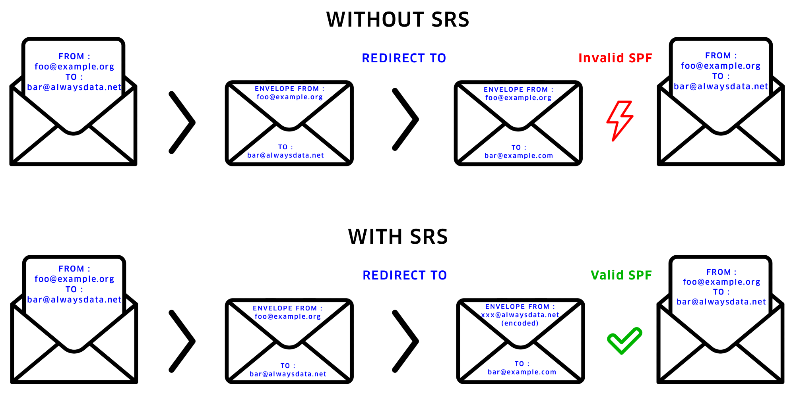
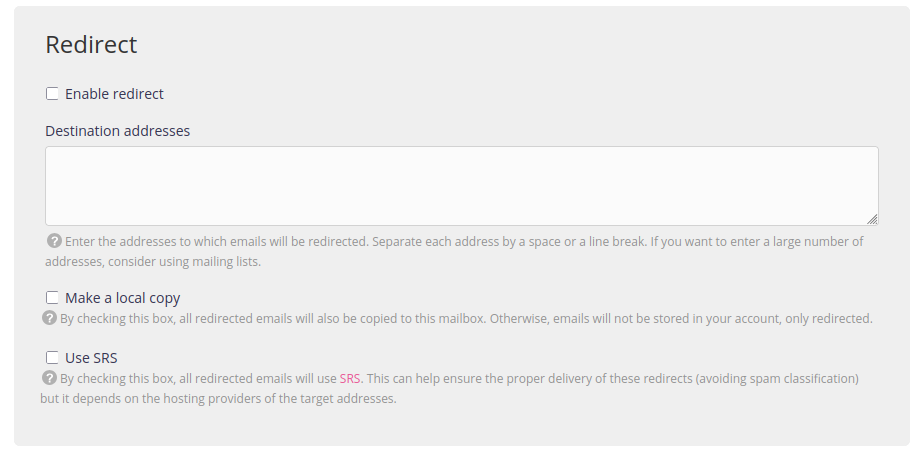

[Sender Rewriting Scheme](https://en.wikipedia.org/wiki/Sender_Rewriting_Scheme) (or SRS) allows rewriting the sender's address on e-mail envelopes to bypass [SPF](https://en.wikipedia.org/wiki/Sender_Policy_Framework)[^1] blocking and thus improve e-mail deliverability **with redirection**.

## Activation at alwaysdata

To activate it, go to the menu **Emails > Addresses > Modify [e-mail address] - ⚙️ > Redirection > Use SRS**

## Notes

By enabling SRS, the `ENVELOPE FROM` and `HEADER FROM`/`FROM` no longer match. While this allows SPF validation, it will still not validate DMARC. DMARC validation will depend solely on the presence of a valid DKIM.

> Icons: The Noun Project

[^1]: [set up SPF at alwaysdata](/en/docs/e-mails/set-up-spf-dkim-dmarc#sender-policy-framework)
