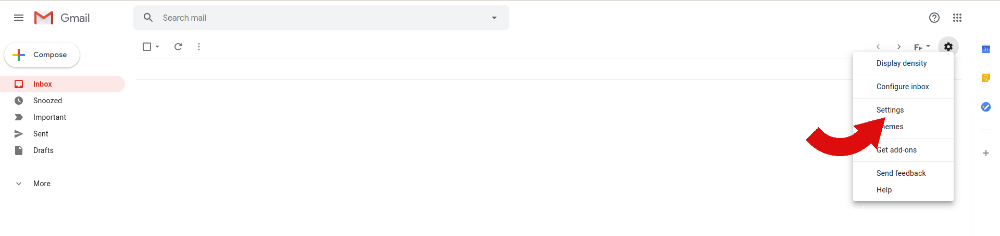
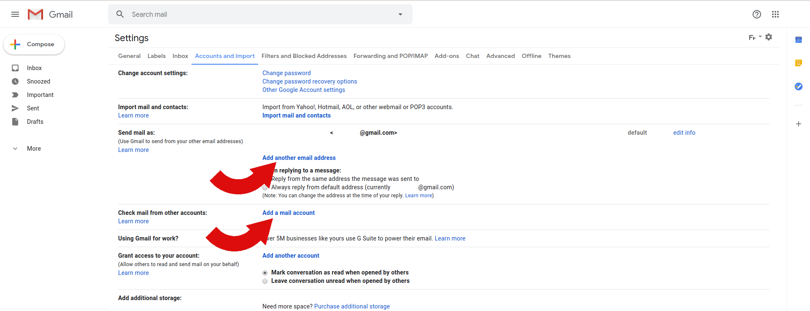
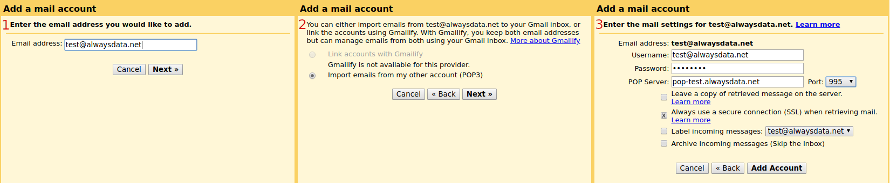
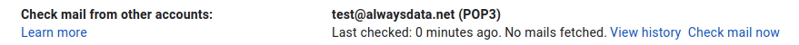
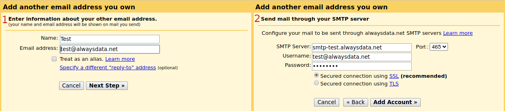
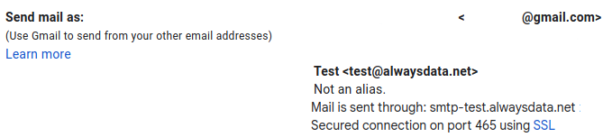
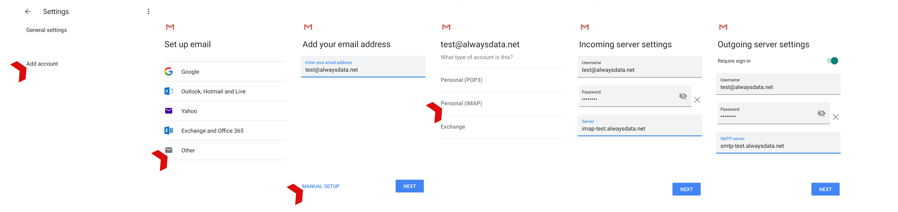

In our examples we consider the following information:

- Account name: `test`
- Mailbox: `test@alwaysdata.net`

They must be replaced by your personal login information: 

|Server|Service|Information||
|---|---|---|---|
|Incoming|POP3|POP Server|pop-*[account]*.alwaysdata.net|
|||Username|Your email address - for example *contact\@example.org*|
|||Password|The password of your email address|
|||Port|995|
|Outgoing|SMTP|SMTP Server|smtp-*[account]*.alwaysdata.net|
|||Username|Your email address - for example *contact\@example.org*|
|||Password|The password of your email address|
||||Do not treat as an alias|
|||Port|465|
||||Secured connection|

> [!TIP]
> *[account]* must be replaced by the name of your account and *contact\@example.org* by your email address. They are defined in the **Emails > Addresses** menu of our administration interface.

## Web browser

Go to **Parameters > Accounts and imports**.

### Incoming mails (IMAP/POP)

Go to **Add a mail account > Import e-mails from my other account (POP3)**.

Check "Always use a secure connectiion (SSL) when retrieving mail.".

> [!WARNING]
> This is a POP3 connection that will get e-mail from the e-mail servers.

### Outgoing mails (SMTP)

Go to **Add another e-mail address**.

- Uncheck the **Treat as an alias** box.

## Mobile

Go to **Settings > Add an account > Other**.

- For *outgoing* mail, check the **Demand a connection** box.
