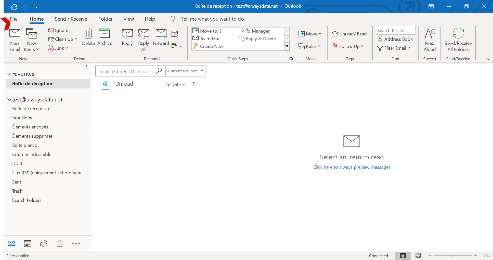
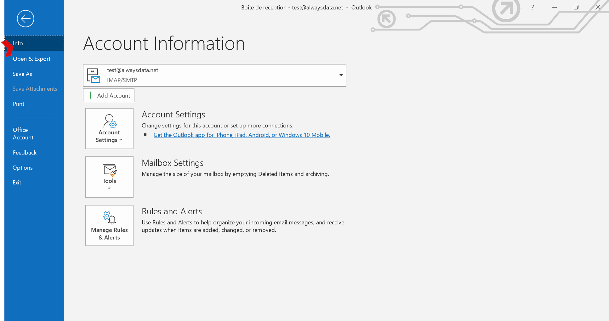
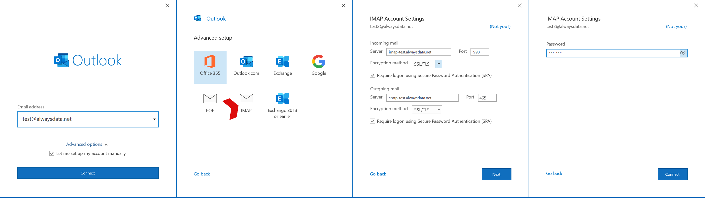
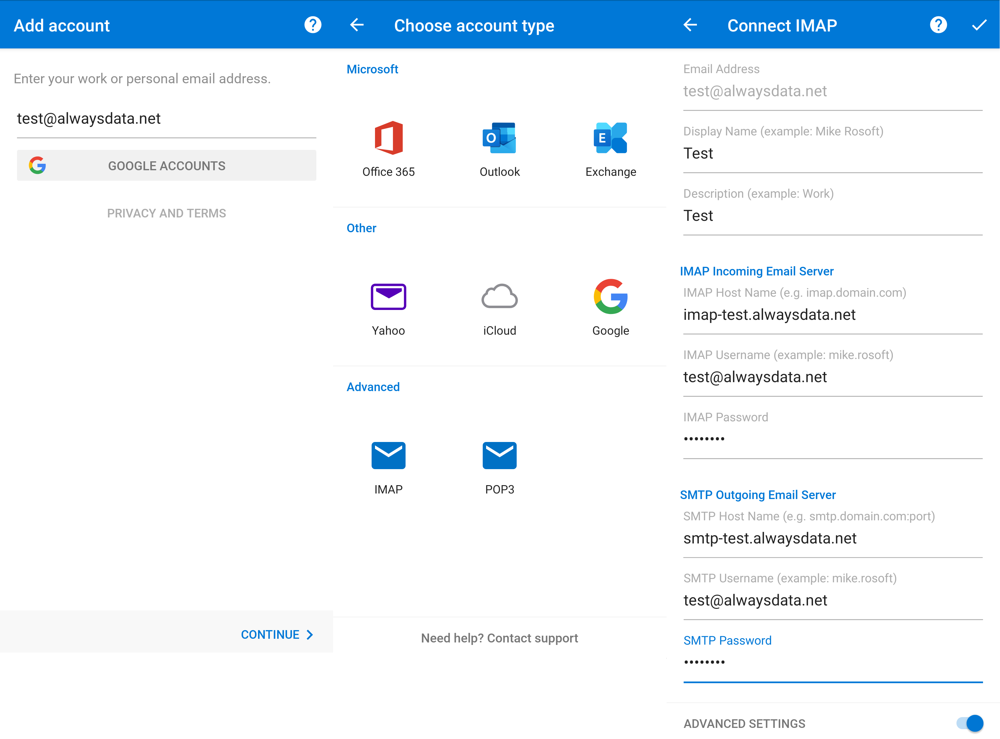

## General

> [!TIP]
> For domains using our DNS servers, Outlook *autoconfiguration* is usable. You just need to provide your username (email address) and password. The other settings are automatically generated.

|Server|Service|Information||
|---|---|---|---|
|Incoming|IMAP|Server|imap-*[account]*.alwaysdata.net|
|||Port|993|
|||Encryption method| Will be automatically set up|
|||Authentication method| Require logon using Secure Password Authentication (SPA)|
|||Email address| Your email address - for example *contact\@example.org*|
|||Password| The password of your email address|
||POP3|Server| pop-*[account]*.alwaysdata.net|
|||Port| 995|
|||Encryption method| Will be automatically set up|
|||Authentication method| Require logon using Secure Password Authentication (SPA)|
|||Email address| Your email address - for example *contact\@example.org*|
|||Password| The password of your email address|
|Outgoing|SMTP|Server|smtp-*[account]*.alwaysdata.net|
|||Port|465|
|||Encryption method| Will be automatically set up|
|||Authentication method| Require logon using Secure Password Authentication (SPA)|
|||Email address| Your email address - for example *contact\@example.org*|
|||Password| The password of your email address|

*`[account]`* must be replaced by the name of your account and *`contact@example.org`* by your email address. They are defined in the **Emails > Addresses** menu of our administration interface.

## Screenshots

In our example we consider the following information (to be replaced by your personal login information):

- Account name: `test`
- Mailbox: `test@alwaysdata.net`

### Computer

Go to **Files > Information > Add an account**.

- Configure the account by hand.
- Choose POP or IMAP.
- Check the **Demand Secure Password Authentication (SPA) on connection** box.

### Mobile

Go to **Go ahead > Ignore** if the **> Advanced IMAP** or **POP3** account types are offered.

Click on **Advanced settings** to specify the *host names*.
