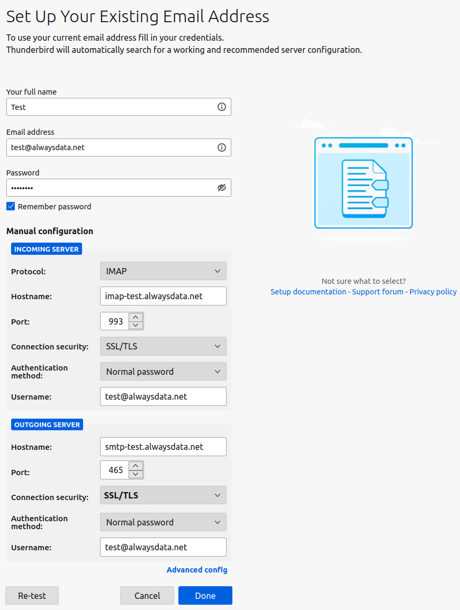
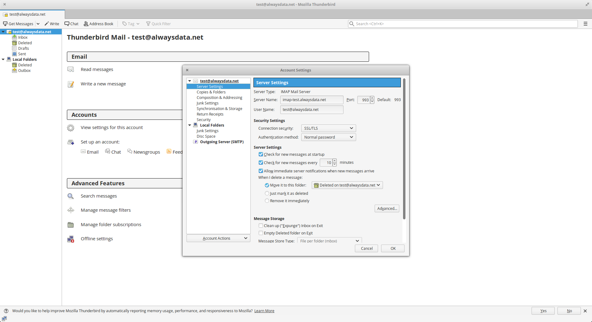
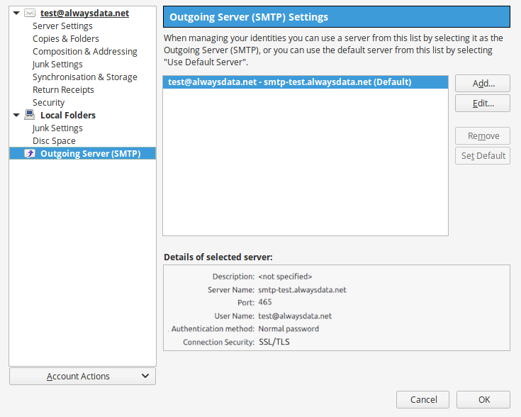

## General

> [!TIP]
> For domains using our DNS servers, Thunderbird *autoconfiguration* is usable. You just need to provide your username (email address) and password. The other settings are automatically generated.

|Server|Service|Information||
|---|---|---|---|
|Incoming|IMAP|Hostname|imap-*[account]*.alwaysdata.net|
|||Port|993|
|||Connection security| Will be automatically set up|
|||Authentication method| Normal password|
|||Username| Your email address - for example *contact\@example.org*|
|||Password| The password of your email address|
||POP3|Host| pop-*[account]*.alwaysdata.net|
|||Port| 995|
|||Connection security|Will be automatically set up|
|||Authentication method|Normal password|
|||Username|Your email address - for example *contact\@example.org*|
|||Password|The password of your email address|
|Outgoing|SMTP|Host|smtp-*[account]*.alwaysdata.net|
|||Port|465|
|||Connection security|Will be automatically set up|
|||Authentication method|Normal password|
|||Username|Your email address - for example *contact\@example.org*|
|||Password|The password of your email address|

> [!TIP]
> Replace *contact\@example.org* by your email address. It is defined in the **Emails > Addresses** menu of our administration interface.

## Screenshots

In our example we consider the following information (to be replaced by your personal login information):

- Account name: `test`
- Mailbox: `test@alwaysdata.net`

Go to **Settings > Configure an account: E-mail**.

To change it once created, go to **Accounts > See settings for this account** or go to the **Edit > Account settings** menu bar:

-   For *incoming* mail, go to **Server settings**.
    

-   For *outgoing* mail, go to **outgoing SMTP server**.
    
