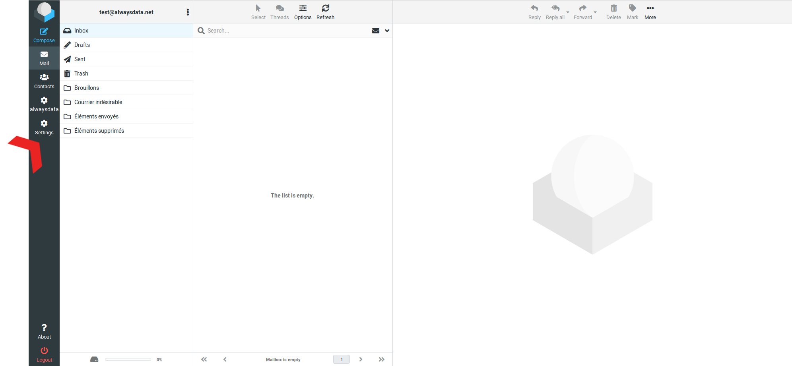
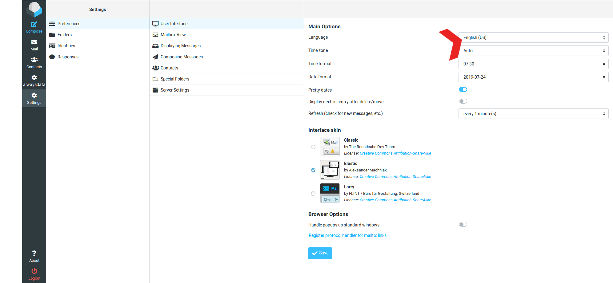

You can access your e-mails in a number of ways. Here are two most used.

## E-mail client

If you wish to configure a mail program on your computer or any other device, here is the information you will need to provide.

|Server|Service|Information|
|--- |--- |--- |
|Incoming|IMAP|Host: **imap-[account].alwaysdata.net**|
|||Port: **993 (SSL/TLS)**|
|||Alternative port: 140 (STARTTLS)|
|||Identifier: **email address** and the **password** assigned to it|
||POP3|Host: **pop-[account].alwaysdata.net**|
|||Port: **995 (SSL/TLS)**|
|||Alternative port: 110 (STARTTLS)|
|||Identifier: **email address** and the **password** assigned to it|
|Outgoing|SMTP|Host: **smtp-[account].alwaysdata.net**|
|||Port: **465 (SSL/TLS)**|
|||Alternative port: 587 (STARTTLS)|
|||Identifier: **email address** and the **password** assigned to it|

> [!NOTE]
> You need to replace `[account]` with the name of your account, the one chosen when it was created.

Password authentication is **mandatory** to use our SMTP server, fill-in the same identifiers as for the incoming server.

It is also possible to use your internet provider's SMTP server.

- [Configure Apple/iOS](/en/docs/e-mails/clients/apple-ios)
- [Configure Gmail](/en/docs/e-mails/clients/gmail)
- [Configure Mozilla Thunderbird](/en/docs/e-mails/clients/thunderbird)
- [Configure Outlook](/en/docs/e-mails/clients/outlook)

## Webmail

If you wish to access your mailbox from a browser, we make available [our webmail, Roundcube](https://webmail.alwaysdata.com). Connect with the email address you wish to view and its password.

By default, the webmail is using the user's web browser language (the one of its first connection). To change the language, click on **Settings** in the top right corner, then **User Interface > Language**.

> [!TIP]
> When you change your password via the webmail, you will need to log out and log back in.

## Notes

- The e-mails are saved in [Maildir](https://en.wikipedia.org/wiki/Maildir) format in directory `/home/[account]/admin/mail`,
- If the destination MX server is not available, the email will be kept for a maximum of five days, with regular attempts made to resend it,
- The maximum size of e-mails sent is set at **50 Mb**,
- SMTP authentication is not required when the service is hosted on alwaysdata servers (e.g. website or scheduled task).
