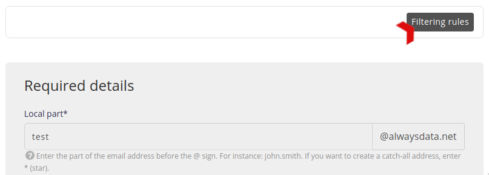
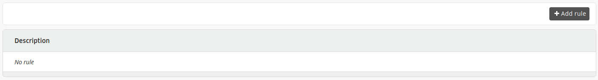
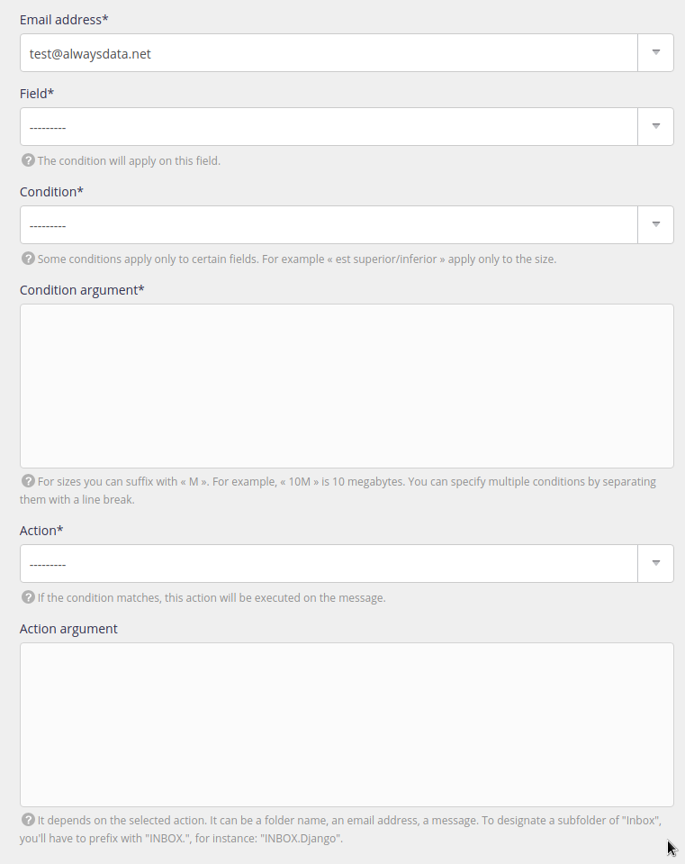

To better manage emails and sort them automatically, filtering rules are available. These rules can be created at the email client or server level.

To create them on the latter, go to **Emails > Addresses > Change** the desired address **> Filter rules**.

You will find a list of your rules that you can add to.

Filtering rules are translated into [Sieve](http://sieve.info/) format and you can find it in the `/home/[account]/admin/mail/[domain]/[local-part]/filter.sieve` file in your file space.

> [!TIP]
> To create more complex rules, you will need to use [Sieve rules](/en/docs/emails/incoming-emails/use-sieve-scripts).

---

- [API resource](https://api.alwaysdata.com/v1/mailbox/rule/doc/)
