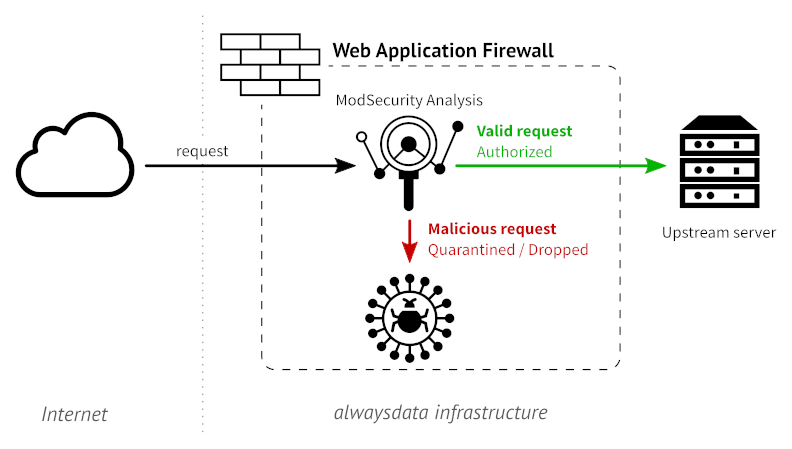
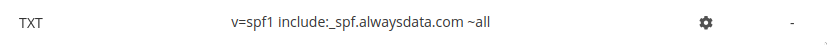
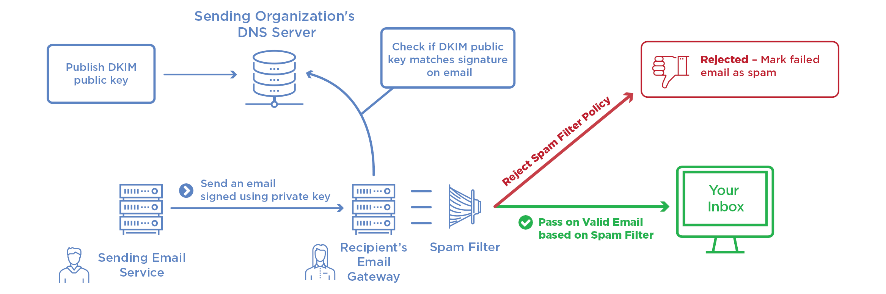
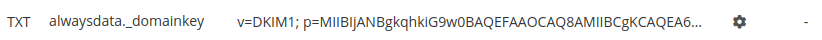
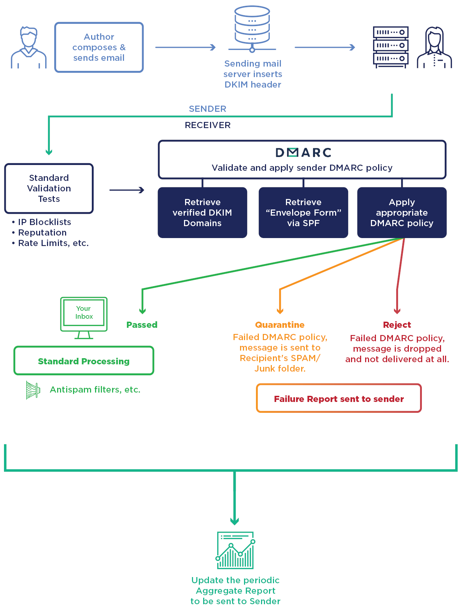
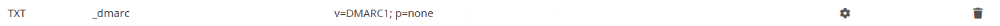

Here are three methods for authenticating your emails and thereby reducing abusive email use (spam, phishing, etc.).

## Sender Policy Framework

[SPF](https://en.wikipedia.org/wiki/Sender_Policy_Framework) makes a `TXT` type DNS request to the sender's domain ("*MAIL FROM*" in the message headers) to find out the list of servers allowed to send emails and compare it with the IP address of the sender's server.

### Parameters

|Mechanism||
|--- |--- |
|ALL|Default result|
|A|An IN A (or AAAA) record that can be resolved as the sender's address|
|IP4|IPv4 range|
|IP6|IPv6 range|
|MX|A Mail eXchanger record pointing to the sender's address|
|EXISTS|The domain is resolved at any address|
|INCLUDE|An included rule passes the test|
|PTR|The IP address domain corresponds to the specified domain and the latter points to the IP in return|

|Qualifiers||
|--- |--- |
|+|Favorable result|
|?|Neutral result|
|~|Slight "SOFTMAIL" failure (email accepted but marked)|
|-|Total failure (email normally rejected)|

|Modifiers||
|--- |--- |
|exp=some.example.org|To get the reason for the failure results|
|redirect=some.example.org|To link to a rule record in another domain|

> [!WARNING]
> This technology may have an impact on email redirects as the sender server is not necessarily the email server belonging to the original email sender.

#### At alwaysdata

A SPF record is created by default and can be found in the **DNS records** tab for the domain:

- `include:_spf.alwaysdata.com` **explicitly allows our servers** to send emails,
- `~all` sends a slight "SOFTMAIL" failure result for the other sender servers.

 If the domain doesn’t use alwaysdata’s DNS servers, you must then, in the DNS service provider, add `include:_spf.alwaysdata.com` to the SPF registration.

### Links

- [RFC 7208](https://tools.ietf.org/html/rfc7208)
- [RFC 7372 - point 3.2](https://tools.ietf.org/html/rfc7372)
- [RFC 4408](https://tools.ietf.org/html/rfc4408)

## DomainKeys Identified Mail

[DKIM](https://en.wikipedia.org/wiki/DomainKeys_Identified_Mail) is used to authenticate the domain name by adding a signature to all of the outgoing emails. Concretely, this works with two keys:

- a private key that is known - and kept secret - from the domain’s mail delivery servers;
- a public key that corresponds to a DNS registration of the `TXT` type.

### At alwaysdata

A pair of keys is created by default, whose public key (the `TXT` record) will be found in the **DNS Records** tab of the domain:

If the domain doesn’t use alwaysdata’s DNS servers, this record must be recopied with your DNS service provider.

> It is possible to generate others in **Domains > Details of [example.org] - 🔎 > Configuration**.

### Links

- [RFC 6376](https://tools.ietf.org/html/rfc6376)
- [RFC 7372 - point 3.1](https://tools.ietf.org/html/rfc7372)

## Domain-based Message Authentication, Reporting and Conformance

[DMARC](https://en.wikipedia.org/wiki/DMARC) is a protocol that standardizes authentication by telling the addressees what actions to take should one of the authentication methods fails. It will check that:

- the domain corresponds to the pair of DKIM keys (field *d=*),
- the sender server is specified in the SPF record for the domain (*MAIL FROM*),
- the domain is in the email's *FROM* field.

> [!NOTE]
> To use DMARC, DKIM and SPF must already be implemented.

### Parameters

|Variables||
|--- |--- |
|v|Protocol version: v=DMARC1 (required)|
|pct|Percentage of messages to filter (default: 100)|
|adkim|Coherency with DKIM|
||s = strict mode - the DKIM signature domain must precisely match the FROM|
||r = relax mode (default)|
|aspf|Coherency with SPF (s or r)|
|p|Procedure in case of failure - main domain (required)|
||none = delivers the email normally|
||quarantine = treats the email as suspect (spam score, flag, etc.)|
||reject = rejects the email|
|sp|Procedure in case of failure - subdomain (none, quarantine or reject)|
|ruf|Recipient of the detailed failure reports|
|fo|Conditions for sending a detailed report|
||1 = DKIM and/or SPF failure|
||d = DKIM failure|
||s = SPF failure|
||0 = DKIM and SPF failure (default)|
|rua|Recipients of aggregated failure reports|

To implement it, a `TXT` DNS record needs to be created. At alwaysdata, you will find it in the **DNS records** tab of the domain:

### Links

- [Official site](https://dmarc.org/)
- [RFC 7489](https://tools.ietf.org/html/rfc7489)

---

Explanatory diagrams reused from [Global Cyber Alliance](https://dmarc.globalcyberalliance.org/)
