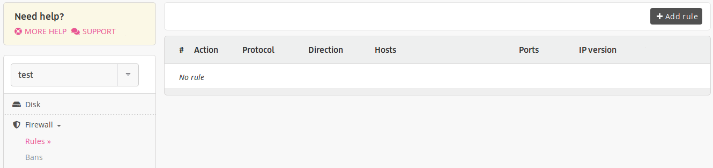
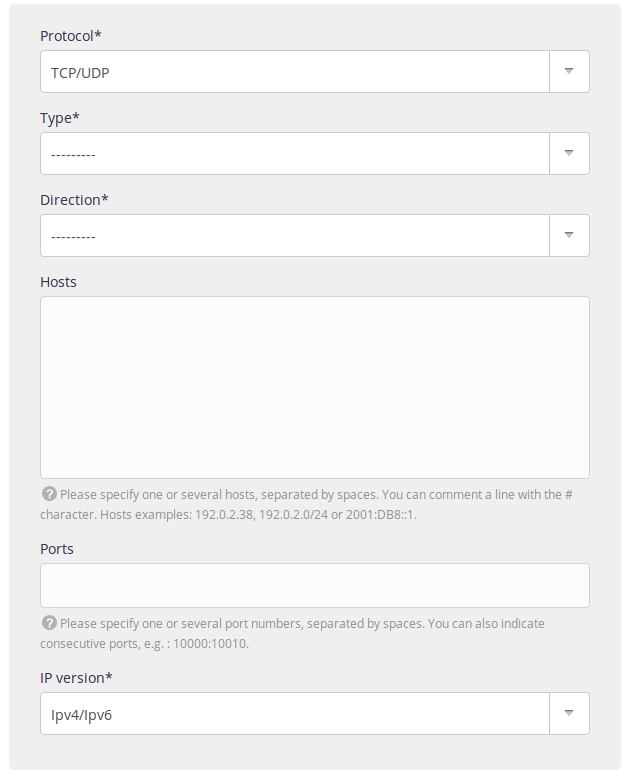
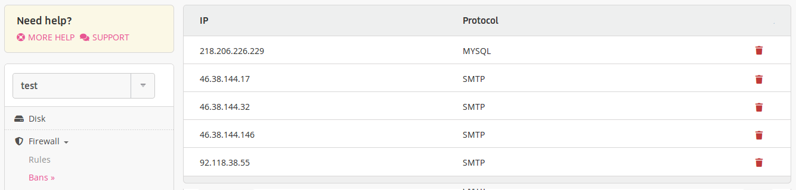
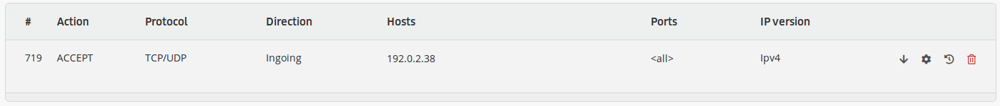
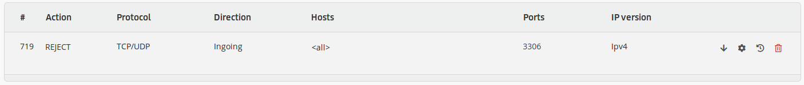

The firewall is managed from the server's **Firewall** menu.

## Rules

Use this menu to find, create and adjust your firewall rules.

If you have a number of rules, the rule placed highest will take precedence over the others.

- [API resource](https://api.alwaysdata.com/v1/firewall/doc/)

### Adding a rule

To add a rule, choose:

- the protocol: [UDP](https://en.wikipedia.org/wiki/User_Datagram_Protocol) or [TCP](https://en.wikipedia.org/wiki/Transmission_Control_Protocol)
- the type of rule: ACCEPT, DROP (reject without informing the sender) or REJECT,
- the direction: in our out,
- the relevant IPs/hosts: these can be IPs or URLs,
- the ports,
- The IPs version.

Not putting anything in *Hosts* and *Ports* will enable the rule for all unless a higher rule states the opposite.

It is possible to give a label by rules (**Annotations**) and directly in your rules by using the string `#`.

> [!NOTE]
> To specify all ports you can leave empty or enter the range `0:65535`.

## Firewall bans

Here you will see the IP addresses currently banned and the services that they are banned from.

If you end up banned from a service, check this menu and delete your IP if it is banned and add the necessary rule.

> [!TIP]
> A ban lasts for 10 minutes by default and takes place after some fifty connection failures.

## Services

This menu allows you to automatically open or close the ports for known functionalities (FTP, mail, SSH, databases, etc.). It is no longer necessary to create the rule manually.

## Examples

### Allow your own IP address to never be blocked on any ingoing port

|Title|Value|
|--- |--- |
|Protocol|UDP/TCP|
|Type|ACCEPT|
|Direction|Input|
|Hosts|\<your IP>|
|Ports|\<specify nothing>|
|IP version|IPv4, IPv6 or IPv4/IPv6 (depending on the stated IPs)|

### Block the MySQL port from outside

|Title|Value|
|--- |--- |
|Protocol|UDP/TCP|
|Type|REJECT|
|Direction|Input|
|Hosts|\<specify nothing>|
|Ports|3306|
|IP version|IPv4/IPv6|

