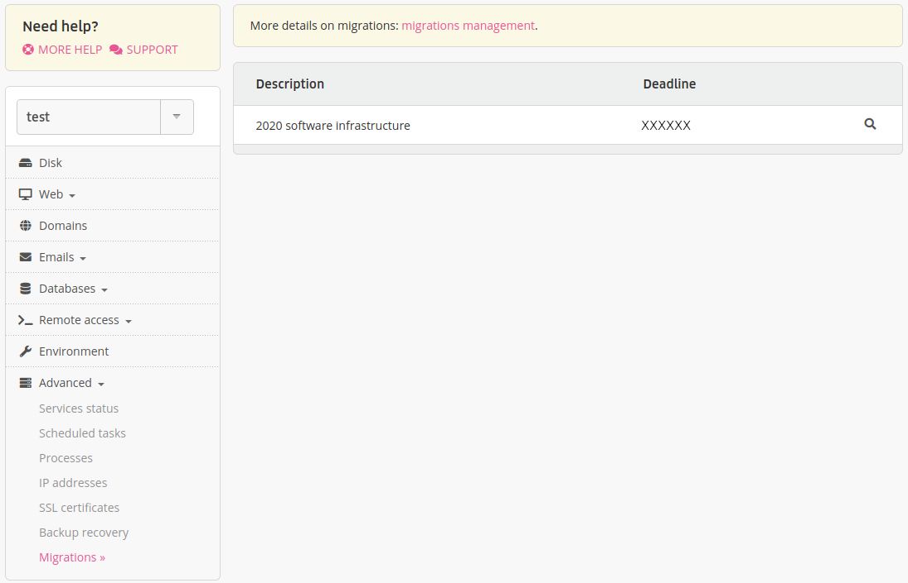

Migration refers to an operation where a technical characteristic of your account is changed. For example, a migration to a new version of MySQL.

The migrations available appear in the [alwaysdata administration](https://admin.alwaysdata.com) **Advanced > Migrations** menu. New migrations are added regularly and we bring this information to our users by e-mail.

Some migrations are optional: you choose whether or not to migrate. Other migrations are mandatory ones: you have a period of time to migrate. Once the deadline is reached, any remaining migrations are done automatically.

- [Perform a migration](/en/docs/technical-specifications/migrations/perform-migration)
- [Private Cloud migrations](/en/docs/technical-specifications/migrations/private-cloud-migrations)

## Migrations currently offered

* [MariaDB 11.4](/en/docs/technical-specifications/migrations/mariadb-11_4)
* [MariaDB 11.8](/en/docs/technical-specifications/migrations/mariadb-11_8)
* [PostgreSQL 17](/en/docs/technical-specifications/migrations/postgresql-17)
* [PostgreSQL 18](/en/docs/technical-specifications/migrations/postgresql-18)

## Former migrations

* [2024 software infrastructure](/en/docs/technical-specifications/migrations/2024-software-architecture)
* [2020 software infrastructure](/en/docs/technical-specifications/migrations/2020-software-architecture)
* [2017 software infrastructure](/en/docs/technical-specifications/migrations/2017-software-architecture)
